# Deploy Elastic on Raspberry Pi

## Intro
A while ago I started to study malware development and decided to build some sort of home lab where I could test my code and techniques I learn against an EDR.

The EDR of choice was Elastic for multiple reasons:
- Easy to deploy
- Free 30-day trial with advanced detection features
- Good reputation

I figure out that I would need at least 3 machines to simulate an attack/defense playground:

- 1 x Attacker machine
- 1 x Target machine
- 1 x EDR machine

Given that my personal computer has limited resources, I could not run 3 virtual machines at the same time as it would crash. To take some of the load, I decided to use my dusty Raspberry Pi 4 to run the EDR. I ended up with the setup as shown below:
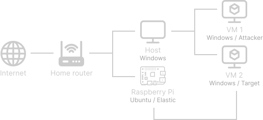

This post is a step-by-step to get Elastic EDR (I will be using docker) up and running on a Raspberry Pi 4. Additionally, I will show how to install an agent enroling a machine in the EDR fleet.

!!!
This tutorial will also work for deploying Elastic on default Ubuntu or any other Debian based Linux machine. If that is your case, skip the Installing Ubuntu on a Raspberry Pi section.
!!!

## Installing Ubuntu on a Raspberry Pi
1. Download the Ubuntu image for Raspberry Pi from the [official Ubuntu website](https://ubuntu.com/download/raspberry-pi).
2. Use the Raspberry Pi Imager to install the downloaded OS image into the SD card.

If you need a guide to install Ubuntu on Raspberry Pi, Nicholas Xuan Nguyen posted a detailed step-by-step tutorial [here](https://adamtheautomator.com/ubuntu-on-raspberry-pi/).

## Installing Docker
We will be using Docker to install and run Elasticsearch, Kibana, and Fleet. This way we avoid many of the burdens installing and configuring dependencies.

The commands below are just a compilation of the [Docker documentation](https://docs.docker.com/engine/install/ubuntu/):
```bash
# Uninstall all conflicting packages:
for pkg in docker.io docker-doc docker-compose podman-docker containerd runc; do sudo apt-get remove $pkg; done

# 1. Setup Docker repository
sudo apt-get update
sudo apt-get install ca-certificates curl gnupg

# 2. Add Docker’s official GPG key
sudo install -m 0755 -d /etc/apt/keyrings
curl -fsSL https://download.docker.com/linux/ubuntu/gpg | sudo gpg --dearmor -o /etc/apt/keyrings/docker.gpg
sudo chmod a+r /etc/apt/keyrings/docker.gpg

# 3. Use the following command to set up the repository:
echo \
  "deb [arch="$(dpkg --print-architecture)" signed-by=/etc/apt/keyrings/docker.gpg] https://download.docker.com/linux/ubuntu \
  "$(. /etc/os-release && echo "$VERSION_CODENAME")" stable" | \
  sudo tee /etc/apt/sources.list.d/docker.list > /dev/null

# 4. Update the apt package index:
sudo apt-get update

# Install Docker Engine - To install the latest version, run:
sudo apt-get install docker-ce docker-ce-cli containerd.io docker-buildx-plugin docker-compose-plugin
```

## Installing elastic-container
Now that Docker was installed, we can move on to install Elastic. We will be using a project created by Andrew Pease called “elastic-container”. I really like how easy it is to get everything working.
```bash
# 1. Install dependencies
sudo apt-get install jq git curl

# 2. Clone the repo
git clone https://github.com/peasead/elastic-container.git
```
Next, change into the `elastic-container/` folder and open the `.env` file using your favorite text editor:

1. Change the default password of “changeme” - Lines 11, 14.
2. Bulk enable detection rules for Windows setting `WindowsDR=1` - Line 22.
3. Change the license type from `basic` to `trial` - Line 30. Elastic provide advanced detection features for a 30-day trial.

Make the shell script executable by running `chmod +x elastic-container.sh`. Start the elastic-container running `sudo ./elastic-container start`.

*It may take a few minutes to download and setup all containers.*
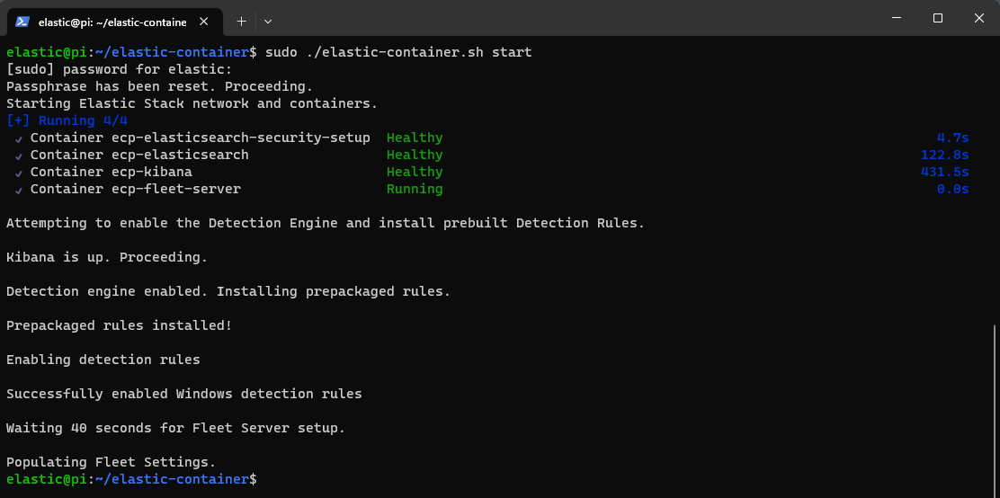

At the end of this process you will have Elasticsearch, Kibana, Fleet, and the Detection Engine all pre-configured, enabled and ready to use. To access Elastic dashboard, browse to `https://localhost:5601` or `https://<RaspberryPi-IP>:5601`. You may be presented a browser warning due to the self-signed certificates. Use the username `elastic` and the password you changed to in the previous steps.
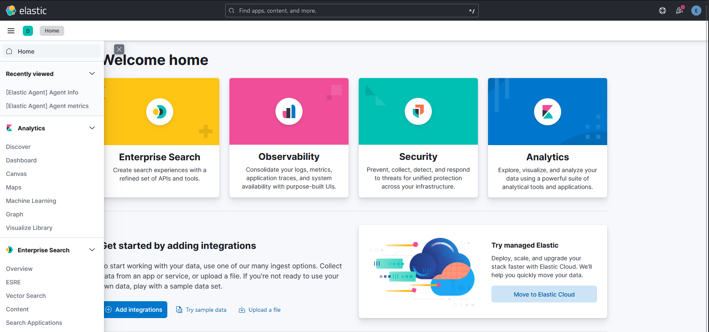

## Enroll the target machine
Now we can enroll the “target” machine into the Elastic Fleet. This will install an agent on the target machine that will monitor and collect the logs and send it back to Kibana.

Use the menu on the left and browse to Mangement → Fleet.


Before enrolling any machine to the fleet we need to modify a couple settings. Go to “Settings” tab and verify if the Output URL is pointing to the Raspberry Pi IP address.
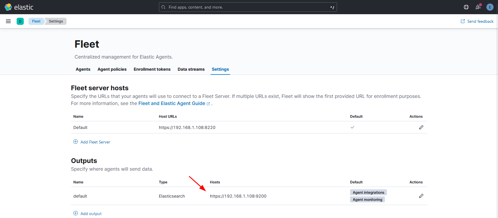

The last thing, click in the pencil icon under Actions to edit the settings of the Output. If not yet, enter `ssl.verification_mode: "none"` in the Advanced YAML configuration. We need this since we are using self-signed certificates, otherwise it will error.
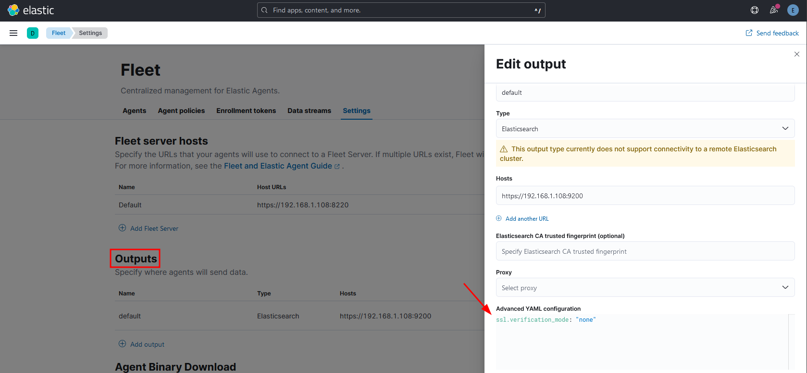

Back to the “Agents” tab, let’s enroll our target machine. Click in the “Add agent” button.
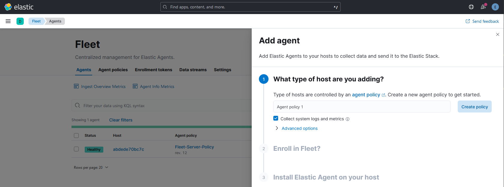
We need to create a policy for this agent, choose a name and click in “Create policy”.

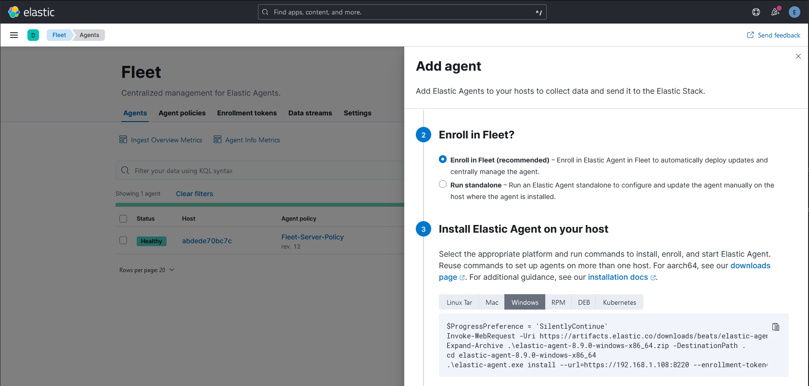
Make sure “Enroll in Fleet” is selected, then in step 3 select the “Windows” version of the agent and below is the code we need to run in our target machine to install the agent. There is only one modification we need to do here. We need to append the flag `--insecure` to the last command since we are using self-signed certificates, for example:
```PowerShell
# 192.168.1.108 = Raspberry Pi IP address
.\elastic-agent.exe install --url=https://192.168.1.108:8220 --enrollment-token=czJO...piQQ== --insecure
```

Open a Powershell terminal as Administrator on the target machine and run the commands.

After a few minutes, the target machine should appear in the “Agents” list with the status of healthy. Next step is to setup the integrations for the agent policy we applied.
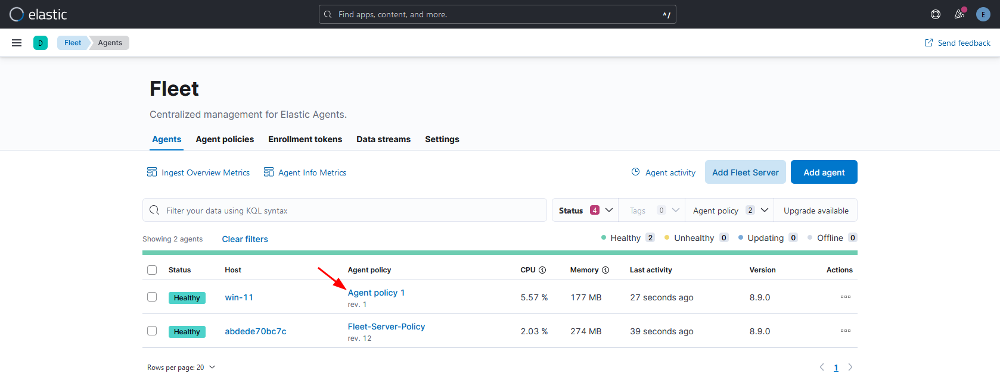
Click in the target machine agent policy name, and next, click in “Add integration” button.

Lets install “Elastic Defend” integration.
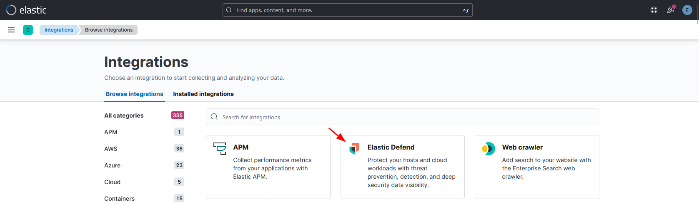

In the next screen, click in “Add Elastic Defend”.
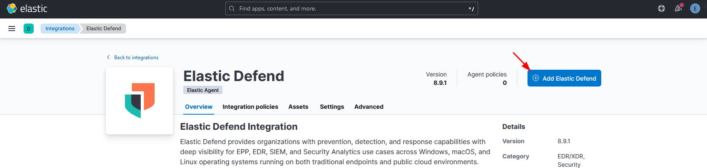

Next:
1. Add a name in the “Integration name”.
2. Select the type of protection, I will go with “Complete EDR” (Note that we will have only 30-days trial to use Essential and Complete EDR).
3. Select the agent policy we created.
4. Click “Save and continue”.

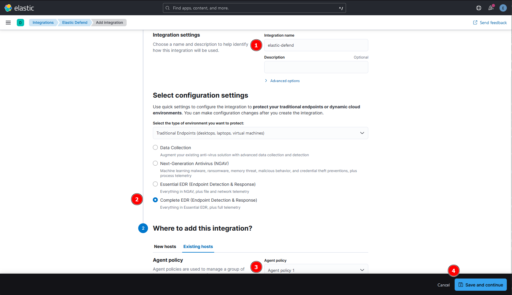

The last thing we need to do is to setup the alert rules. Use the menu on the left and browse to Security → Alerts. Click in the “Manage rules” button.

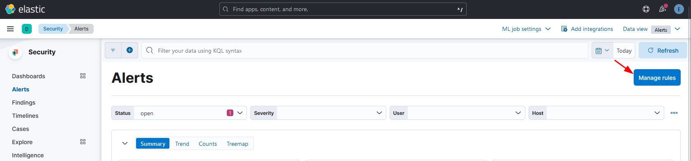

Under the “Installed Rules” tab, we can enable all rules. 
1. Click in Select all 860 rules
2. Bulk actions: Enable

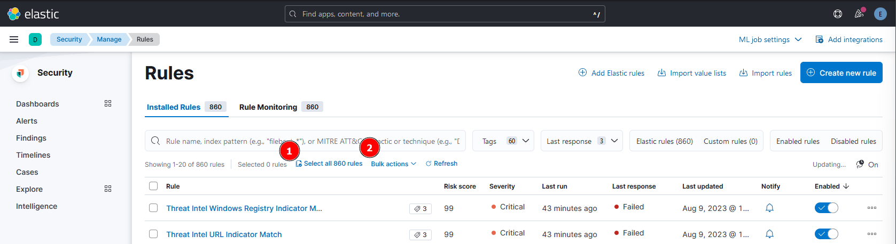
*Note 1: Some of the rules may fail, that is ok, they require other integrations that we did not install.  
Note 2: Enabling all rules will generate a lot of alerts, therefore, a lot of “noise” for the SOC. This is an unrealistic scenario as it would overwhelm the SOC operators with false positives, but we want to check for every single prevention/detection during our tests.*

Now everything is ready, you may head to Security → Alerts to see any suspicious activity caught by Elastic.
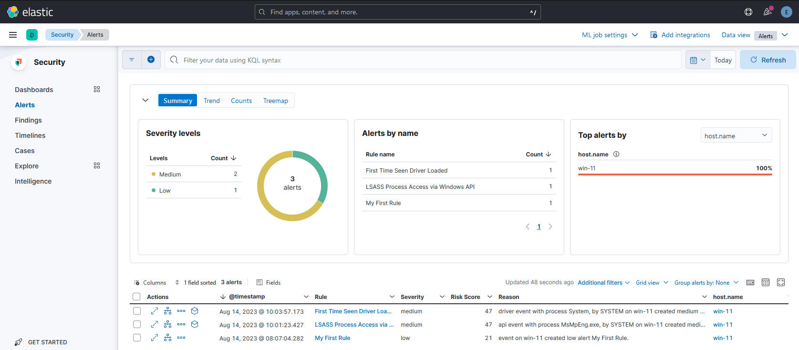

## Shutting down Elastic containers
You can use the following command to stop the elastic containers. This command will not uninstall Elastic, it just stop the containers running in the Raspberry Pi. I usually turn it off when I’m done with my tests.
```bash
sudo ./elastic-container.sh stop
```
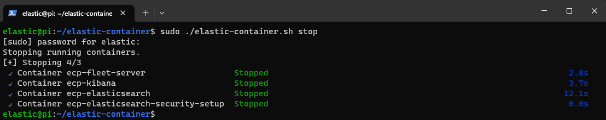

The following command will re-start the containers:
```bash
sudo ./elastic-container.sh start
```