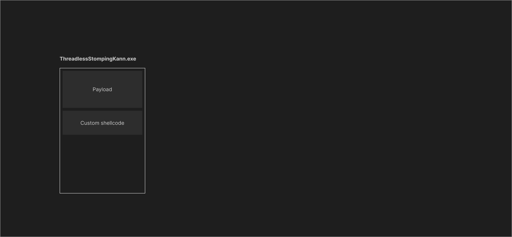
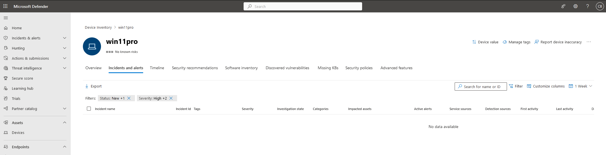
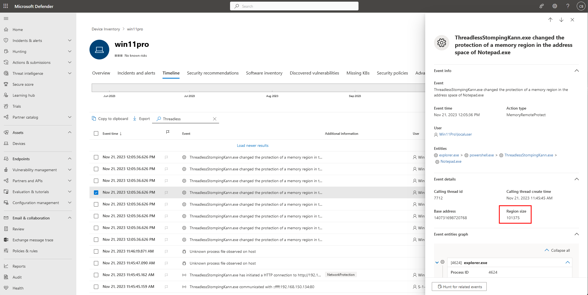

# ThreadlessStompingKann

## Intro
The combination of the techniques Threadless Injection, Stomping, and Caro-Kann has proven to be highly evasive against AV/EDR. I developed a simple proof-of-concept by integrating these three techniques and then executed it on a computer protected with Microsoft Defender for Endpoint to observe the detections.

## The defense - MDE
I sign up to evaluate Microsoft Defender for Endpoint for free (up to 2 months I guess) [in this link](https://learn.microsoft.com/en-us/microsoft-365/security/defender-endpoint/evaluate-mde?view=o365-worldwide). Next, I created a new Windows 11 Pro virtual machine no my home network, and onboarded the machine into MDE.

Note that I have not changed any rules or policies, these are the default settings when onboarding a new device.

## The code
Threadless Injection is a novel process injection technique involving hooking an export function from a remote process in order to gain shellcode execution.

More info at [CCob repo and BSides presentation](https://github.com/CCob/ThreadlessInject).

Caro-Kann involves two injections in the remote process, one for the payload, and the second for a custom shellcode. The custom shellcode is then modified at runtime with the payload address just before injection. A new thread is created pointing to the custom shellcode address, which in turn will change the memory permissions (to RX) and execute the payload.

More info at S3cur3Th1sSh1t repo [of the Caro-Kann technique](https://github.com/S3cur3Th1sSh1t/Caro-Kann#caro-kann).

DLL Stomping, or module stomping, is a technique that involves overwriting loaded modules with malicious code. The main goal is to backup the malicious code with some legitimate module, creating a camouflage effect that makes it more challenging for security measures to detect the presence of the malicious payload.

The plan:
1. Fetch the payload from the internet
2. Get a handle to a remote process
3. Inject the DLL we want to stomp in the remote process (Stomp + Threadless Inject)
4. Get the address of 2 functions present in the DLL (Stomp)
    1. Find the address of a function A to hold the payload (Stomp)
    2. Find the address of a function B to hold a custom shellcode that will change the memory protection of function A execute it (Stomp)
5. Write the payload into function A (Caro-Kann)
6. Modify the custom shellcode at runtime adding the address of function A and size of the payload (Caro-Kann)
7. Save the original state of the function B (Caro-Kann)
8. Write the custom shellcode into function B (Caro-Kann)
9. Use Threadless Injection to call function B (Threadless)
10. Sleep for a few seconds to let the function B to call function A and then restore function B (entry point) to original state (Caro-Kann)

## Executing
To execute the ThreadlessStompingKann technique, the following steps were taken:
1. Started a Havoc C2 listener on port 443 (HTTPS) and created a beacon shellcode. 
2. Next, XOR encrypted the beacon file and hosted on the attacker machine, port 80 (HTTP). 
3. Dropped the compiled executable ThreadlessStompingKann.exe in the target machine under the Downloads folder. 
4. Opened Notepad, started Powershell, and executed the program.

Seconds later, I could see a hit on the web server of the attacker machine to fetch the payload and a new connection was established coming from Notepad.exe.

I executed a few commands in the beacon just to test everything was working, including listed the processes running as we can see below. Highlighted is the MDE agent running.

## Observations

During the execution, the following observations were made.

Microsoft Defender for Endpoint (MDE) detected and logged several incidents related to the ThreadlessStompingKann technique, however, none of them seems to be critical enough to raise any alert.

In the image above we see MDE alerts page is empty. I waited up to 4 hours and nothing came up.

The MDE timeline showed the initial detection and response to the technique.

1. Powershell started the process ThreadlessStompingKann.exe
2. The payload being fetched from the attacker machine
3. The payload was triggered and Notepad.exe established a C2 connection via HTTPS to the attacker machine

After 30 minutes of the execution, MDE provided incident details, including information on the memory protections that were changed in Notepad.exe. 

The selected row is the Havoc payload, we can compare the size of the region with the output in the executable. However, the detection was triggered during the allocation of the memory and not when the custom shellcode was executed.

Note:
*I could have used many different approaches to be a bit more stealthier, for example, since we are communicating to the C2 via HTTPS choosing msedge.exe instead of Notepad.exe, or adding other evasive techniques, such as unhooking dll, direct/indirec syscalls, api hashing, iat obfuscation, etc. The code have some intentionally bad opsec to get the gist of MDE against it. I guess the simple code using WinAPIs still work.*

!!!  
The full code for the POC above can be found [on my Github repo here](https://github.com/caueb/ThreadlessStompingKann).   
!!!

# Credits
- CCob for his Threadless Inject: https://github.com/CCob/ThreadlessInject
- OtterHacker for his DEFCON31 presentation on Threadless Stomping: https://github.com/OtterHacker/Conferences/tree/main/Defcon31
- S3cur3Th1sSh1t for his Caro-Kann: https://github.com/S3cur3Th1sSh1t/Caro-Kann