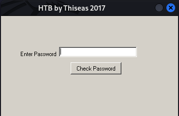
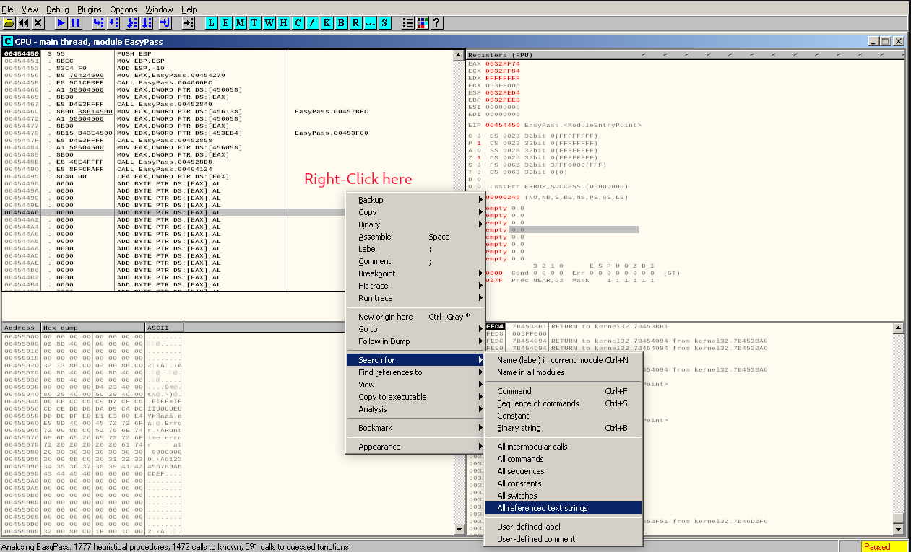
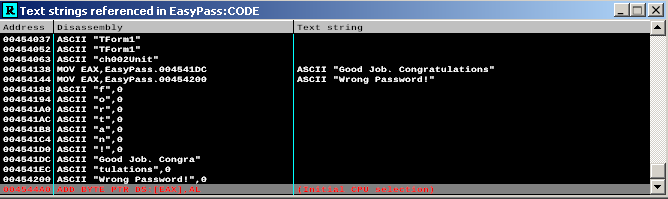
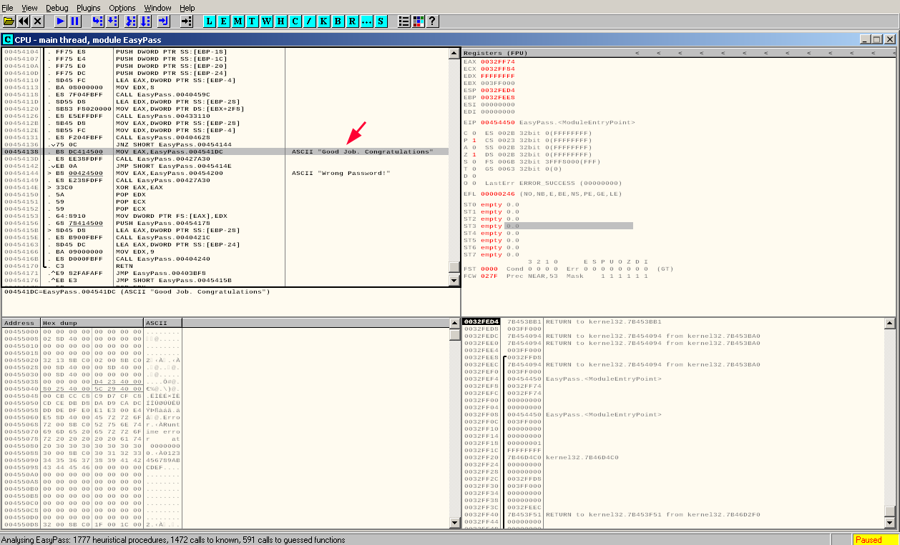
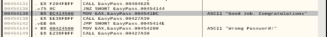
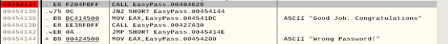
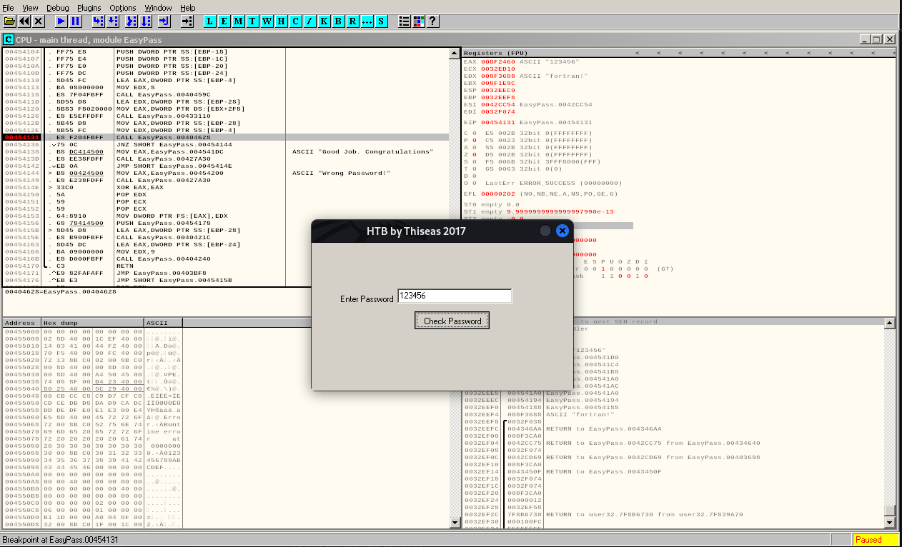
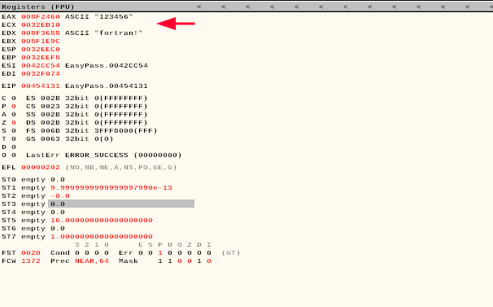

# Find The Easy Pass

## Challenge description
| Category | Level | Description |
| --- | --- | --- |
| Reversing | Easy | Find the password (say PASS) and enter the flag in the form HTB{PASS}


## Downloading files
For this challenge it is given only one executable file:
- EasyPass.exe

## Installing wine & ollydbg
Since this is a Windows executable, lets use `wine` to run this application. In case you don't have `wine` installed, this is what you should do:
```bash
$ sudo dpkg --add-architecture i386 
$ sudo apt update 
$ sudo apt install wine wine64 wine32 winbind winetricks
```

Now we can simply run `wine EasyPass.exe` and the application will load:


We also need a debugger that works for Windows executables, there are many out there but I will be using Ollydbg. Remember that Ollydbg requires `wine` to run.
Installing Ollydbg:
```bash
$ sudo apt install ollydbg
```

## Ollydbg
First thing lets have a look at the string that are longer than 10 characters, maybe we can quick find some passwords or something like that:
```bash
strings -n 10 EasyPass.exe
```
No luck.

To start Ollydbg simply run:
```bash
$ ollydbg
```

We can go to File -> Open -> (select the `EasyPass.exe` file)

### Strings
Now that we have the file loaded lets search for some strings.
-   Right click
-   Go to "Search for"
-   Click on "All referenced text strings"


We see:
- Good job. Congratulations  
- Wrong Password!



So it seems that these are the message sent in case of right or wrong password entered. Double-click in the "Good job" to see where it is implemented.



### Analysis

**JNZ** is a conditional jump, lets single left click on the **JNZ** and press enter. By default it goes to "Wrong Password!".
All we need to do now is find out what is the **JNZ** comparing to and we could potentially find the password. Lets set a breakpoint in the **CALL** just before the **JNZ**.

Select the line and press F2.


Now lets run the application clicking in the Play button. We can enter anything when prompted for a password:


As soon as we press the "Check Password" button we hit the breakpoint. If we look at the registers we can spot the two ASCII that are probably being compared to define if the password entered is good:

The program is comparing EAX (user input) to EDX (password in memory).
We can confirm that running the program again and entering `fortran!` in the password field and we get the "Good Job" message.
